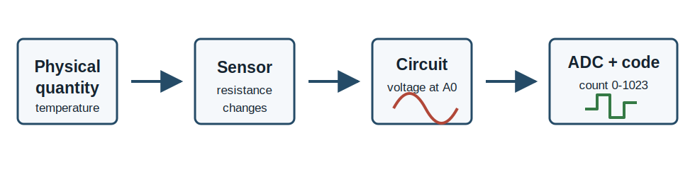
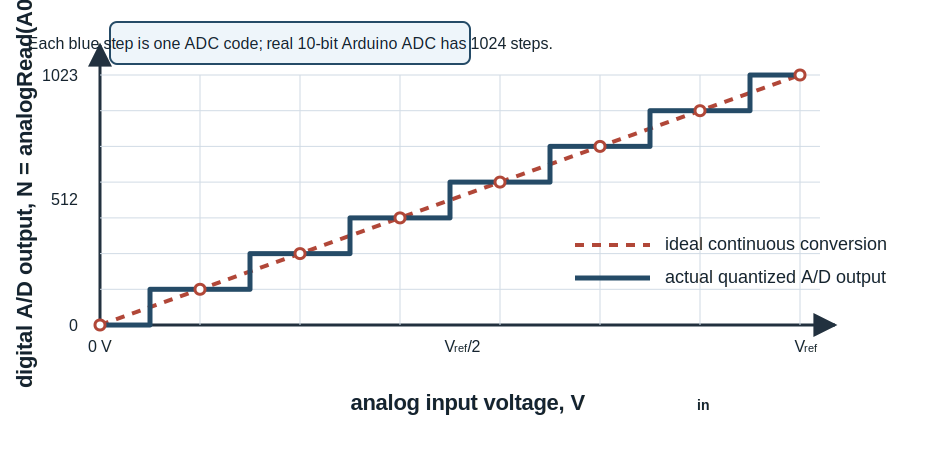
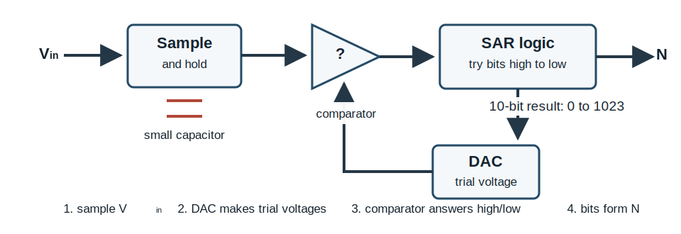
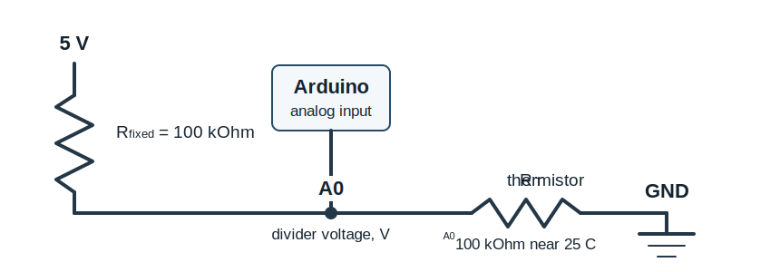
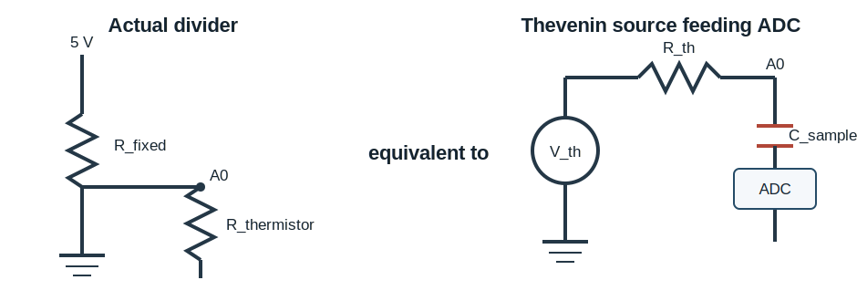
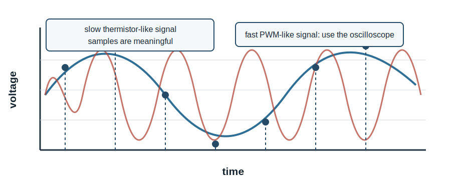
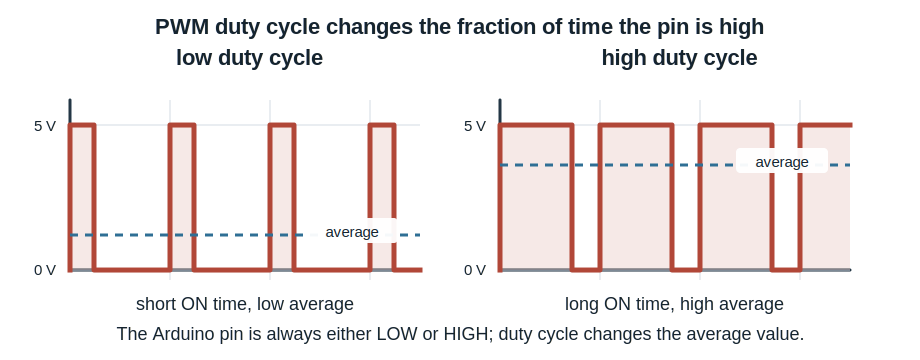
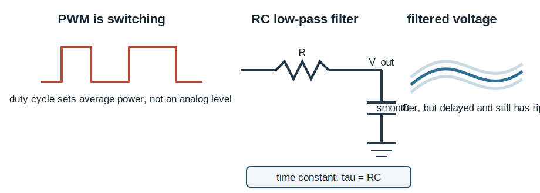

# Analog-To-Digital Conversion: Measuring Real Voltages With Arduino

This tutorial is about the circuit physics behind `analogRead()`. The Arduino
ADC is useful only when the analog circuit feeding it is understood. The
important habit is the same one used throughout electronics: draw the circuit,
replace the source by an equivalent circuit when useful, estimate the error,
and then check the result with an instrument.



An Arduino analog input measures voltage relative to Arduino ground. It does not
measure temperature, resistance, brightness, or knob position directly. Those
physical quantities must first be converted into a voltage by a sensor circuit.

## 1. The ADC Model

For the Arduino Uno, `analogRead()` uses a 10-bit analog-to-digital converter.
With the usual 5 V reference, the returned number is an integer from `0` to
`1023`.

$$
2^{10}=1024 \quad \text{codes}
$$

$$
\Delta V = \frac{V_{\mathrm{ref}}}{1024}
$$

For $V_{\mathrm{ref}}=5.00\ \mathrm{V}$,

$$
\Delta V = 4.88\ \mathrm{mV}
$$

The ADC output is therefore a rounded and clipped version of the input voltage.
Voltages below ground read as `0`; voltages near or above the reference read as
`1023`; intermediate voltages are assigned to the nearest available count.



In this transfer curve, the horizontal axis is the analog input voltage
$V_{\mathrm{in}}$. The vertical axis is the digital output number $N$ returned
by `analogRead()`. The dashed line is the ideal continuous conversion. The blue
staircase is the actual A/D conversion. Each flat step is one output code; the
dashed line crosses each step at the input voltage represented by that code.

### How The Arduino ADC Finds The Number

There are several ways to build an A/D converter. An integrating or dual-slope
ADC charges an integrator for a known time, then compares against a reference
while it discharges. That method is common in digital multimeters because it is
accurate and rejects line-frequency noise well, but it is relatively slow.

The Arduino Uno uses a different method: a successive-approximation ADC. The ADC
first samples the input voltage onto a small capacitor. Then internal logic tries
the bits of the answer from most significant to least significant. For each bit,
an internal DAC makes a trial voltage and a comparator asks whether the sampled
input voltage is above or below that trial voltage.



For a 10-bit ADC, this binary search needs about ten comparator decisions. The
result is the integer count returned by `analogRead()`.

A good first estimate is

$$
V_{\mathrm{in}} \simeq \frac{N}{1023}V_{\mathrm{ref}}
$$

where $N$ is the ADC count. The quantization uncertainty is roughly half of one
least significant bit:

$$
\delta V_{\mathrm{quant}} \simeq \pm \frac{1}{2}\Delta V
$$

For a 5 V reference, this is about $\pm 2.4\ \mathrm{mV}$ before considering
noise, reference error, source impedance, or calibration error.

## 2. Voltage Dividers Are Thevenin Sources

Many sensors are read using a voltage divider. A thermistor divider is one
example:



The open-circuit divider voltage is

$$
V_{A0}=V_{\mathrm{ref}}\frac{R_{\mathrm{thermistor}}}{R_{\mathrm{fixed}}+R_{\mathrm{thermistor}}}
$$

The ADC input is connected to the divider midpoint. The divider midpoint is not
an ideal voltage source, because the voltage is made through resistors. The
Thevenin equivalent replaces the divider by an ideal voltage source
$V_{\text{th}}$ in series with an effective source resistance $R_{\text{th}}$.

To derive $R_{\text{th}}$, turn off the ideal 5 V source. An ideal voltage
source set to zero volts becomes a short circuit to ground. Then, looking back
into the circuit from A0, there are two paths to ground:

$$
A0 \rightarrow R_{\mathrm{fixed}} \rightarrow \mathrm{GND}
$$

and

$$
A0 \rightarrow R_{\mathrm{thermistor}} \rightarrow \mathrm{GND}
$$

If a small test voltage $v$ is applied at A0, the current drawn from that test
source is

$$
i = \frac{v}{R_{\mathrm{fixed}}}+\frac{v}{R_{\mathrm{thermistor}}}
$$

Therefore

$$
R_{\mathrm{th}}
= \frac{v}{i}
= \frac{1}{\frac{1}{R_{\mathrm{fixed}}}+\frac{1}{R_{\mathrm{thermistor}}}}
= R_{\mathrm{fixed}} \parallel R_{\mathrm{thermistor}}
$$

or

$$
R_{\mathrm{th}}
= \frac{R_{\mathrm{fixed}}R_{\mathrm{thermistor}}}
{R_{\mathrm{fixed}}+R_{\mathrm{thermistor}}}
$$



This matters because the ADC input includes a small sample-and-hold capacitor.
During a conversion, that capacitor must charge through the source resistance.
If the divider resistance is too large, the capacitor may not settle to the true
input voltage before the ADC records the sample.

A practical rule is: do not make the divider impedance unnecessarily large. If
the measurement is noisy, check wiring and grounding first; if the reading is
slow or history-dependent, source impedance and ADC settling may be involved.

## 3. Potentiometer Example

A potentiometer connected between 5 V and GND makes an adjustable divider.

```text
5 V ----/\/\/\/\/\/---- GND
           |
           A0
```

The wiper voltage changes continuously as the knob turns. The ADC reports this
continuous motion as a sequence of integer counts.

```cpp
const int analogPin = A0;
const float Vref = 5.0;

void setup() {
  Serial.begin(9600);
}

void loop() {
  int count = analogRead(analogPin);
  float voltage = count * Vref / 1023.0;

  Serial.print(count);
  Serial.print(",");
  Serial.println(voltage, 4);

  delay(100);
}
```

The potentiometer is a good first test because the expected voltage is easy to
check with a multimeter. If the multimeter and Arduino disagree, check the
reference voltage, ground connection, wiring, and conversion formula.

## 4. Thermistor Example

A thermistor changes resistance with temperature. The Arduino still measures
only voltage.

```text
temperature -> thermistor resistance -> divider voltage -> ADC count -> calculated temperature
```

That chain gives several possible places for error:

| Stage | Possible problem | Instrument check |
| --- | --- | --- |
| Thermistor | Wrong part, poor thermal contact, self-heating | Compare with room temperature or another thermometer |
| Divider | Wrong resistor value or swapped wiring | Measure A0 voltage with a multimeter |
| ADC | Noisy ground, unstable reference, source impedance | Compare ADC voltage to multimeter voltage |
| Calibration | Wrong beta value or formula | Check calculated resistance before temperature |

This is why it is often better to print intermediate quantities: ADC count,
voltage, resistance, and temperature. If the temperature is wrong but the
voltage is right, the bug is after the ADC conversion.

## 5. Sampling And Aliasing

The ADC samples the voltage at discrete times. It does not know what happened
between samples.



For a slowly changing thermistor, sampling every 0.1 s may be fine. For a PWM
waveform, casual ADC samples are misleading because the waveform is switching
between low and high states. Use the oscilloscope for PWM frequency, duty cycle,
high voltage, low voltage, and edge timing.

## 6. Noise, Averaging, And Bandwidth

Averaging reduces random noise, but it also reduces bandwidth. It is a digital
low-pass filter.

```cpp
const int analogPin = A0;
const int nSamples = 1000;
const float Vref = 5.0;

void setup() {
  Serial.begin(9600);
}

void loop() {
  long total = 0;

  for (int i = 0; i < nSamples; i++) {
    total += analogRead(analogPin);
  }

  float averageCount = total / float(nSamples);
  float averageVoltage = averageCount * Vref / 1023.0;

  Serial.print(averageCount, 1);
  Serial.print(",");
  Serial.println(averageVoltage, 4);
}
```

If the noise is random and uncorrelated from sample to sample, averaging $M$
samples reduces the random component by about

$$
\frac{1}{\sqrt{M}}
$$

But averaging cannot repair a bad ground, a loose breadboard connection, a
wrong resistor, or a drifting reference voltage. It also makes real changes
appear later.

## 7. RC Filtering And PWM

A PWM output is not an analog voltage. It is a digital waveform whose duty cycle
can be varied.



An RC low-pass filter can turn PWM into an approximate average voltage, but only
if the RC time constant is long compared with the PWM period and short compared
with the signal changes you care about.

$$
\tau = RC
$$

The design tradeoff is unavoidable:

- larger $RC$: smoother voltage, slower response
- smaller $RC$: faster response, more ripple



## 8. Practical Measurement Checklist

Before trusting an ADC number, check these things:

- Is Arduino ground connected to the circuit ground?
- Is the input voltage between 0 V and $V_{\mathrm{ref}}$?
- What is the actual value of $V_{\mathrm{ref}}$?
- What is the source resistance feeding the ADC input?
- Does a multimeter agree with the calculated ADC voltage?
- Is the signal slow enough for the chosen sampling rate?
- Is averaging hiding real dynamics?
- Should this signal be measured with the oscilloscope instead?

## 9. Lab Questions

1. With a potentiometer, measure the ADC count near 0 V, 2.5 V, and 5 V. Does
   the count agree with the multimeter voltage?
2. Estimate the voltage represented by one ADC count. Can you observe a one-count
   change reliably?
3. Build or inspect a thermistor divider. What is $R_{\mathrm{th}}$ near room
   temperature?
4. Increase the averaging length. What improves, and what gets worse?
5. Look at a PWM output with the oscilloscope. Why is `analogRead()` not the
   right way to characterize that waveform?
