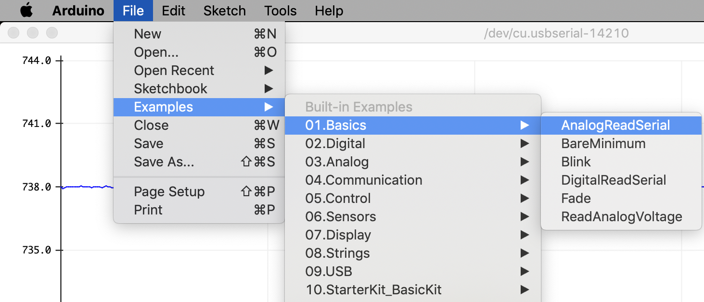

# Arduino Tutorial

Learn how to use an Arduino for input and output. The point of this tutorial is
not to write a large program all at once. The point is to make one small piece
of hardware work, measure what it does, and then add one more piece.

The Arduino IDE includes permanent example sketches that are worth learning
because students can find them again after the course. Open them from:

```text
File -> Examples
```


## What The Arduino Does In This Course

The Arduino Uno is the small computer at the center of the first part of the
course. It reads voltages from sensors, communicates with the laptop over USB,
and produces digital or PWM control signals.

- Reads thermistor voltage-divider signals with analog inputs.
- Sends measurements to a laptop through USB serial communication.
- Produces digital timing signals for oscilloscope measurements.
- Produces PWM signals for actuator control.
- Implements safety logic and, later, feedback control.

## Tutorial Exercises

### 1. Blink

Do the official Arduino
[Blink tutorial](https://www.arduino.cc/en/Tutorial/BuiltInExamples/Blink)
using both the built-in LED and an external LED.

Change the on time and off time. Describe the duty cycle in words and calculate
it from the sketch.

### 2. AnalogReadSerial

Do the official Arduino
[AnalogReadSerial tutorial](https://www.arduino.cc/en/Tutorial/AnalogReadSerial).
Look at the voltage using the Serial Monitor and Serial Plotter under the
Arduino IDE **Tools** menu.

Vary the voltage using a potentiometer. Record the smallest change in voltage
that the Arduino reports. What is the digitization error?



### 3. Average The Voltage

Modify the analog-reading code so that it averages 100 consecutive measurements
before printing a value.

Observe the result on the Serial Plotter. What changes as you vary the number
of samples included in the average?


### 4. Button

Do the official Arduino
[Button tutorial](https://www.arduino.cc/en/Tutorial/BuiltInExamples/Button)
using a push button.

Use the button to control an LED. Be sure you can explain whether the button
input is high or low when the button is pressed.

### 5. OneButton Library

Install the
[OneButton library](https://github.com/mathertel/OneButton). Arduino's guide to
library installation is here:
[Add libraries to Arduino IDE](https://support.arduino.cc/hc/en-us/articles/5145457742236-Add-libraries-to-Arduino-IDE).

Run the `SimpleOneButtonSingleClick` example sketch. Use a single click to
toggle an LED on and off.

### 6. PWM And H-Bridge

Hook up a small DC motor to the H-bridge. Connect one H-bridge PWM input to an
Arduino PWM output. Run the motor at different PWM settings.

Reverse direction using your push button. Disable the motor before reversing
direction.

Measure the PWM signal with the oscilloscope. Record the PWM frequency, high
voltage, low voltage, and duty cycle.

!!! warning
    Arduino pins provide logic signals, not motor or TEC power. The motor or TEC
    must be driven through the H-bridge and an appropriate external power
    supply.

## Helpful Reference

- [Arduino Uno pinout](pinout.md)
- [Official Arduino Uno Rev3 page](https://docs.arduino.cc/hardware/uno-rev3/)
- [Pulse-width modulation background](https://en.wikipedia.org/wiki/Pulse-width_modulation)
