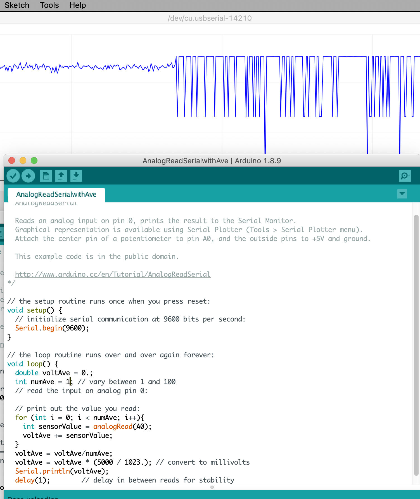

# Lab 1 Assignment: First Contact

Learn how to use an Arduino for input and output. The point of this tutorial is
not to write a large program all at once. The point is to make one small piece
of hardware work, measure what it does, and then add one more piece.

The Arduino IDE includes permanent example sketches that are worth learning
because students can find them again after the course. Open them from:

```text
File -> Examples
```

Another great resource are the [worked examples](https://docs.arduino.cc/built-in-examples/) from Arduino. This lab is based on some of them.

## What The Arduino Does In This Course

The Arduino Uno is the small computer at the center of the first part of the
course. It reads voltages from sensors, communicates with the laptop over USB,
and produces digital or PWM control signals.

- Reads thermistor voltage-divider signals with analog inputs.
- Sends measurements to a laptop through USB serial communication.
- Produces digital timing signals for oscilloscope measurements.
- Produces PWM signals for actuator control.
- Implements safety logic and, later, feedback control.

## Tutorial Exercises

### 1. Blink

Do the official Arduino
[Blink tutorial](https://www.arduino.cc/en/Tutorial/BuiltInExamples/Blink)
using both the built-in LED and an external LED. The external LED needs to be current limited so place a resistor between 200 $ \Omega $ and  2000 $\Omega$ in series with the LED.  Follow the schematic in the link.

Change the duty cycle from 1:1 to 10:1 and 1:10. Play with the on- and -off times.

### 2. AnalogReadSerial

Do the official Arduino
[AnalogReadSerial tutorial](https://www.arduino.cc/en/Tutorial/AnalogReadSerial). Vary the voltage using a potentiometer. Look at the readings on the Serial Monitor and Serial Plotter under the
Arduino IDE **Tools** menu. The Analog to Digital (A/D) converter is 10 bit. What range of numbers do you observe? Convert the signal to voltage. What range of voltage do you observe?

Record the smallest change in voltage
that the Arduino reports. What is the digitization error?


### 3. Average The Voltage

Modify the analog-reading code so that it averages 1000 consecutive measurements
before printing a value.

Observe the result on the Serial Plotter. What changes as you vary the number
of samples included in the average?



### 4. LED Brightness From Averaged Analog Input

Modify your `AveAnalogReadSerial` sketch to make a new `LEDbrightness` sketch.
Keep the potentiometer connected to an analog input, keep the averaging, and
use the averaged analog voltage to set the brightness of an LED with PWM.

The signal chain is:

```text
pot voltage  -> analogRead ave number -> average voltage -> map to PWM -> analogWrite -> oscilloscope -> LED brightness
```

Start by printing the averaged voltage and the PWM value to Serial
Monitor so you can see what the code is doing. Then measure the PWM output pin
with the oscilloscope while you turn the potentiometer. Finally, connect the PWM
pin to an LED with an appropriate series resistor and confirm that the LED
brightness follows the potentiometer.

### 5. Next Lab: PWM And H-Bridge

This is not part of the first lab unless your instructor explicitly asks you to continue. First make sure you can explain the LED PWM waveform from Step 4.

Hook up a small DC motor to the H-bridge. Connect one H-bridge PWM input to an
Arduino PWM output. Run the motor at different PWM settings.

Reverse direction using your push button. Disable the motor before reversing
direction.

Measure the PWM signal with the oscilloscope. Record the PWM frequency, high
voltage, low voltage, and duty cycle. This step prepares you for later TEC
heat/cool control, but the TEC power supply remains off until the actuator lab.

!!! warning
    Arduino pins provide logic signals, not motor or TEC power. The motor or TEC
    must be driven through the H-bridge and an appropriate external power
    supply.

## Helpful Reference

- [Arduino Uno pinout](pinout.md)
- [Official Arduino Uno Rev3 page](https://docs.arduino.cc/hardware/uno-rev3/)
- [Pulse-width modulation background](https://en.wikipedia.org/wiki/Pulse-width_modulation)
