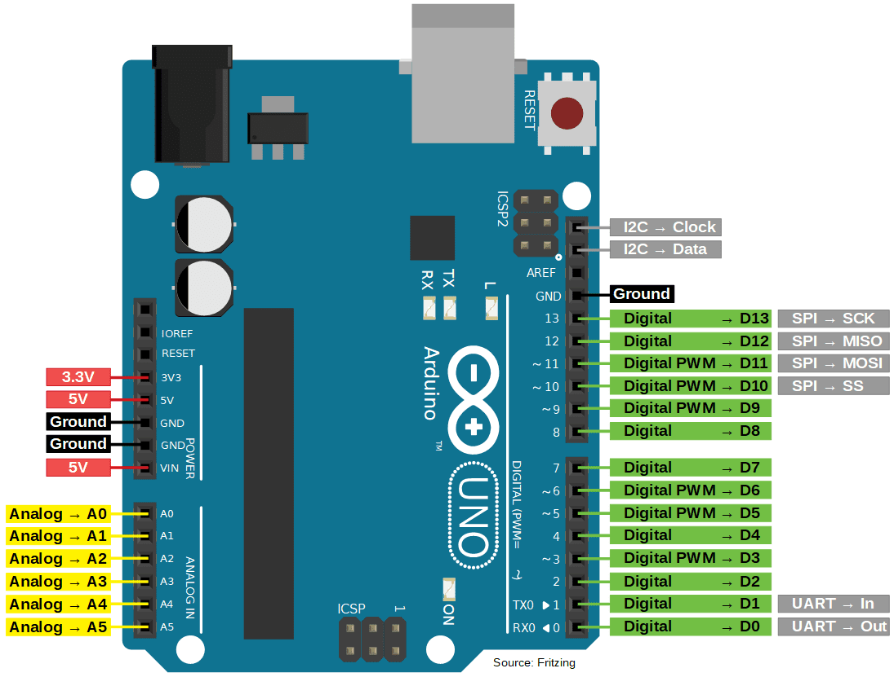

# Arduino Uno Pinout

## Pin Groups

| Pins | Purpose |
| --- | --- |
| `0-13` | Digital input/output |
| `A0-A5` | Analog voltage inputs |
| `3, 5, 6, 9, 10, 11` | Digital pins that support PWM on a standard Uno |
| `5V`, `3.3V` | Regulated logic-power outputs |
| `GND` | Electrical reference and return |
| `VIN` | External board-power input |

The `~` symbol printed beside selected digital pin numbers identifies pins that
support Arduino `analogWrite()` PWM output.

!!! warning
    Arduino pins provide logic signals, not TEC power. The TEC must be driven
    through an appropriate H-bridge and external power supply.

