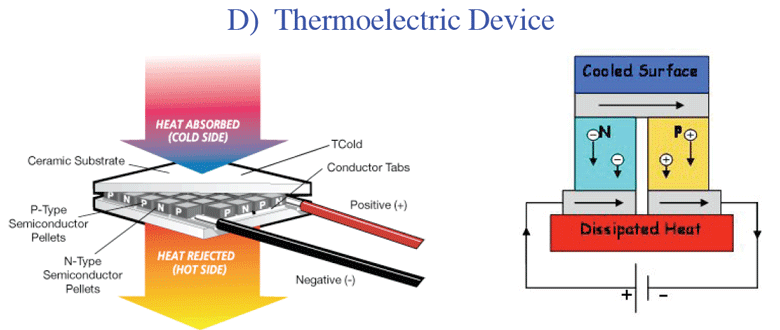
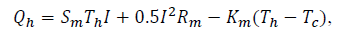
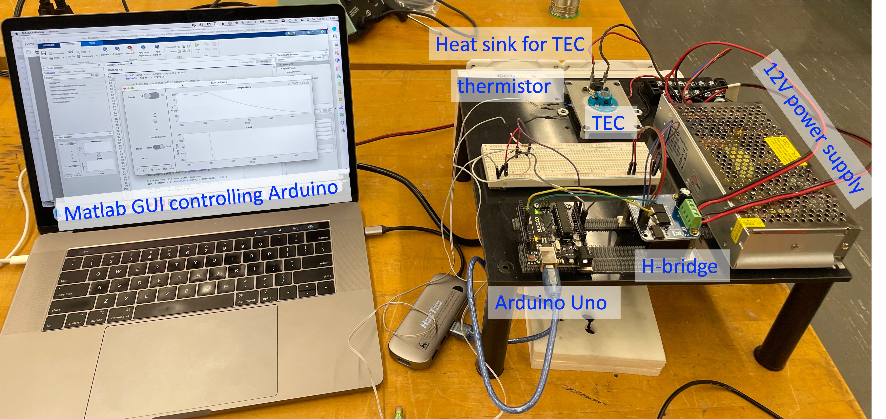

# Hardware For Temperature Control

The temperature-control instrument connects low-power measurement and control
electronics to a higher-power thermal actuator.

## Interactive Instrument Map

Select a labeled component in the diagram to jump to its description and
reference material below.

<div class="apparatus-scroll">
  <div class="apparatus-map">
    
    <a class="apparatus-hotspot hotspot-switch" href="#thermal-safety-switch">Thermal switch</a>
    <a class="apparatus-hotspot hotspot-thermistor" href="#thermistor">Thermistor</a>
    <a class="apparatus-hotspot hotspot-tec" href="#thermoelectric-cooler">TEC</a>
    <a class="apparatus-hotspot hotspot-exchanger" href="#heat-exchanger">Heat exchanger</a>
    <a class="apparatus-hotspot hotspot-arduino" href="#arduino-uno">Arduino</a>
    <a class="apparatus-hotspot hotspot-hbridge" href="#h-bridge">H-bridge</a>
    <a class="apparatus-hotspot hotspot-laptop" href="#laptop-software">Laptop</a>
  </div>
</div>

## Signal And Power Path

```text
thermistor → Arduino analog input → Arduino code → PWM outputs
    → H-bridge → TEC → heating or cooling
```

The laptop communicates with the Arduino through USB serial. It displays
measurements, saves data, and eventually sends control settings. The bench
power supply provides the TEC current; the Arduino supplies only logic-level
control signals.

## Component Reference


| Component | Function in the instrument | Reference |
| --- | --- | --- |
| Thermal safety switch | Opens the power circuit near 70 °C if software control fails. | [Cantherm R23 data sheet](references/thermal-switch-cantherm.pdf) |
| 100 kOhm NTC thermistor | Senses TEC/block temperature through a voltage divider connected to an Arduino analog input. | [TDK/EPCOS B57861S0104F040V24 data sheet](references/epcos-b57861s0202f040-f2026.pdf) · [Exact class part search](https://www.digikey.com/en/products?keywords=B57861S0104F040V24) · [Thermistor beta equation](https://en.wikipedia.org/wiki/Thermistor#B_or_%CE%B2_parameter_equation) |
| 100 kOhm precision resistor | Forms the thermistor voltage divider and sets the useful measurement range near room temperature. | Use the approved course part |
| TEC/Peltier element | Moves heat when current flows; reversing current reverses heat/cool direction. | [Laird CP14-127-045 data sheet](references/laird-tec-cp14-127-045.pdf) |
| Heat exchanger | Removes waste heat from the TEC hot side and rejects it to the room. | [ID-COOLING DASHFLOW 240 BASIC WHITE product page](https://www.idcooling.com/product/detail?id=323&name=DASHFLOW%20240%20BASIC%20WHITE) · [F2023 parts-list order link](https://www.amazon.com/ID-COOLING-DASHFLOW-LGA1700-Compatible-2x120mm/dp/B0BFPL84GK) |
| Arduino Uno | Digitizes sensor voltage, communicates over USB serial, and produces two PWM control signals. | [Uno overview](arduino/index.md) · [Uno pinout](arduino/pinout.md) · [Official Uno Rev3](https://docs.arduino.cc/hardware/uno-rev3/) |
| BTS7960 H-bridge | Uses Arduino PWM inputs to drive TEC current in either direction from the external supply. | [BTS7960 driver reference](references/bts7960-h-bridge.pdf) |
| Bench power supply | Supplies current-limited actuator power to the H-bridge and TEC. | Use the assigned laboratory supply |
| Oscilloscope | Verifies voltage levels, timing, PWM duty cycle, direction signals, and grounding. | Use the assigned laboratory oscilloscope |
| Laptop and Python software | Displays strip charts, logs data, sends commands, and later compares measurements with models. | [Course repository](repository.md) |

### Thermal Safety Switch

The hardware thermal switch is independent of the Arduino program. It cuts
power near 70 °C and remains an important protection even after software
temperature limits are added.

[Open the thermal-switch data sheet](references/thermal-switch-cantherm.pdf)

### Thermistor

The class sensor is the **100 kOhm TDK/EPCOS B57861S0104F040V24 NTC
thermistor**. Use it with a 100 kOhm precision fixed resistor unless the
voltage-divider design and firmware calibration are deliberately changed.

Arduino measures the divider voltage. Software converts voltage to thermistor
resistance and then converts resistance to temperature with the beta equation.

- [Thermistor background](https://en.wikipedia.org/wiki/Thermistor)
- [Beta-parameter equation](https://en.wikipedia.org/wiki/Thermistor#B_or_%CE%B2_parameter_equation)
- [TDK/EPCOS B57861S0104F040V24 100 kOhm data sheet](references/epcos-b57861s0202f040-f2026.pdf)
- [TDK/EPCOS B57861S0104F040V24 supplier search](https://www.digikey.com/en/products?keywords=B57861S0104F040V24)

### Thermoelectric Cooler

The thermoelectric cooler, or TEC, is the thermal actuator. Reversing current
reverses which face heats and which face cools. The hot face must remain
thermally coupled to the heat exchanger.



- [Laird TEC performance data](references/laird-tec-cp14-127-045.pdf)
- [Introduction to practical thermoelectrics](references/introduction-to-thermoelectrics.pdf)
- [Thermoelectric-effect background](https://en.wikipedia.org/wiki/Thermoelectric_effect)

The legacy model writes the heat carried by the TEC as a combination of the
Peltier term, Joule heating, and ordinary thermal conduction:



[Melcor thermal-solutions reference](references/melcor-thermal-solutions.pdf)

### Heat Exchanger

The water-cooled heat exchanger carries waste heat away from the TEC. The F2023
parts list identifies the class heat exchanger as an **ID-COOLING DASHFLOW**
CPU liquid cooler with a 2x120 mm radiator. The TEC cannot cool effectively if
its hot side is allowed to overheat.


- [ID-COOLING DASHFLOW 240 BASIC WHITE product page](https://www.idcooling.com/product/detail?id=323&name=DASHFLOW%20240%20BASIC%20WHITE)
- [DASHFLOW install video for Intel LGA1700](https://youtu.be/uAy_E5BkyvE)
- [F2023 parts-list order link](https://www.amazon.com/ID-COOLING-DASHFLOW-LGA1700-Compatible-2x120mm/dp/B0BFPL84GK)

### Arduino Uno

The Arduino reads sensor voltages and produces logic-level control signals. Its
pins cannot directly power the TEC.

- [Arduino overview and built-in examples](arduino/index.md)
- [Arduino Uno pinout](arduino/pinout.md)
- [Official Arduino Uno Rev3 page](https://docs.arduino.cc/hardware/uno-rev3/)

### H-Bridge

The BTS7960-style H-bridge lets the low-power Arduino control the amount and
direction of current from the external supply through the TEC.

On the class board:

- Arduino pins `9` and `10` go to the two H-bridge PWM inputs.
- The two H-bridge enable inputs are held high.
- Only one PWM direction input should be active at a time.
- Arduino ground and H-bridge logic ground must share a reference.

[Open the H-bridge reference](references/bts7960-h-bridge.pdf)

### Laptop Software

The current course uses Python rather than MATLAB for new development. The
laptop reads Arduino serial output, displays live plots, logs data, and later
sends control commands.

[Read about the course repository workflow](repository.md)

## Class Apparatus Photographs




## Additional Reference

- [2023 Phys 39 hardware and parts list](references/phys39-hardware-parts-list-2023.pdf)
- [Pulse-width modulation background](https://en.wikipedia.org/wiki/Pulse-width_modulation)

!!! warning
    The Arduino and USB cable do not supply TEC power. Do not energize the
    H-bridge or TEC until the assignment and instructor explicitly call for it.
