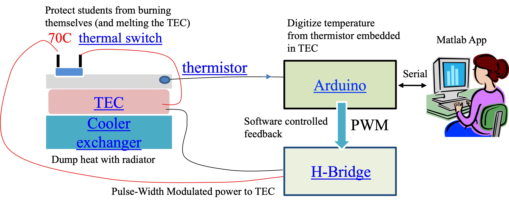
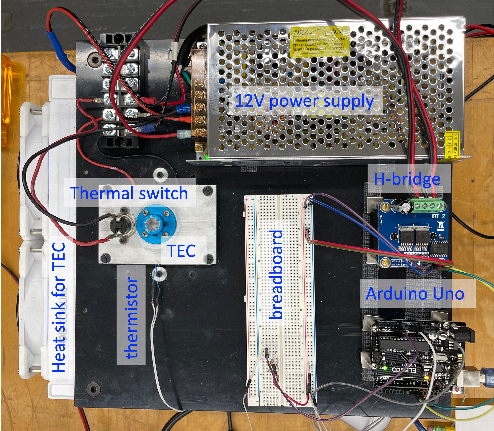

# Hardware For Temperature Control

The temperature-control instrument connects a low-power measurement and
control system to a higher-power thermal actuator.



## Signal And Power Path

```text
thermistor → Arduino analog input → Arduino code → PWM outputs
    → H-bridge → TEC → heating or cooling
```

The laptop communicates with the Arduino through USB serial. It can display
measurements, save data, and eventually send control settings.

## Main Components

### Arduino Uno

The Arduino reads sensor voltages and produces logic-level control signals. Its
pins cannot directly power the TEC.

- [Arduino overview and examples](arduino/index.md)
- [Arduino Uno pinout](arduino/pinout.md)

### Thermistor

The class sensor is a **100 kOhm NTC thermistor**. It is used in a voltage
divider with a 100 kOhm precision fixed resistor. Arduino measures the divider
voltage and software converts voltage to resistance and temperature.

[Thermistor background and beta equation](https://en.wikipedia.org/wiki/Thermistor)

### H-Bridge

An H-bridge is an electronic circuit that lets the low-power Arduino control
the amount and direction of current from a high-power supply through the TEC.

The class board uses two Arduino PWM signals for opposite current directions.
The H-bridge enable inputs are held high.

### Thermoelectric Cooler

The thermoelectric cooler, or TEC, is the thermal actuator. Reversing current
reverses which face heats and which face cools. The hot side must be coupled to
an appropriate heat exchanger.

[Thermoelectric-effect background](https://en.wikipedia.org/wiki/Thermoelectric_effect)

### Oscilloscope

The oscilloscope provides physical ground truth for voltage and timing. Before
applying TEC power, use it to verify Arduino output levels, PWM duty cycle, and
which H-bridge input is active.

## Class Apparatus




!!! warning
    The Arduino and USB cable do not supply TEC power. Do not energize the
    H-bridge or TEC until the assignment and instructor explicitly call for it.

