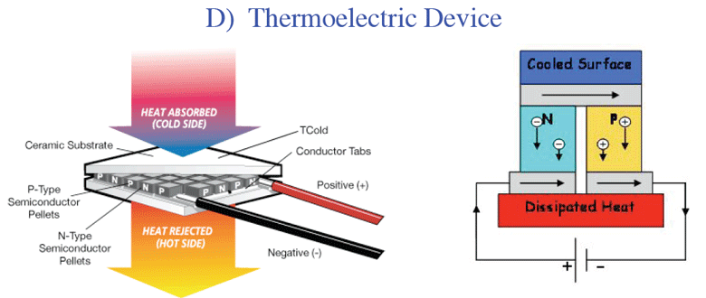
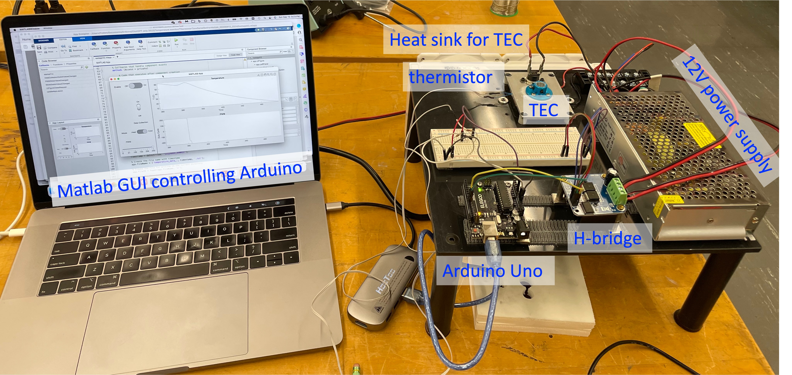

# Hardware For Temperature Control

The temperature-control instrument connects low-power measurement and control
electronics to a higher-power thermal actuator.

## Interactive Instrument Map

Select a labeled component in the diagram to jump to its description and
reference material below.

<div class="apparatus-scroll">
  <div class="apparatus-map">
    
    <a class="apparatus-hotspot hotspot-switch" href="#thermal-safety-switch">Thermal switch</a>
    <a class="apparatus-hotspot hotspot-thermistor" href="#thermistor">Thermistor</a>
    <a class="apparatus-hotspot hotspot-tec" href="#thermoelectric-cooler">TEC</a>
    <a class="apparatus-hotspot hotspot-exchanger" href="#heat-exchanger">Heat exchanger</a>
    <a class="apparatus-hotspot hotspot-arduino" href="#arduino-uno">Arduino</a>
    <a class="apparatus-hotspot hotspot-hbridge" href="#h-bridge">H-bridge</a>
    <a class="apparatus-hotspot hotspot-laptop" href="#laptop-software">Laptop</a>
  </div>
</div>

## Signal And Power Path

```text
thermistor → Arduino analog input → Arduino code → PWM outputs
    → H-bridge → TEC → heating or cooling
```

The laptop communicates with the Arduino through USB serial. It displays
measurements, saves data, and eventually sends control settings. The bench
power supply provides the TEC current; the Arduino supplies only logic-level
control signals.

## Component Reference


| Component | Function in the instrument | Reference |
| --- | --- | --- |
| Thermal safety switch | Opens the power circuit near 70 °C if software control fails. | [Cantherm R23 data sheet](references/thermal-switch-cantherm.pdf) |
| 100 kOhm NTC thermistor | Senses TEC/block temperature through a voltage divider connected to an Arduino analog input. | [TDK/EPCOS B57861S0104F040V24 data sheet](references/epcos-b57861s0202f040-f2026.pdf) · [Exact class part search](https://www.digikey.com/en/products?keywords=B57861S0104F040V24) · [Thermistor beta equation](https://en.wikipedia.org/wiki/Thermistor#B_or_%CE%B2_parameter_equation) |
| 100 kOhm precision resistor | Forms the thermistor voltage divider and sets the useful measurement range near room temperature. | Use the approved course part |
| TEC/Peltier element | Moves heat when current flows; reversing current reverses heat/cool direction. | [Laird CP14-127-045 data sheet](references/laird-tec-cp14-127-045.pdf) |
| Heat exchanger | Removes waste heat from the TEC hot side and rejects it to the room. | [ID-COOLING DASHFLOW 240 BASIC WHITE product page](https://www.idcooling.com/product/detail?id=323&name=DASHFLOW%20240%20BASIC%20WHITE) · [F2023 parts-list order link](https://www.amazon.com/ID-COOLING-DASHFLOW-LGA1700-Compatible-2x120mm/dp/B0BFPL84GK) |
| Arduino Uno | Digitizes sensor voltage, communicates over USB serial, and produces two PWM control signals. | [Arduino reference](arduino/index.md) · [Uno pinout](arduino/pinout.md) · [Official Uno Rev3](https://docs.arduino.cc/hardware/uno-rev3/) |
| BTS7960 H-bridge | Uses Arduino PWM inputs to drive TEC current in either direction from the external supply. Use 18 AWG wire for the TEC. | [BTS7960 driver reference](references/bts7960-h-bridge.pdf) |
| Bench power supply | Supplies current-limited actuator power to the H-bridge and TEC heat-exchanger. Use 18 AWG wire for the H-bridge. | [ALITOVE 12V 10A power adapter](https://alitove.com/products/alitove-12v-10a-power-adapter) |
| Oscilloscope | Verifies voltage levels, timing, PWM duty cycle, direction signals, and grounding. | Use the assigned laboratory oscilloscope |
| Laptop and Python software | Displays strip charts, logs data, sends commands, and later compares measurements with models. | [Course repository](repository.md) |

### Thermal Safety Switch

The hardware thermal switch is independent of the Arduino program. It cuts
power near 70 °C and remains an important protection even after software
temperature limits are added. Use 18G wire and crimped female spades.

[Open the thermal-switch data sheet](references/thermal-switch-cantherm.pdf)

### Thermistor

The class sensor is the **100 kOhm TDK/EPCOS B57861S0104F040V24 NTC
thermistor**. Use it with a 100 kOhm precision fixed resistor unless the
voltage-divider design and firmware calibration are deliberately changed.

Arduino measures the divider voltage. Software converts voltage to thermistor
resistance and then converts resistance to temperature with the beta equation.

The thermistor's factory leads are **30 AWG**. They are too thin to make
reliable contact with a solderless breadboard. Use a thermistor prepared with
**22 AWG solid-wire breadboard ends**; do not insert the original 30 AWG leads
directly into the breadboard. Check the equipment box for a prepared sensor
before beginning. If one is not present, solder a 22 AWG solid wire to each
thermistor lead and insulate the joints separately with heat-shrink tubing.

<div class="thermistor-comparison">
  <figure>
    
    <figcaption>Bare thermistor with 30 AWG factory leads.</figcaption>
  </figure>
  <figure>
    
    <figcaption>Prepared thermistor with solid 22 AWG breadboard ends.</figcaption>
  </figure>
</div>

The prepared example includes an optional stranded-wire extension between the
thermistor and its solid breadboard ends. This intermediate extension is not
required: 22 AWG solid wire may be soldered directly to the thermistor leads.

- [Thermistor background](https://en.wikipedia.org/wiki/Thermistor)
- [Beta-parameter equation](https://en.wikipedia.org/wiki/Thermistor#B_or_%CE%B2_parameter_equation)
- [TDK/EPCOS B57861S0104F040V24 100 kOhm data sheet](references/epcos-b57861s0202f040-f2026.pdf)
- [TDK/EPCOS B57861S0104F040V24 supplier search](https://www.digikey.com/en/products?keywords=B57861S0104F040V24)

### Thermoelectric Cooler

The **thermoelectric cooler (TEC)** is also commonly called a **Peltier
cooler** or **Peltier device**; these names refer to the same component. It is
named for French physicist Jean Charles Athanase Peltier, who discovered the
**Peltier effect**: an electrical current through junctions between different
materials carries heat from one junction to another. In this course,
"TEC" and "Peltier" are used synonymously for the device.

The TEC is the thermal actuator. One side is in thermal contact with an object
whose temperature is to be controlled, e.g. cooled or heated, and the other
side is connected to a heat reservoir (sink). The TEC controls whether heat
flows into or out of the object. Reversing the current direction reverses the
direction of heat flow. The face opposite the object must remain thermally
coupled to the heat exchanger. Use 18G wire.

A TEC contains alternating p-type and n-type semiconductor pellets. As charge
carriers cross the junctions, they absorb energy from lattice vibrations
(phonons) at one face and release it at the other, coupling electrical current
to heat transport. In this limited sense, a TEC acts like a reversible
heat-flow rectifier: the current polarity selects the direction in which heat
is pumped. Reversing the current reverses the heat flow, while the magnitude of
the Peltier heat is proportional to $|I|$ and is the same for equal currents in
either direction in the ideal symmetric model.


The figure shows two P-N couples. The class uses a Laird TEC, CP14-127-045-L2-W4.5, that contains **127 P-N couples**, or **254 semiconductor pellets**, connected electrically in series and thermally in parallel. Combining many couples gives the module its substantial
heat-pumping capacity.

The semiconductor pellets are brittle, and the manufacturer specifies a
maximum operating temperature of **80 °C**. Above 80 °C, the internal solder
joints and bonding materials can degrade or fail, electrical and thermal
contacts can be lost, and the module can be permanently damaged. Never tug on
the TEC wires: doing so can break internal connections or pull the module
assembly apart.



- [Laird TEC performance data](references/laird-tec-cp14-127-045.pdf)
- [Introduction to practical thermoelectrics](references/introduction-to-thermoelectrics.pdf)
- [Melcor thermal-solutions reference](references/melcor-thermal-solutions.pdf)
- [Thermoelectric-effect background](https://en.wikipedia.org/wiki/Thermoelectric_effect)

The heat carried by the TEC can be considered as having three terms, the
Peltier term whose sign is set by the electrical current $I$, Joule heating,
which goes as $I^2$, and ordinary thermal conduction. For the face attached to
the controlled object, define $\dot Q_o>0$ as heat entering the object and
$I>0$ as the current direction that heats it. Then

\[
\dot Q_o
=S_M T_o I+\frac{1}{2}I^2R_M+K_M(T_r-T_o).
\]

The **Peltier term**, $S_M T_oI$, is heat actively carried by the electrical
current. It changes sign when the H-bridge reverses the current. Here $S_M$ is
the effective Seebeck coefficient of the complete TEC in volts per kelvin and
$T_o$ is the absolute temperature of the object face in kelvin.

The **Joule-heating term**, $\frac{1}{2}I^2R_M$, is the portion of the TEC's
resistive heating assigned to the object face by the simple symmetric model.
It is positive for either current direction. Here $R_M$ is the electrical
resistance of the TEC in ohms.

The **thermal-conduction term**, $K_M(T_r-T_o)$, is passive heat flow through
the TEC from the reservoir face at temperature $T_r$ toward the object face.
It heats an object colder than the reservoir and cools an object hotter than
the reservoir. Here $K_M$ is the TEC thermal conductance in watts per kelvin.

With PWM, the temperature changes negligibly during one switching cycle, so
the cycle-averaged heat rate is

\[
\left\langle\dot Q_o\right\rangle
=S_M T_o\langle I\rangle
+\frac{1}{2}R_M\left\langle I^2\right\rangle
+K_M(T_r-T_o).
\]

For ideal current pulses with duty cycle $D$ and on-state current magnitude
$I_{\mathrm{on}}$,

\[
\langle I\rangle=\pm D I_{\mathrm{on}},
\qquad
\left\langle I^2\right\rangle=D I_{\mathrm{on}}^2.
\]

The sign selects heating or cooling. Notice that
$\langle I^2\rangle\ne\langle I\rangle^2$: PWM averages the Peltier and Joule
terms differently.

The Laird data sheet tabulates the module resistance, maximum current, maximum
cold-side heat pumping at $\Delta T=0$, and maximum temperature difference for
the class TEC under specified operating conditions. Learning to locate those
values, read their units, and identify the temperature and current conditions
attached to them is part of A2; the values are therefore not reproduced here.
Use the [Laird TEC performance data](references/laird-tec-cp14-127-045.pdf)
directly.

Joule heating assists the Peltier effect when the object is heated but opposes
it when the object is cooled. Equal PWM magnitudes therefore need not produce
equal heating and cooling temperature slopes.


### Heat Exchanger

The heat pumped into or out of the TEC has to come from somewhere. We use a water-cooled heat exchanger to couple the heat pumped by the TEC to the room. The thermal capacitance of the room is much greater than that of the object we are trying to control. The F2023 parts list identifies the class heat exchanger as an **ID-COOLING DASHFLOW**
CPU liquid cooler with a 2x120 mm radiator. Power directly from the 12V power supply. The TEC cannot cool effectively if it is not coupled to a heat reservoir. See how the TEC operates when you turn off the heat pump. You will not be happy with the result.


- [ID-COOLING DASHFLOW 240 BASIC WHITE product page](https://www.idcooling.com/product/detail?id=323&name=DASHFLOW%20240%20BASIC%20WHITE)
- [DASHFLOW install video for Intel LGA1700](https://youtu.be/uAy_E5BkyvE)
- [F2023 parts-list order link](https://www.amazon.com/ID-COOLING-DASHFLOW-LGA1700-Compatible-2x120mm/dp/B0BFPL84GK)

### Arduino Uno

The Arduino reads sensor voltages and produces logic-level control signals. Its
pins cannot directly power the TEC.

- [Arduino reference and built-in examples](arduino/index.md)
- [Arduino Uno pinout](arduino/pinout.md)
- [Official Arduino Uno Rev3 page](https://docs.arduino.cc/hardware/uno-rev3/)

### H-Bridge

The BTS7960-style H-bridge lets the low-power Arduino control the amount and
direction of current from the external supply through the TEC. Use 18G wire to connect to the 12V power supply B+, B- and the TEC, M+, M-.

**Never connect a motor or TEC directly to an Arduino PWM output.** Arduino
pins `9` and `10` supply only low-current logic signals to the H-bridge. Connect
the load to H-bridge outputs `M+` and `M-`, which receive power from the external
12 V supply.

On the class board:

- Arduino pins `9` and `10` go to the two H-bridge PWM inputs.
- The two H-bridge enable inputs are held high.
- Only one PWM direction input should be active at a time.
- Arduino ground and H-bridge logic ground must share a reference.

[Read the Wikipedia H-bridge overview](https://en.wikipedia.org/wiki/H-bridge)
for the basic switching principle and current-direction diagrams.

[Open the H-bridge reference](references/bts7960-h-bridge.pdf)

### Laptop Software

We use Python for the GUI to control the Arduino. The
laptop reads Arduino serial output, displays live plots, logs data, and later
sends control commands. Coding is done using VS Code with a co-pilot agent.

[Read about the course repository workflow](repository.md)

## Class Apparatus Photographs




## Additional Reference

- [2023 Phys 39 hardware and parts list](references/phys39-hardware-parts-list-2023.pdf)
- [Pulse-width modulation background](https://en.wikipedia.org/wiki/Pulse-width_modulation)

!!! warning
    The Arduino and USB cable do not supply TEC power. Do not energize the
    H-bridge or TEC until the assignment and instructor explicitly call for it.
