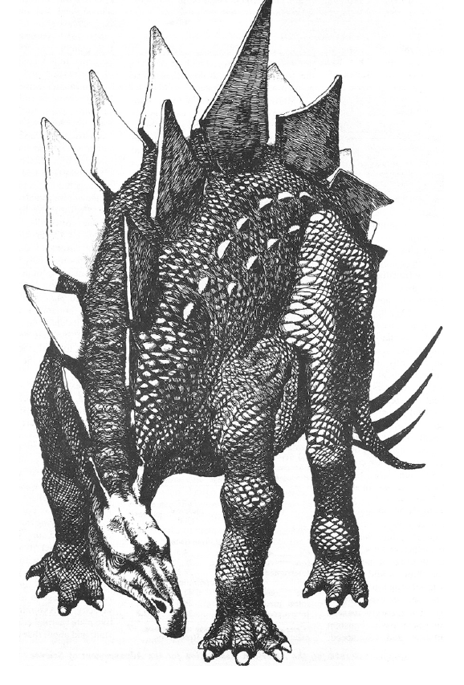
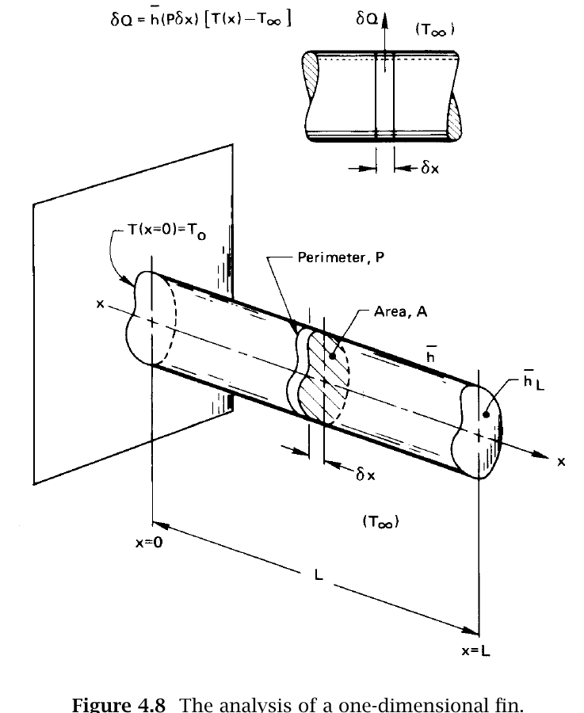

# Fin Design: From A Finite Rod To An Infinite Rod

This reference develops Lienhard and Lienhard Section 4.5, textbook
pp. 163-173. It collects Eqs. (4.27)-(4.51) in one place so you can follow the
logic from a physical fin to the finite-length and infinite-length rod models
used in Module 8.

## How To Use This Reference

Read this page alongside Lienhard Section 4.5 for A4. The Module 8 workload
budget includes **150 minutes total** for reading the module, the textbook
section, and this guide. This page is not a separate submission and should not
be copied into another report.

Annotate the derivation with three questions in mind:

1. Which term comes from Fourier conduction along the rod?
2. Which term comes from Newton cooling through the rod's side?
3. Which boundary condition distinguishes the finite insulated-tip solution
   from the semi-infinite solution?

## What A Fin Does

A fin conducts heat along a solid while exchanging heat with the surrounding
fluid through its surface. Increasing surface area can greatly increase heat
transfer.

*Examples used in the historical Phys 39 course: extended metal surfaces
increase the area available for heat transfer.*

*Lienhard and Lienhard, Fig. 4.7, textbook p. 165: a speculative biological
example of cooling fins.*

## Geometry And The One-Dimensional Assumption

*Lienhard and Lienhard, Fig. 4.8, textbook p. 166: a fin of length \(L\),
cross-sectional area \(A\), perimeter \(P\), conductivity \(k\), side
coefficient \(h\), and tip coefficient \(h_L\).*

The transverse Biot number must be small:

\[
\mathrm{Bi}_{\mathrm{fin}}
=\frac{h(A/P)}{k}\ll1.
\tag{4.27}
\]

For a circular rod, \(A/P=R/2\). This criterion allows us to use one
cross-sectional temperature \(T(x)\).

## Energy Balance And Differential Equation

An energy balance on a slice of width \(\delta x\) is

\[
-kA\left.\frac{dT}{dx}\right|_{x+\delta x}
+kA\left.\frac{dT}{dx}\right|_x
+hP\delta x\,[T(x)-T_\infty]=0.
\tag{4.28}
\]

As \(\delta x\rightarrow0\),

\[
\frac{
\left.dT/dx\right|_{x+\delta x}
-\left.dT/dx\right|_x
}{\delta x}
\rightarrow
\frac{d^2T}{dx^2}
=\frac{d^2(T-T_\infty)}{dx^2}.
\tag{4.29}
\]

Therefore,

\[
\frac{d^2(T-T_\infty)}{dx^2}
=\frac{hP}{kA}(T-T_\infty).
\tag{4.30}
\]

For a convecting tip,

\[
(T-T_\infty)_{x=0}=T_0-T_\infty,
\qquad
-kA\left.\frac{d(T-T_\infty)}{dx}\right|_{x=L}
=h_LA(T-T_\infty)_{x=L}.
\tag{4.31a}
\]

For an insulated tip,

\[
(T-T_\infty)_{x=0}=T_0-T_\infty,
\qquad
\left.\frac{d(T-T_\infty)}{dx}\right|_{x=L}=0.
\tag{4.31b}
\]

## Dimensional Form

The dimensional functional relation is

\[
T-T_\infty
=\operatorname{fn}(T_0-T_\infty,x,L,kA,hP,h_LA).
\tag{4.32}
\]

Define

\[
\Theta=\frac{T-T_\infty}{T_0-T_\infty},
\qquad
\xi=\frac{x}{L},
\qquad
m=\sqrt{\frac{hP}{kA}},
\qquad
\mathrm{Bi}_{\mathrm{axial}}=\frac{h_LL}{k}.
\]

Then a convecting-tip fin has

\[
\Theta=\operatorname{fn}
\left(\xi,mL,\mathrm{Bi}_{\mathrm{axial}}\right),
\tag{4.33a}
\]

whereas an adiabatic-tip fin has

\[
\Theta=\operatorname{fn}(\xi,mL).
\tag{4.33b}
\]

The differential equation becomes

\[
\frac{d^2\Theta}{d\xi^2}=(mL)^2\Theta.
\tag{4.34}
\]

Its general solution is

\[
\Theta=C_1e^{mL\xi}+C_2e^{-mL\xi}.
\tag{4.35}
\]

## Finite Rod With An Insulated Tip

The dimensionless boundary conditions are

\[
\Theta(0)=1,
\qquad
\left.\frac{d\Theta}{d\xi}\right|_{\xi=1}=0.
\tag{4.36}
\]

Substitution into the general solution gives

\[
C_1+C_2=1,
\qquad
C_1e^{mL}-C_2e^{-mL}=0.
\tag{4.37}
\]

The hyperbolic functions used to simplify the result are

\[
\begin{aligned}
\sinh z&=\frac{e^z-e^{-z}}{2},&
\cosh z&=\frac{e^z+e^{-z}}{2},\\
\tanh z&=\frac{\sinh z}{\cosh z},&
\coth z&=\frac{\cosh z}{\sinh z}.
\end{aligned}
\tag{4.38}
\]

Their needed derivatives are

\[
\frac{d}{dz}\sinh z=\cosh z,
\qquad
\frac{d}{dz}\cosh z=\sinh z.
\tag{4.39}
\]

The constants are

\[
C_1=\frac{e^{-mL}}{2\cosh(mL)},
\qquad
C_2=1-\frac{e^{-mL}}{2\cosh(mL)}.
\tag{4.40}
\]

The finite insulated-tip temperature distribution is

\[
\Theta(\xi)
=\frac{\cosh[mL(1-\xi)]}{\cosh(mL)}
=\frac{\cosh[m(L-x)]}{\cosh(mL)}.
\tag{4.41}
\]

The heat-transfer rate at the base is

\[
\dot Q_0
=-kA\left.\frac{d(T-T_\infty)}{dx}\right|_{x=0}.
\tag{4.42}
\]

Thus,

\[
\frac{\dot Q_0L}{kA(T_0-T_\infty)}
=mL\frac{\sinh(mL)}{\cosh(mL)}
=mL\tanh(mL),
\tag{4.43}
\]

or

\[
\frac{\dot Q_0}
{\sqrt{kAhP}\,(T_0-T_\infty)}
=\tanh(mL).
\tag{4.44}
\]

At the tip,

\[
\Theta_{\mathrm{tip}}=\frac{1}{\cosh(mL)}.
\tag{4.45}
\]

## Exact Convecting-Tip Solution

The dimensionless boundary conditions become

\[
\Theta(0)=1,
\qquad
-\left.\frac{d\Theta}{d\xi}\right|_{\xi=1}
=\mathrm{Bi}_{\mathrm{axial}}\Theta(1).
\tag{4.46}
\]

Substitution into the general solution gives

\[
\begin{aligned}
C_1+C_2&=1,\\
-mL(C_1e^{mL}-C_2e^{-mL})
&=\mathrm{Bi}_{\mathrm{axial}}
(C_1e^{mL}+C_2e^{-mL}).
\end{aligned}
\tag{4.47}
\]

The exact temperature distribution is

\[
\Theta(\xi)
=
\frac{
\cosh[mL(1-\xi)]
+(\mathrm{Bi}_{\mathrm{axial}}/mL)\sinh[mL(1-\xi)]
}{
\cosh(mL)
+(\mathrm{Bi}_{\mathrm{axial}}/mL)\sinh(mL)
}.
\tag{4.48}
\]

The corresponding base heat rate is

\[
\frac{\dot Q_0}
{\sqrt{kAhP}\,(T_0-T_\infty)}
=
\frac{
(\mathrm{Bi}_{\mathrm{axial}}/mL)+\tanh(mL)
}{
1+(\mathrm{Bi}_{\mathrm{axial}}/mL)\tanh(mL)
}.
\tag{4.49}
\]

## Infinite-Rod Limit

When \(mL\gg1\), the finite solution approaches

\[
\lim_{mL\rightarrow\infty}\Theta
=e^{-mL\xi}
=e^{-mx}.
\tag{4.50}
\]

The base heat rate becomes

\[
\dot Q_0=\sqrt{kAhP}\,(T_0-T_\infty).
\tag{4.51}
\]

Lienhard recommends \(mL\gtrsim5\) when using the infinite-fin approximation
for temperature and \(mL\gtrsim3\) when using it for the base heat rate. In
Module 8 you will calculate the actual finite-versus-infinite error at every
sensor rather than relying only on these general thresholds.

## What To Be Able To Explain

1. Why does Eq. (4.27) concern the **radius**, whereas \(mL\) concerns the
   **length**?
2. Which term in Eq. (4.28) represents side heat loss?
3. What physical assumption changes Eq. (4.31a) into Eq. (4.31b)?
4. How does Eq. (4.41) retain information about the far end?
5. Why is Eq. (4.50) an approximation rather than a new physical law?
6. Starting from Eq. (4.28), derive Eq. (4.30) and check every term's units.
7. Starting from the general solution, use the base and insulated-tip boundary
   conditions to obtain Eq. (4.41).
8. Show mathematically how Eq. (4.41) approaches Eq. (4.50) when the far end
   becomes irrelevant.

These are assessed in the [A4 written derivation](../lab-08/index.md#a4-finite-length-and-small-biot-guided-study)
and may be sampled in the C5 oral check. Understanding the derivation matters
more than reproducing a long sequence of algebra from memory.
