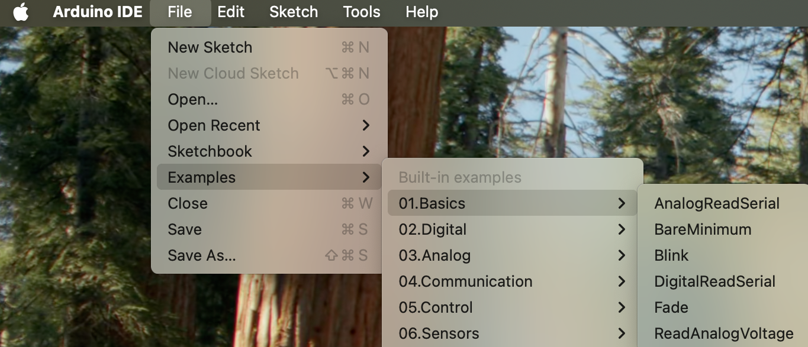

# Lab 1 Assignment: First Contact With The Instrument

## Introductory Material

### Purpose

In the first class you will meet the temperature-control instrument that we will build toward during the semester. It uses an Arduino, a thermistor, a thermoelectric cooler, an H-bridge driver, a power supply, a heat exchanger, an oscilloscope, and laptop software. If you haven't already, read the course<strong> </strong><a href="https://sethfraden.github.io/Phys39F26-course/">Overview</a>.

Before class, your job is to arrive ready to connect to an Arduino, upload a simple program, and think clearly about safety.

### Vocabulary

- **Arduino Uno**: the microcontroller board that reads voltages and sends control signals.
- **Serial Monitor**: the Arduino IDE window that shows text sent from the Arduino to the laptop.
- **Digital output**: a pin that the Arduino can set near 0 V or 5 V.
- **Oscilloscope**: an instrument that displays voltage versus time.
- **Thermistor**: a resistor whose resistance changes with temperature.
- **TEC/Peltier element**: a bidirectional thermal actuator. It can heat one side and cool the other depending on current direction.
- **H-bridge**: an electronic circuit that lets the low-power Arduino control the amount and direction of current from a high-power supply through a load.
- **PWM**: pulse-width modulation, a way to control average power using fast on/off switching.

### Safety Boundary For Lab 1

In Lab 1, the Arduino is powered by USB. The TEC power supply stays off.

You may inspect the TEC, H-bridge, heat exchanger, thermistor, and safety cutoff, but you will not power the TEC during the first lab. This is deliberate. The course begins by verifying the measurement and communication chain before applying actuator power.

## Pre-Class Assignment

### Before Class

Complete these steps before the first meeting.

1. Install the Arduino IDE on the laptop you plan to use in lab, if possible.
2. Bring a USB cable or adapter that can connect your laptop to an Arduino Uno.
3. Read this assignment and write down any question that feels basic or confusing.
4. Skim the vocabulary list below.

If you cannot install software before class, come anyway. We will handle setup in lab.

### Pre-Class Questions

Write short answers before class. These are not meant to be polished.

1. What is the difference between a sensor and an actuator?
2. Why should the TEC power supply remain off while we are only testing Arduino upload and serial communication?
3. What do you expect an Arduino digital output to look like on an oscilloscope?
4. If software says "toggle every 500 ms," what period and frequency would you expect to measure?

### Bring To Class

- Laptop, if you have one.
- Lab notebook or note-taking device.
- Questions.

## In-Class Assignment

### What You Will Do

You will:

- Identify the instrument's sensor, actuator, controller, power stage, thermal load, and safety cutoff.
- Upload Arduino sketches from the Arduino IDE.
- Open Serial Monitor and read heartbeat messages from the Arduino.
- Probe an Arduino digital output with an oscilloscope.
- Measure voltage levels, timing, and PWM duty cycle.
- Read a potentiometer voltage with `analogRead`.
- Average analog readings and use the averaged value to control LED brightness.
- Compare the measured signals to the code that generated them.

### Programming Task 

- Read the introduction to <a href="https://docs.arduino.cc/learn/starting-guide/whats-arduino?queryID=b6c1b642087e54fac19b7471a69050cb&_gl=1*iny9um*_ga*MTQ1Nzk0MDE2MS4xNjg0ODU0NzQ5*_ga_NEXN8H46L5*MTY4NTIxODMyOC40LjAuMTY4NTIxODMyOC4wLjAuMA..">arduino</a>. 

- Read the section on <a href="https://sethfraden.github.io/Phys39F26-course/hardware/">Hardware for temperature control</a> (there are no exercises here). It contains a description of the setup with links to details about the components.  

- The bulk of the first lab is next. Do the <a href="https://sethfraden.github.io/Phys39F26-course/arduino/">intro to arduino assignment</a>. 
 It consists of the following steps:
<ol>
  <li>Run the official Blink sketch using the built-in LED and then an external LED with a current-limiting resistor.</li>
  <li>Modify Blink so the duty cycle is 1:1, 10:1, and 1:10. Measure the digital output with the oscilloscope.</li>
  <li>Run the official AnalogReadSerial sketch with a potentiometer wired as a 0-5 V voltage divider. View the result in Serial Monitor and Serial Plotter.</li>
  <li>Modify the analog-reading sketch so it averages 1000 readings before printing. Compare the averaged readings with the unaveraged readings.</li>
  <li>Modify the averaged analog-reading sketch into an LED-brightness sketch: potentiometer voltage to averaged analog number to PWM output to LED brightness. Measure the PWM output with the oscilloscope.</li>
</ol>

The H-bridge and TEC remain inspection-only today. We will use the H-bridge in
a later actuator lab after everyone has measured PWM directly and can explain
what `analogWrite` is doing.

 <!-- In class,

- Launch Arduino IDE
- From the examples section, run Blink.ino

- Change the duty cycle from the default 1:1 to 10:1 and to 1:10. Did it work?
- Now run another example, AnalogReadSerial.ino
- Wire up the trim pot as instructed. View the results on the Serial Monitor and Serial Plotter. Slow down the time intervals between measurements to something sensible. Rotate the trim pot and see if the graphical plot makes sense. What range of voltage do you input into the analog pin from the trim pot? What range of numbers does the Arduino analog read report back to you as you vary voltage?
- Add averaging to the analog-reading sketch.
- Use the averaged analog reading to set PWM on an LED.
- Measure the PWM output with the oscilloscope and compare the waveform to the LED brightness.

You should expect to revise the sketch after the first upload. Debugging board selection, port selection, baud rate, and timing is part of the lab. -->

## Post-Class Assignment

### What To Submit

Submit a short lab note containing:

- A labeled photo or sketch of the apparatus.
- The Arduino board and serial port you used.
- The Arduino sketch you wrote.
- Three lines copied from Serial Monitor.
- An oscilloscope screenshot or hand sketch of the Blink waveform.
- An oscilloscope screenshot or hand sketch of the PWM waveform.
- A small table with `V_low`, `V_high`, period, frequency, and duty cycle.
- A paragraph answering: What did the oscilloscope show that the Serial Monitor and Serial Plotter did not?
