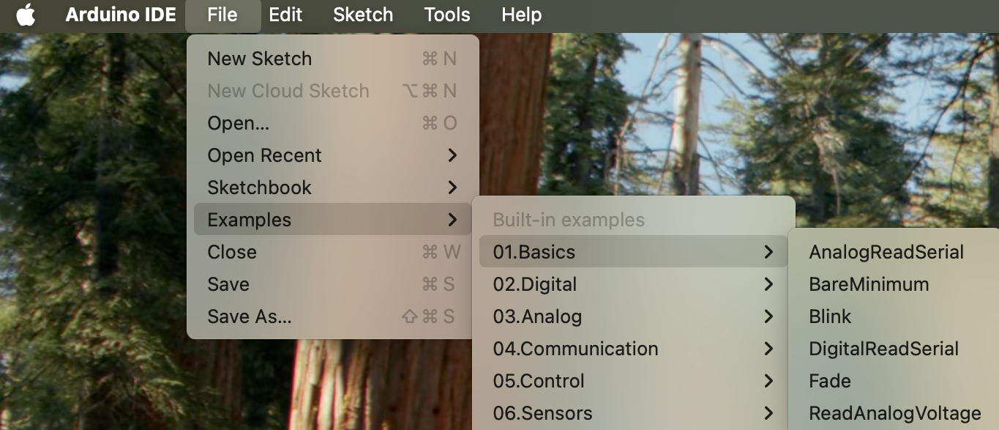
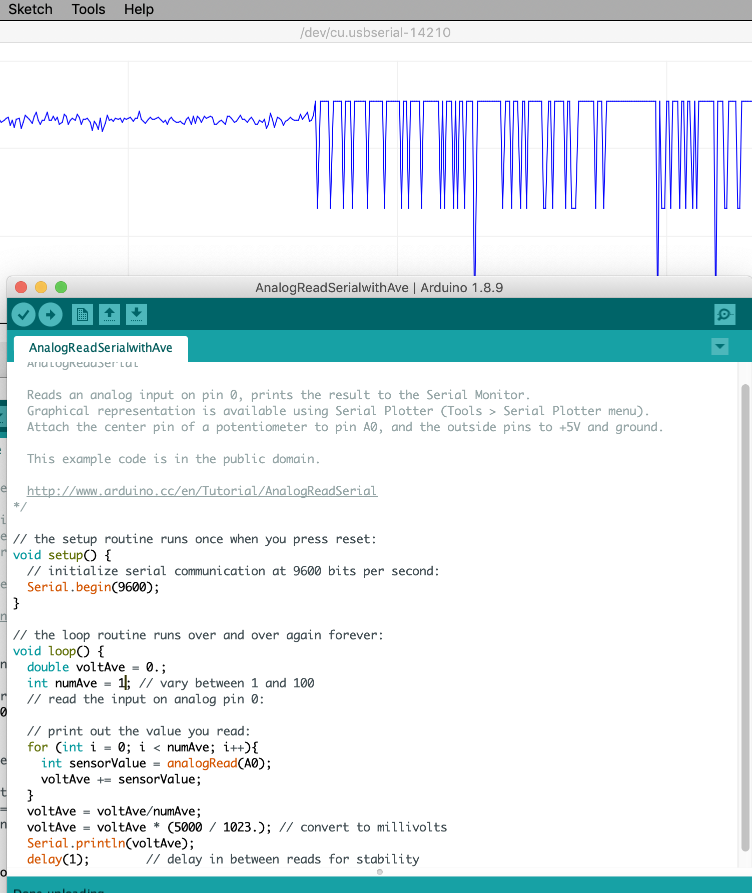

# Module 1 Assignment: First Contact With The Instrument

## Introductory Material

### Purpose

In Module 1 you will meet the temperature-control instrument that we will build toward during the semester. It uses an Arduino, a thermistor, a thermoelectric cooler, an H-bridge driver, a power supply, a heat exchanger, an oscilloscope, and laptop software. If you haven't already, read the course<strong> </strong><a href="https://sethfraden.github.io/Phys39F26-course/">Overview</a>.

Before class, your job is to arrive ready to connect to an Arduino, upload a simple program, and think clearly about safety.

### Vocabulary

- **Arduino Uno**: the microcontroller board that reads voltages and sends control signals.
- **Serial Monitor**: the Arduino IDE window that shows text sent from the Arduino to the laptop.
- **Digital output**: a pin that the Arduino can set near 0 V or 5 V.
- **Oscilloscope**: an instrument that displays voltage versus time.
- **Thermistor**: a resistor whose resistance changes with temperature.
- **TEC/Peltier element**: a bidirectional thermal actuator. It can heat one side and cool the other depending on current direction.
- **H-bridge**: an electronic circuit that lets the low-power Arduino control the amount and direction of current from a high-power supply through a load.
- **PWM**: pulse-width modulation, a way to control average power using fast on/off switching.

### Safety Boundary For Module 1

In Module 1, the Arduino is powered by USB. The TEC power supply stays off.

You may inspect the TEC, H-bridge, heat exchanger, thermistor, and safety cutoff, but you will not power the TEC during Module 1. This is deliberate. The course begins by verifying the measurement and communication chain before applying actuator power.

## Pre-Class Assignment

### Before Class

Complete these steps before Module 1.

1. Install the Arduino IDE on the laptop you plan to use in lab, if possible.
2. Read this assignment and write down any question that feels basic or confusing.
3. Skim the vocabulary list below.

If you cannot install software before class, come anyway. We will handle setup in lab.

### Pre-Class Questions

Write short answers before class. These are not meant to be polished.

1. What is the difference between a sensor and an actuator?
2. Why should the TEC power supply remain off while we are only testing Arduino upload and serial communication?
3. What do you expect an Arduino digital output to look like on an oscilloscope?
4. If software says "toggle every 500 ms," what period and frequency would you expect to measure?

### Bring To Class

- Laptop, if you have one.
- Lab notebook or note-taking device.
- Questions.

### Outside-Class Workload Budget For S2

| Work | Planned time |
| --- | ---: |
| Read this module assignment | 20 minutes |
| Read the linked Arduino and hardware introductions | 35 minutes |
| Answer the pre-class questions | 20 minutes |
| Assemble and submit A1 after the in-class evidence is complete | 90-120 minutes |
| **Total outside class associated with S2** | **2 hours 45 minutes-3 hours 15 minutes** |

The four-hour course limit is a maximum, not a target. Ask for help rather than
silently exceeding it because of installation or access problems.

## In-Class Assignment

### What You Will Do

You will:

- Identify the instrument's sensor, actuator, controller, power stage, thermal load, and safety cutoff.
- Upload Arduino sketches from the Arduino IDE.
- Open Serial Monitor and read heartbeat messages from the Arduino.
- Probe an Arduino digital output with an oscilloscope.
- Measure voltage levels, timing, and PWM duty cycle.
- Read a potentiometer voltage with `analogRead`.
- Quantify potentiometer-signal variation and test how averaging changes it.
- Use an averaged analog reading to control LED brightness.
- Compare the measured signals to the code that generated them.

### Get Oriented

Spend 5-10 minutes reading Arduino's introduction, [What is
Arduino?](https://docs.arduino.cc/learn/starting-guide/whats-arduino), and
another 5-10 minutes reviewing [Hardware for temperature
control](../../hardware.md). The hardware page describes the course apparatus
and links to details about its components; there are no exercises on that page.

The Arduino IDE includes permanent example sketches that are worth learning
because you can find them again after this course. Open them from:

```text
File -> Examples
```

The [official built-in examples](https://docs.arduino.cc/built-in-examples/)
provide another permanent reference.



### Part 1: Blink And Digital Output

Do the official Arduino [Blink
tutorial](https://docs.arduino.cc/built-in-examples/basics/Blink/) using both
the built-in LED and an external LED. The external LED must be current limited,
so place a resistor between 200 $\Omega$ and 4000 $\Omega$ in series with the
LED. Follow the schematic in the tutorial.

Change the HIGH:LOW time ratio from 1:1 to 10:1 and then 1:10. Play with the
on and off times.

### Part 2: AnalogReadSerial

Do the official Arduino [AnalogReadSerial
tutorial](https://docs.arduino.cc/built-in-examples/basics/AnalogReadSerial/).
Use a 100 kΩ potentiometer as a voltage divider that supplies 0-5 V to the analog
input. Connect one outer terminal to
Arduino `5V`, the other outer terminal to Arduino `GND`, and the center wiper to
`A0`. If you feel the need to bend the legs of the pot, something is wrong! View the readings with both **Serial Monitor** and **Serial Plotter**
from the Arduino IDE **Tools** menu. Slow the interval between reports to a
sensible rate.

Rotate the potentiometer and confirm that the reported ADC number responds.
Part 3 develops this observation into a quantitative measurement of ADC
digitization and averaging.

Read [Analog, ADC, And PWM](../../arduino/analog-digital.md) for explanations of how analog to digital conversion works.

### Part 3: Quantify The Power Of Averaging

Continue using the 100 kΩ potentiometer as a voltage divider.

#### 3A: Observe The Integer ADC Readings

Starting from `AnalogReadSerial`, write a sketch that continuously reads `A0`
and prints the result as an **integer**. Display the same stream in both Serial
Monitor and Serial Plotter. Use a single labeled quantity that Serial Plotter
recognizes, such as

```text
ADC:512
```

Turn the potentiometer carefully to both ends of its range. Record the minimum
and maximum ADC values that you can obtain. Then set the potentiometer close to
the midpoint of the measured range,

\[
n_{\mathrm{mid}}=\frac{n_{\mathrm{min}}+n_{\mathrm{max}}}{2},
\]

and leave it untouched for the remaining measurements.

Hold the potentiometer fixed at approximately the midpoint and observe the output. Then choose
at least one substantially different setting and repeat. Describe and explain
what you see in both displays. In particular:

1. Do the reported values vary even when you do not touch the potentiometer?
2. Do the values change continuously, or do they occupy discrete integer
   levels? Why?
3. What does Serial Monitor reveal that is difficult to see in Serial Plotter,
   and vice versa?

**Checkpoint**: Call the instructor over at this point and show him what you see on the Serial Plotter.


#### 3B: Convert ADC Number To Voltage

Modify your code so that it converts each ADC number \(n\) to voltage and
prints the voltage continuously:

\[
V \approx V_{\mathrm{ref}}\frac{n}{1023}.
\]

Use the measured reference voltage if you have measured it; otherwise use the
nominal value \(V_{\mathrm{ref}}=5.00\ \mathrm{V}\). The Arduino Uno has a
10-bit ADC, so it divides the input range into \(2^{10}=1024\) levels. Its
nominal one-count voltage resolution is

\[
\Delta V_{\mathrm{ADC}}=\frac{V_{\mathrm{ref}}}{2^{10}}.
\]

Calculate this resolution in millivolts. For a 5.00 V reference it is about
4.88 mV. Explain why printing many decimal places does not, by itself, give the
ADC finer physical resolution.

#### 3C: Compare One Reading With A 1000-Reading Average

Rewrite the voltage sketch so that it repeatedly produces:

1. **100 sequential voltage values**, each obtained from one reading of `A0`.
2. **100 sequential voltage values**, each obtained by averaging 1000 readings of `A0`.
3. Return to step 1 and repeat forever.

Keep the potentiometer fixed. Print only one plotted voltage quantity per line. In Serial
Monitor, also identify the point number and whether it came from \(N=1\) or
\(N=1000\), without creating additional plotted curves.

For example, the output may look like this:

```text
Ave1000_Point_1 Voltage_V:2.4561
Ave1000_Point_2 Voltage_V:2.4564
Ave1_Point_1 Voltage_V:2.4570
```

Serial Monitor displays each complete line. Serial Plotter treats each newline
as a new plotted point and needs only **one numeric quantity per line** for this
experiment. It ignores unrecognized text such as `Ave1000_Point_1`, while the
stable `Voltage_V:number` field supplies the one number to plot. Keep the field
name `Voltage_V` the same for both averaging modes; using different numeric
field names would make Serial Plotter create separate curves.

Open Serial Plotter and wait until it contains both kinds of data. Stop the
plotter when the transition between an unaveraged block and a 1000-reading
average block is approximately halfway across the graph, as in the figure
below. Your numerical values and detailed trace need not look identical to the
example. Save this screenshot and the corresponding numerical output.

**Checkpoint**: Call your instructor over to show him plots of the data for the averaged and non-averaged signal on the Serial Plotter.



**(a)** For each 100-point block, calculate the mean voltage and sample standard
deviation \(s\). In this exercise, use \(s\) as an empirical estimate of the
noise-limited voltage resolution of the reported value. Compare the measured
ratio \(s_{1000}/s_1\) with the independent-noise prediction

\[
s_{1000} \approx \frac{s_1}{\sqrt{1000}}
              \approx 0.0316s_1.
\]

**(b)** A second way to measure the effective resolution in millivolts for the unaveraged and averaged
blocks is by looking at the smallest discrete voltage jump between two subsequent data points. Compare the unaveraged smallest discrete voltage jump between two subsequent data points with  the ADC's fixed one-count
digitization step \(\Delta V_{\mathrm{ADC}}\).

Each individual conversion is
still a 10-bit measurement, but averaging can produce a result with additional
**effective bits of precision** when the input is stable and independent noise
causes the readings to sample neighboring ADC codes.

The improvement in precision is approximately \(\sqrt{N}\). Therefore, the
number of effective bits gained by averaging \(N\) independent measurements is

\[
b_{\mathrm{gained}}
  = \log_2\!\left(\sqrt{N}\right)
  = \frac{1}{2}\log_2 N.
\]

Equivalently, averaging \(2^m\) independent measurements ideally provides
\(m/2\) additional binary digits, or bits, of precision. Because
\(1000\approx 2^{10}\) and \(\sqrt{1000}\approx 32=2^5\), averaging 1000
readings can ideally add about **five effective bits of precision** to the
estimated voltage.

This gain requires the underlying voltage to remain essentially constant over
the averaging interval and the measurement fluctuations to be sufficiently
independent. Explain likely departures from the \(1/\sqrt{N}\) prediction,
including drift, correlated pickup, quantization, and variation of the Arduino
reference voltage. Averaging improves precision under these conditions, but it
does not automatically improve absolute accuracy or remove calibration errors.

#### 3D: Measure The Time Cost Of Averaging

Use `micros()` immediately before and after the loop that acquires 1000
readings. Record the elapsed time in microseconds, calculate the corresponding
number of `analogRead()` conversions per second, and compare your result with
the Arduino reference value of roughly \(100\ \mu\mathrm{s}\) per conversion.
At that rate, 1000 readings alone should require roughly 0.10 s, before any
additional calculation or Serial output time.

Explain the tradeoff. Averaging over a finite interval acts as a low-pass
filter: rapid fluctuations tend to cancel, but changes occurring during the
averaging window are smoothed or delayed. Improved voltage precision therefore
comes with reduced time resolution.

**Checkpoint**: Call your instructor over and explain this to him.

### Part 4: LED Brightness From Averaged Analog Input

Return the potentiometer to the analog input. Modify your Arduino code to use
the averaged potentiometer voltage to set the brightness of an LED with PWM.

The signal chain is:

```text
pot voltage -> averaged ADC number -> voltage -> map to PWM -> analogWrite -> oscilloscope -> LED brightness
```

Start by printing the averaged voltage and PWM value to Serial Monitor so you
can see what the code is doing. Then measure the PWM output pin with the
oscilloscope while you turn the potentiometer. What is the period, amplitude and duty-cycle of the PWM as a function of voltage? The [Analog, ADC, And
PWM](../../arduino/analog-digital.md#7-rc-filtering-and-pwm) reference explains
why PWM is a switching waveform rather than a continuously variable voltage.
Finally, connect the PWM pin to an LED with an appropriate series resistor and
confirm that the LED brightness follows the potentiometer.

Record the PWM high and low voltages, period, frequency, and duty cycle at two
substantially different potentiometer settings. Determine which quantities
change and which remain approximately fixed. If you use Arduino Uno pin 9,
compare the measured frequency with the expected value of approximately 490
Hz. Compare this with the roughly 50-60 Hz range above which ordinary flicker
often appears steady to the eye. Explain why the LED looks continuously lit
even though the oscilloscope resolves individual pulses.

**Checkpoint**: Call your instructor over and show him the PWM traces as you vary the potentiometer.

You should expect to revise your sketches after the first upload. Debugging
board selection, port selection, baud rate, wiring, and timing is part of the
lab.

### C1 In-Class Assessment

There will be a short graded assessment of Module 1 during **Session S4,
Wednesday, September 9**. Each student must submit a text response to the
Moodle `C1 Team Checkoff` activity by **5:00 PM on September 9**. The text may
be identical for both members of a team because it documents shared repository
evidence, but each student must make a separate Moodle submission.

The text response must give both team members' names, the team repository URL,
the full Git commit hash demonstrated during the checkoff, and the paths to the
project `README.md` and principal Arduino sketch or sketches.

Before the checkoff:

1. Follow the [team-repository setup](../../git-vscode-ai-workflow.md#receive-and-clone-your-team-repository)
   and [GitHub Desktop checkpoint](../../git-vscode-ai-workflow.md#github-desktop-checkpoint-workflow)
   instructions.
2. Put the Module 1 sketches in an organized folder in the team repository.
3. Update the project `README.md` to identify the sketches and measurements
   that were tested.
4. Make a meaningful commit and push it to GitHub.
5. Be ready to locate the files and commit in VS Code and GitHub Desktop and to
   demonstrate one uploaded sketch.
6. In GitHub Desktop, open the repository's **History**, locate the current and
   preceding commits, and inspect what changed in one file. You do not need to
   revert a commit during the checkoff.

#### C1 Rubric

| Criterion | Points |
| --- | ---: |
| Arduino IDE, VS Code, and GitHub workflow operate; a modified sketch uploads and runs | 4 |
| Organized folder and short README identify what was tested | 2 |
| Meaningful commit is pushed and can be located | 1 |
| Individual explains files, upload, commit, and push | 1 |
| Individual explains ADC resolution, averaging, acquisition time, or the measured PWM waveform | 1 |
| Complete by the deadline | 1 |

#### C1 Oral Questions

Each student will answer one workflow question from Questions 1-3 and one
measurement question from Questions 4-8. Be prepared to answer without asking
an AI agent during the checkoff.

1. Show where the Arduino sketch is stored. What did you change, and how can
   you tell the uploaded board is running that version?
2. What is the difference between saving a file, committing it, and pushing it?
3. Starting from the cited commit, use the repository history to locate and
   inspect the preceding committed version of one file. What protection does
   this history provide when a later edit goes wrong?
4. A 10-bit ADC uses a 5.00 V reference. How many output codes are possible,
   what are the minimum and maximum codes, and what voltage is represented by
   one ADC count?
5. Why can averaging independent readings improve voltage precision? Derive
   the number of effective bits gained from \(N\) readings, and estimate the
   gain for \(N=1000\). State the assumptions required for this result.
6. Approximately how fast can an Arduino Uno acquire standard `analogRead()`
   measurements, and how long should 1000 readings take? How would you measure
   the actual time with `micros()`? Explain why averaging over this interval
   acts as a low-pass filter and identify the cost in time resolution. The
   official Arduino [`analogRead()`
   reference](https://docs.arduino.cc/language-reference/en/functions/analog-io/analogRead/)
   gives the approximate conversion time.
7. Point to the LED PWM waveform on the oscilloscope. Measure its period and
   calculate its frequency. What are its high and low voltages and duty cycle?
   Which of these quantities changes when you turn the potentiometer? If you
   used Arduino Uno pin 9, compare your measurement with the expected PWM
   frequency of approximately 490 Hz.
8. Roughly how rapidly can the human eye follow an LED turning on and off
   before the flashes appear to merge into steady light? Compare the typical
   50-60 Hz flicker-fusion range with your measured PWM frequency. Why does the
   LED appear steady even though the oscilloscope shows that it repeatedly
   switches on and off? Explain why the visual threshold is not one universal
   frequency but depends on brightness, contrast, and viewing conditions.

### Collect Your A1 Evidence During Class

The post-class assignment is expected to take **90-120 minutes**. To stay near
the lower end of that range, collect and save all measurements, code, and
images while you still have the Arduino and oscilloscope in front of you.

Before leaving class, complete this checklist. If an item cannot be completed,
show the instructor what is missing before you leave.

- [ ] Save a labeled photograph or quick sketch of the apparatus.
- [ ] Save all Arduino code used to complete the activities and produce the
  submitted measurements. You may organize the work into as many or as few
  sketches as you find useful.
- [ ] Record the minimum, maximum, and selected midrange ADC values.
- [ ] Save a Serial Plotter screenshot with the transition between the 100-point
  \(N=1\) and \(N=1000\) voltage blocks near the center of the graph.
- [ ] Save a Serial Plotter screenshot with only the \(N=1000\) voltage block so you can estimate the miniumun discrete voltage jump.
- [ ] Record the measured time for 1000 `analogRead()` conversions and the
  corresponding conversion rate.
- [ ] Save an oscilloscope screenshot or clear hand sketch of the LED PWM
  waveform.
- [ ] Record the high and low voltages, period, frequency, and duty cycle for
  the three Blink timing ratios and for two LED-PWM settings.
- [ ] Fill in the averaging table below.
- [ ] Write two or three bullet points about what the oscilloscope revealed that
  the serial displays did not.


| Potentiometer block | Reported points | Readings averaged per point \(N\) | Mean voltage | Sample standard deviation \(s\) | \(s/s_1\) measured | \(s/s_1\) predicted |
| --- | ---: | ---: | ---: | ---: | ---: | ---: |
| Unaveraged | 100 | 1 |  |  mV | 1.000 | 1.000 |
| Long average | 100 | 1000 |  |  mV |  | 0.0316 |

This is the only required table. Report the oscilloscope measurements in a
concise labeled list or in prose. Include units with every measured quantity.
Calculate

$$
f=\frac{1}{T},
\qquad
D=100\%\frac{t_{\mathrm{HIGH}}}{T}.
$$

For Arduino PWM, the expected duty cycle is approximately

$$
D_{\mathrm{expected}}=100\%\frac{\texttt{analogWrite value}}{255}.
$$


## Post-Class Assignment

### A1: Module 1 Evidence Note

- **Assessment code:** `A1`, graded team assignment, 5 points
- **Due:** Monday, September 14, at **5:00 PM**
- **Repository file:** `docs/module_notes/module_01_evidence.md`
- **Moodle submission:** Each student uploads `A1_Lastname_Lastname.pdf`;
  teammates may upload the same PDF
- **Expected post-class time:** **90-120 minutes**, provided the in-class
  evidence checklist is complete

`A1` assesses the scientific and technical evidence from Module 1. It is
separate from the [`C1` in-class assessment](#c1-in-class-assessment), which
you will demonstrate during S4.

You will complete the in-class `C1` checkoff before submitting `A1`. Use the
questions and feedback from that checkoff to improve the clarity, organization,
and technical accuracy of your written evidence note.

### Assemble And Submit The Note

After class, complete these steps in order:

1. Create or open `docs/module_notes/module_01_evidence.md`. At the top, give
   the assignment code, team members, date, and repository URL.
2. Add the labeled apparatus photograph or sketch collected in class.
3. Link to every Arduino file used to produce the submitted results. You may
   organize the work into one evolving sketch or several focused sketches; the
   choice is yours. Do not paste pages of Arduino code into the note.
4. Document the ADC digitization results. Include  the measured minimum,
   maximum, and midrange ADC values; the calculated one-count voltage
   resolution in millivolts; and an explanation of why the readings occupy
   discrete levels.
5. Document the averaging results. Include the centered Serial Plotter
   screenshot comparing the 100-point \(N=1\) and \(N=1000\) blocks, the
   \(N=1000\)-only screenshot, the measured minimum discrete voltage jump, and
   the completed averaging table. Compare the measured voltage resolutions
   with the \(1/\sqrt{N}\) prediction. Report the measured time for 1000
   conversions and explain why averaging improves precision while acting as a
   low-pass filter that reduces time resolution.
6. Document the oscilloscope results. Include the LED-PWM oscilloscope image
   or hand sketch and report the requested Blink and PWM high and low voltages,
   period, frequency, and duty cycle with units. Then answer in three to five
   sentences: **What did the oscilloscope show that the Serial Monitor and
   Serial Plotter did not?** Distinguish a direct electrical measurement from
   values chosen and printed by software. Discuss the individual pulses and
   waveform timing; the serial displays show reported samples rather than the
   fast PWM waveform itself.
7. Proofread the complete note. Check that every figure is legible and labeled,
   every measured quantity has units, and every code link opens the exact file
   used for the experiment.
8. Commit the note, sketches, and evidence; push the [Git checkpoint
   (`GC`)](#pushed-git-checkpoint) to GitHub and copy its full commit hash.
9. Export the note as `A1_Lastname_Lastname.pdf`. Confirm that the first page
   gives the team members, repository URL, and full commit hash. Each team
   member must separately submit the PDF to the [`A1` Moodle
   activity](https://moodle.brandeis.edu/course/view.php?id=6589) before the
   deadline. Teammates may upload the same PDF.

<span id="pushed-git-checkpoint"></span>**Pushed Git checkpoint:** Save the current files, create a Git
commit with a meaningful message, and push that commit to GitHub. Record the
repository URL and full commit hash so the submitted version can be located.
This checkpoint, abbreviated `GC`, is not a separate assignment; it preserves
the exact code, evidence, and notes supporting an `A#` or `C#` assessment.

### Post-Class Time Budget

| Task | Target time |
| --- | ---: |
| Organize, caption, and link the in-class evidence | 15-20 minutes |
| Complete the averaging table and timing/PWM calculations | 20-25 minutes |
| Write the ADC, averaging, filtering, and oscilloscope explanations | 25-35 minutes |
| Assemble and proofread the Markdown note | 15-20 minutes |
| Commit, push, export the PDF, and submit to Moodle | 15-20 minutes |
| **Total** | **90-120 minutes** |

### A1 Rubric

| Criterion | Points |
| --- | ---: |
| Labeled apparatus evidence and links to all Arduino code used for the submitted results are complete | 1 |
| ADC minimum, maximum, midrange, one-count voltage resolution, and explanation of discrete levels are correct | 1 |
| Averaging plots and table, discrete voltage jump, \(1/\sqrt{N}\) comparison, acquisition time, and low-pass-filter explanation are complete and correct | 1 |
| PWM oscilloscope evidence, dimensional Blink/PWM measurements, and comparison with the serial displays are complete and credible | 1 |
| The PDF is clear and labeled, uses units, cites the [pushed Git checkpoint](#pushed-git-checkpoint), and is submitted by the deadline | 1 |
