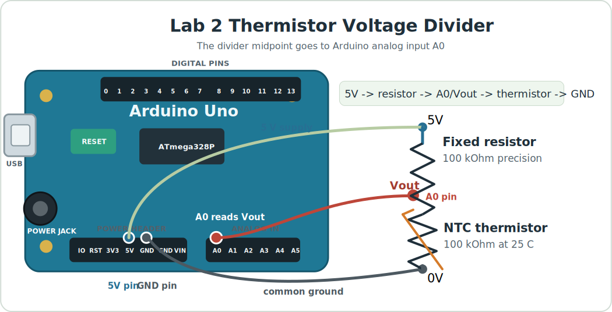
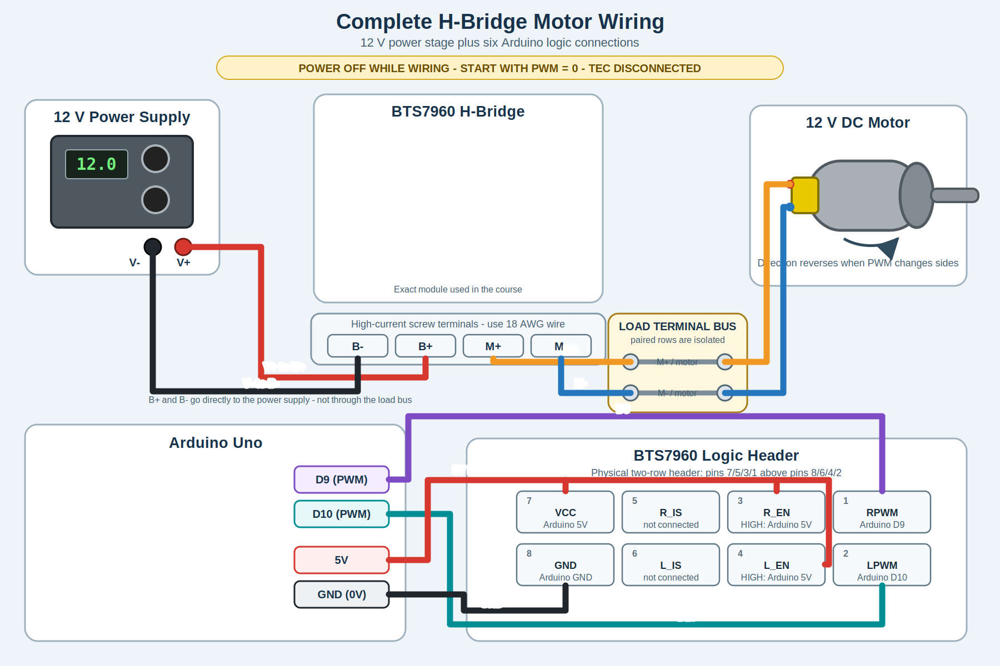

# Lab 2 Assignment: First Real Instrument Pieces

## Purpose

In Lab 1 you used the Arduino for digital output, analog input, averaging, and LED PWM. In Lab 2, you reuse those ideas to begin building a real instrument: thermistor temperature measurement, Arduino Serial Plotter output, and trim-pot-controlled PWM signals for the H-bridge.

The actuator side also begins, but cautiously. You will verify H-bridge logic
and PWM with the oscilloscope before connecting a DC motor. The TEC remains
disconnected throughout Lab 2.

## Theme

**First Real Instrument Pieces**

Thermistor serial data, temperature conversion, Arduino Serial Plotter output,
H-bridge logic/PWM verification, and possibly a low-power DC motor direction
and speed test if the instrument passes the safety checks.

## Safety Boundary

The thermistor circuit is safe to build and test from Arduino USB power.

The TEC remains disconnected throughout Lab 2. External actuator power remains
off until the H-bridge input signals have been checked with the oscilloscope.
For the optional motor test, use low PWM only and stop immediately if the motor,
H-bridge, or wiring becomes unexpectedly warm.

## Before Class

1. Review your [Lab 1 assignment](../lab-01/index.md) notes on `analogRead`,
   averaging, PWM, and oscilloscope duty-cycle measurements.
2. Read the [Arduino Tutorial](../../arduino/index.md) through the LED brightness
   section and review [Analog, ADC, And PWM](../../arduino/analog-digital.md)
   for voltage dividers, ADC counts, averaging, and PWM waveforms. The official
   Arduino references for
   [AnalogReadSerial](https://docs.arduino.cc/built-in-examples/basics/AnalogReadSerial/),
   [analogRead](https://docs.arduino.cc/language-reference/en/functions/analog-io/analogRead/),
   [analogWrite](https://docs.arduino.cc/language-reference/en/functions/analog-io/analogWrite/),
   and [map](https://docs.arduino.cc/language-reference/en/functions/math/map/)
   will also be useful.
3. Read the hardware page sections on the
   [thermistor](../../hardware.md#thermistor),
   [H-bridge](../../hardware.md#h-bridge), and
   [TEC](../../hardware.md#thermoelectric-cooler).
4. Bring the Arduino, thermistor divider parts, trim pot, USB cable, and your
   Lab 1 notes.

## Pre-Class Questions

1. A 100 k$\Omega$ fixed resistor and a 100 k$\Omega$ thermistor form a voltage
   divider, wired as described in Part 1: Thermistor Serial Data (below). What voltage do you expect at 15C, at 25C, and at 35C? You need the thermistor data sheet to answer.
2. Why is a temperature reading more model-dependent than a voltage reading?
3. Describe the H-bridge input signals you expect for each case: PWM = 0, low-power heat, and low-power cool. Which of the two Arduino pins should carry the PWM signal in each case, and what should the other direction pin do?
4. What is one advantage of Arduino Serial Plotter compared with Arduino Serial Monitor?

## What You Will Do

- Build or inspect a thermistor voltage divider.
- Write and upload a thermistor serial sketch.
- Convert ADC counts into voltage, resistance, and temperature.
- Revise the sketch so Arduino Serial Plotter shows temperature versus serial
  read order.
- Use a trim-pot voltage as a manual input that sets PWM.
- Use a separate digital input or switch to choose heat versus cool.
- Verify H-bridge direction and PWM logic on the oscilloscope.
- Test DC motor speed and direction at low PWM only if the instructor approves.

## Part 1: Thermistor Serial Data And Temperature Conversion

Wire the thermistor divider:

- Arduino `5V` to fixed resistor.
- Fixed resistor to Arduino `A0`.
- Arduino `A0` to thermistor.
- Thermistor to Arduino `GND`.



[Open the thermistor-divider diagram full size](../../assets/thermistor_voltage_divider_arduino.svg)

Write a sketch that prints human-readable measurements in Serial Monitor. A good output line looks like this:

```text
time = 1.50 s    average ADC = 511.8    voltage = 2.501 V    resistance = 100.23 kOhm    temperature = 24.9 C    samples = 100
```

Every number should have a label and a unit where appropriate. The goal is for a person looking at Serial Monitor to understand the measurement without memorizing a column order.

From this point forward in the course, every measured temperature must use the
same acquisition sequence: take between **100 and 1000** raw voltage
measurements with `analogRead(A0)`, average those measurements, convert the
average ADC value to one average voltage, and only then calculate thermistor
resistance and temperature. Do not calculate a temperature from each raw ADC
measurement and then average the temperatures.

Write your own sketch for this measurement. You may ask an AI agent for help, but do not simply upload code that you do not understand. You should be able to explain every calculation and every printed value.

### What Your Sketch Should Do

Include these functions in your sketch. Build and test them one at a time.

- Constants at the top describe the circuit and thermistor model: Arduino pin `A0`, the 5 V reference, the 100 kOhm fixed resistor, the 100 kOhm thermistor value at 25 C, the beta value, and a sample count between `100` and `1000`.
- `averageAdcSamples()` reads `A0` between 100 and 1000 times and returns the average ADC value.
- `adcToVoltage()` converts the average ADC value into an average voltage.
- `voltageToResistance()` uses the voltage-divider equation to calculate the thermistor resistance.
- `resistanceToCelsius()` uses the beta model to convert thermistor resistance into temperature.
- `setup()` starts Serial Monitor at `9600` baud and prints a short heading.
- `loop()` waits until it is time for a new report, averages 100 to 1000 raw readings from `A0`, then calculates voltage, resistance, and temperature in that order and prints one labeled line.
- `printHumanReadable()` controls the exact text you see in Serial Monitor. If you want the output to look different, this is the safest first place to edit.


Hold the thermistor firmly between your index finger and thumb to heat it. Slightly moisten the thermistor to cool it. The reported temperature should move slowly and plausibly. If it jumps wildly, check the wiring, ground, and
serial parsing before changing the code.

## Part 2: Serial Plotter Output

Revise the sketch so each serial line contains only one temperature value. For
example:

```text
24.9
25.0
25.2
```

This format is less friendly for a person reading one line, but it is exactly
what Arduino Serial Plotter needs. The plotter will draw temperature versus
serial read order, not temperature versus a time value that you provide. Open
Serial Plotter and confirm that the graph responds when you hold the thermistor
between your fingers or cool it with a slightly moistened finger.

Record:

- the code change you made so each serial line contains only temperature,
- a screenshot or sketch of the Serial Plotter trace,
- whether warming and cooling the thermistor move the plotted temperature in
  the expected direction.

Lab 2 stays inside the Arduino IDE.

## Part 3: Trim Pot To PWM And Heat/Cool Direction

In Lab 1, a trim pot produced a variable voltage and the Arduino converted that voltage to an ADC number. Now use the same idea as a manual control input.

Build code with this signal path:

```text
trim-pot voltage -> analogRead average -> map to PWM -> analogWrite -> H-bridge input
```

Use one analog input for the trim pot, for example `A1`. The analog input has
10-bit resolution and therefore produces numbers from `0` to `1023`. Convert
the averaged trim-pot reading into a PWM output signal. PWM outputs have 8-bit
resolution and therefore values from `0` to `255` are used to control them.

Use a separate digital pin as a heat/cool input, for example pin `11`:

| Direction input | Mode | Arduino pin `9` | Arduino pin `10` |
| --- | --- | --- | --- |
| `5V` | heat / clockwise | PWM | `0V` |
| `0V` | cool / counterclockwise | `0V` | PWM |

This is the logic of H-bridge method 2: the two H-bridge control inputs receive
either the PWM command or `0V`, depending on whether you want to heat or cool.
In the Lab 2 motor demonstration, **heat means clockwise** and **cool means
counterclockwise**.
Read the [H-bridge hardware notes](../../hardware.md#h-bridge) before wiring
the class board.

Keep actuator power off and the TEC disconnected for this part. You are
verifying the command signals, not driving a load yet.

## Part 4: Oscilloscope Checkoff: H-Bridge Command Signals

Do this with actuator power off and the TEC disconnected.

Use the oscilloscope to inspect the Arduino pins that drive the H-bridge. On the
class boards, the PWM pins are expected to be Arduino pins 9 and 10. Verify the
actual board wiring before powering anything.

Check:

- which pin is active in heat/clockwise mode,
- which pin is active in cool/counterclockwise mode,
- whether the inactive side stays off,
- whether the PWM duty cycle matches the commanded value,
- whether Arduino ground and oscilloscope ground are common.


## Optional Stretch Or Instructor Demo: DC Motor Direction And PWM

Only do this after the instructor checks the H-bridge signals. The TEC must
remain disconnected.

Before connecting the TEC in a later lab, use a small motor as the first visible
H-bridge load. The motor makes direction reversal and PWM speed control easy to
observe without immediately applying power to the thermal system.

Complete wiring, including the six Arduino logic connections:



[Open the complete Arduino, H-bridge, power-supply, and motor wiring diagram full size](../../assets/hbridge_motor_arduino_wiring.svg)

Arduino pin `9` connects to `RPWM`, and pin `10` connects to `LPWM`. Connect
`R_EN`, `L_EN`, and logic `VCC` to Arduino `5V`; connect logic `GND` to Arduino
`GND` (0 V). Leave the `R_IS` and `L_IS` current-sense outputs unconnected.

1. Turn off the actuator power supply and disconnect the TEC and thermal switch
   from the H-bridge output.
2. Prepare two 18 AWG stranded motor leads. Strip the insulation carefully and
   tin ends that will be soldered or installed in solder-style terminals.
   Do not put a fully tinned end directly under a screw clamp; use properly
   stripped bare stranded wire or an approved ferrule there.
3. Use two isolated paired positions on the terminal bus to connect the motor
   leads to H-bridge `M+` and `M-`. Each motor lead and its corresponding
   H-bridge lead terminate on the same paired position; do not solder the wires
   together. The power-supply `V+`/`V-` leads connect directly to H-bridge
   `B+`/`B-` and do not go through this bus.
4. Set PWM to zero, have the instructor check the wiring and current limit, and
   then turn on actuator power.
5. Apply a low PWM command in one direction, return to zero, and then apply a
   low PWM command in the other direction. Record the observed motor direction
   and relative speed.
6. Return PWM to zero and turn off actuator power before removing the motor.

Before preparing the leads, review these technique illustrations:

- [Tinning stranded wire: illustrated instructions](https://cei-lab.github.io/ece3400-2017/tutorials/Soldering/Soldering_Tutorial.html#tinning-stranded-wire)
- [How to tin a wire: YouTube demonstration](https://www.youtube.com/watch?v=pRPF4wpXX9Q)

The small motor might not require 18 AWG wire electrically. You are using
18 AWG here to learn the stripping, tinning, and termination skills that the
TEC high-current circuit requires. Do not connect the TEC or thermal switch
during this motor-first exercise.

For the Lab 2 demonstration, the heat command should turn the motor clockwise
and the cool command should turn it counterclockwise. If the mapping is
reversed, set PWM to zero, turn off actuator power, and ask the instructor
before swapping the motor leads.

## What To Submit

Submit a short lab note containing:

- Thermistor divider circuit sketch.
- Three human-readable serial lines copied from the Part 1 Arduino output.
- The conversion chain from averaged ADC count to temperature.
- Thermistor constants used in your sketch.
- Serial Plotter screenshot or sketch of temperature versus serial read order.
- Trim-pot-to-PWM code excerpt or signal-path explanation.
- H-bridge signal table for heat/clockwise and cool/counterclockwise commands
  with actuator power off and the TEC disconnected.
- If attempted: a short motor-test note recording clockwise/counterclockwise
  direction and the observed PWM speed response.
- A paragraph answering: What makes this setup an instrument rather than just
  an Arduino program?
