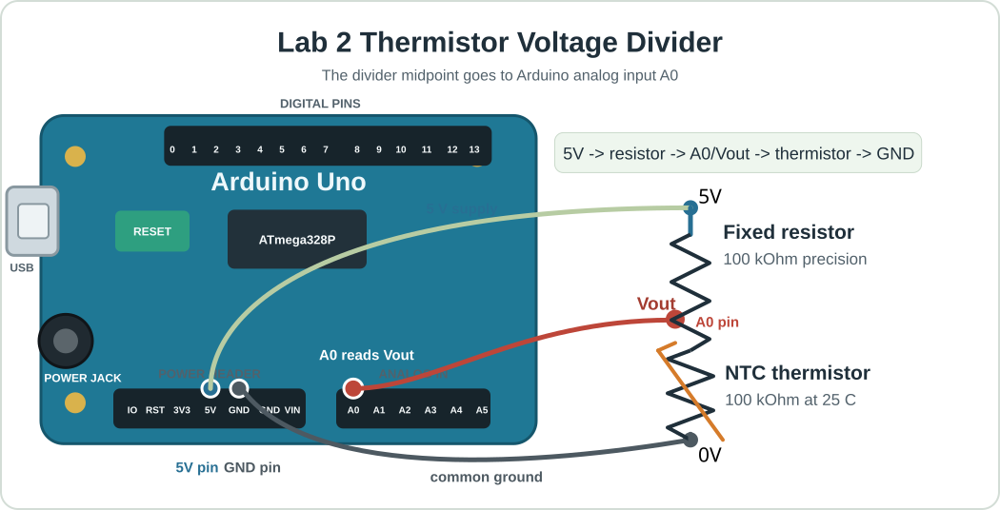
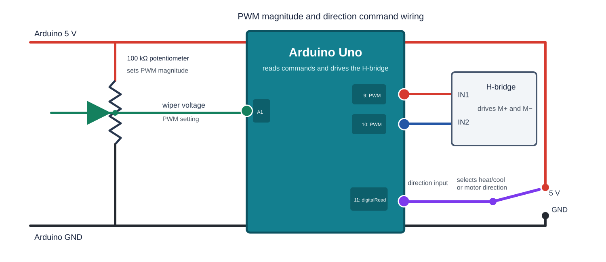
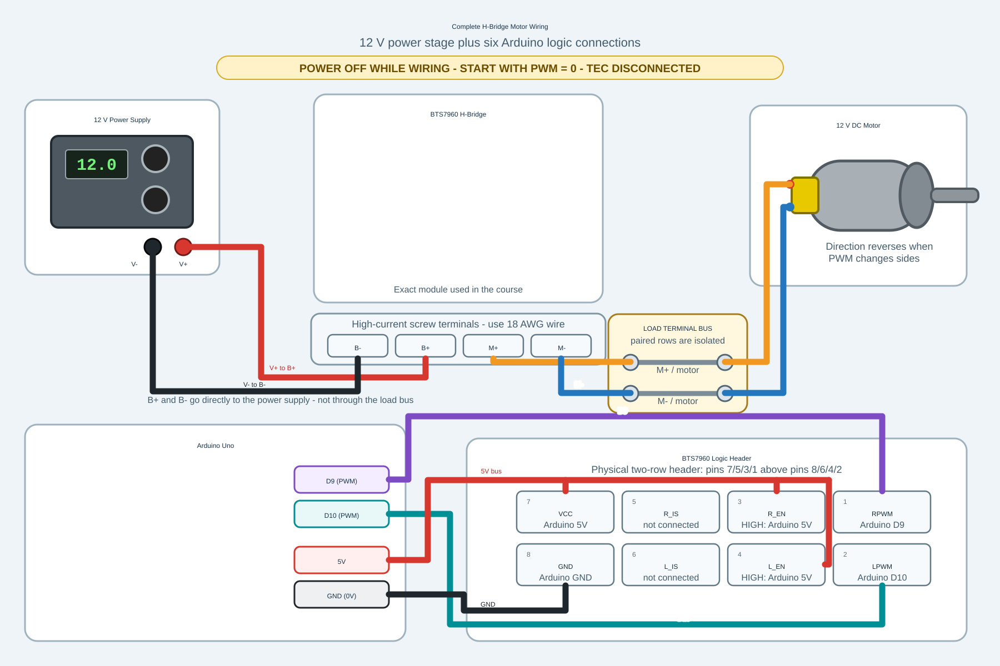

# Module 2 Assignment: First Real Instrument Pieces

## Purpose

In Module 1 you used the Arduino for digital output, analog input, averaging, and LED PWM. In Module 2, you reuse those ideas to begin building a real instrument: thermistor temperature measurement, Arduino Serial Plotter output, and trim-pot-controlled PWM signals for the H-bridge.

Module 2 was taught during **Session S5 on Monday, September 14**.

The actuator side also begins, but cautiously. You will verify H-bridge logic
and PWM with the oscilloscope before connecting a DC motor. The TEC remains
disconnected throughout Module 2.

## Theme

**First Real Instrument Pieces**

Thermistor serial data, temperature conversion, Arduino Serial Plotter output,
H-bridge logic/PWM verification, and a low-power DC motor direction and speed
test after the instrument passes the safety checks.

## Safety Boundary

The thermistor circuit is safe to build and test from Arduino USB power.

The TEC remains disconnected throughout Module 2. External actuator power remains
off until the H-bridge input signals have been checked with the oscilloscope.
For the motor test, stop immediately if the motor,
H-bridge, or wiring becomes unexpectedly warm.

**Motor connection warning:** Never connect the motor directly to Arduino PWM
pins `9` or `10`. These pins provide low-current logic commands to the H-bridge;
they do not provide motor power. Connect the motor only to H-bridge outputs
`M+` and `M-` as shown in the wiring diagram.

**Oscilloscope ground warning:** Connect every oscilloscope probe ground clip
to Arduino `GND`. **Never connect a scope ground clip to H-bridge output `M+`
or `M-`.** The H-bridge drives both motor terminals; grounding either output
through the oscilloscope can short the output and damage the apparatus.

<p style="font-size: 3rem; line-height: 1; margin: 0.75rem 0; text-align: center;" role="img" aria-label="Death's-head safety warning" title="Safety first">☠</p>

## Before Class

1. Review your [Module 1 assignment](../lab-01/index.md) notes, especially
   AnalogReadSerial, averaging, LED brightness, PWM, and oscilloscope
   duty-cycle measurements. Also review [Analog, ADC, And
   PWM](../../arduino/analog-digital.md) for voltage dividers, ADC counts,
   averaging, and PWM waveforms. The official Arduino references for
   [AnalogReadSerial](https://docs.arduino.cc/built-in-examples/basics/AnalogReadSerial/),
   [analogRead](https://docs.arduino.cc/language-reference/en/functions/analog-io/analogRead/),
   [analogWrite](https://docs.arduino.cc/language-reference/en/functions/analog-io/analogWrite/),
   and [map](https://docs.arduino.cc/language-reference/en/functions/math/map/)
   will also be useful.
2. Read the hardware page sections on the
   [thermistor](../../hardware.md#thermistor),
   [H-bridge](../../hardware.md#h-bridge), and
   [TEC](../../hardware.md#thermoelectric-cooler).
3. Bring the Arduino, thermistor divider parts, trim pot, USB cable, and your
   Module 1 notes.

## Outside-Class Workload Budget

| Session | Work | Planned time |
| --- | --- | ---: |
| S5 | Read this assignment and inspect the thermistor diagram | 30 minutes |
| S5 | Arduino tutorial, hardware references, and thermistor data-sheet reading | 45 minutes |
| S5 | Answer the four pre-class questions | 45 minutes |
| S5 | Review and finish the thermistor/PWM sketches needed in class | 60 minutes |
| S5 | Label, commit, and push the C2 evidence after class | 30 minutes |
| S5 | **Total associated with S5** | **3 hours 30 minutes** |

The time includes reading the assignment itself. If hardware access or a
software problem would push the work beyond four hours for a session, document
the blocker and bring it to class.

## Pre-Class Questions

1. A 100 kΩ fixed resistor and a 100 kΩ thermistor form a voltage
   divider, wired as described in Part 1: Thermistor Serial Data (below). What
   voltage do you expect at 15 °C, at 25 °C, and at 35 °C? You need the
   thermistor data sheet to answer.
2. Why is a temperature reading more model-dependent than a voltage reading?
3. Describe the H-bridge input signals you expect for each case: PWM = 0, low-power heat, and low-power cool. Which of the two Arduino pins should carry the PWM signal in each case, and what should the other direction pin do?
4. What is one advantage of Arduino Serial Plotter compared with Arduino Serial Monitor?

## What You Will Do

- Build or inspect a thermistor voltage divider.
- Write and upload a thermistor serial sketch.
- Convert ADC counts into voltage, resistance, and temperature.
- Revise the sketch so Arduino Serial Plotter shows temperature versus serial
  read order.
- Use a trim-pot voltage as a manual input that sets PWM.
- Use a separate digital input or switch to choose heat versus cool.
- Verify H-bridge direction and PWM logic on the oscilloscope.
- View the H-bridge `M+` and `M-` output waveforms with the oscilloscope.
- Test DC motor speed and direction at low PWM after the instructor checks the
  H-bridge signals.

## Part 1: Thermistor Serial Data And Temperature Conversion

Wire the thermistor divider:

- Arduino `5V` to fixed resistor.
- Fixed resistor to Arduino `A0`.
- Arduino `A0` to thermistor.
- Thermistor to Arduino `GND`.



[Open the thermistor-divider diagram full size](../../assets/thermistor_voltage_divider_arduino.svg)

Write a sketch that prints human-readable measurements in Serial Monitor. A good output line looks like this:

```text
time = 1.50 s    average ADC = 511.8    voltage = 2.501 V    resistance = 100.23 kΩ    temperature = 24.9 °C    samples = 1000
```

Every number should have a label and a unit where appropriate. The goal is for a person looking at Serial Monitor to understand the measurement without memorizing a column order.

From this point forward in the course, every measured temperature must use the
same acquisition sequence: take **1000** raw ADC readings with
`analogRead(A0)`, average those readings, convert the average ADC value to one
average voltage, and only then calculate thermistor resistance and temperature.
Do not calculate a temperature from each raw ADC reading and then average the
temperatures.

Averaging 1000 readings reduces random measurement noise, but it also takes
time and therefore acts as a low-pass filter: rapid changes can be smoothed or
delayed. An Arduino Uno takes roughly 0.1 s to acquire 1000 analog readings, so
the update remains fast enough for the slowly changing thermistor temperature
in this module.

Write your own sketch for this measurement. You may ask an AI agent for help, but do not simply upload code that you do not understand. You should be able to explain every calculation and every printed value.

### What Your Sketch Should Do

Include these functions in your sketch. Build and test them one at a time.

- Constants at the top describe the circuit and thermistor model: Arduino pin `A0`, the 5 V reference, the 100 kΩ fixed resistor, the 100 kΩ thermistor value at 25 °C, the beta value, and a sample count of `1000`.
- `averageAdcSamples()` reads `A0` 1000 times and returns the average ADC value.
- `adcToVoltage()` converts the average ADC value into an average voltage.
- `voltageToResistance()` uses the voltage-divider equation to calculate the thermistor resistance.
- `resistanceToCelsius()` uses the beta model to convert thermistor resistance into temperature.
- `setup()` starts Serial Monitor at `9600` baud and prints a short heading.
- `loop()` waits until it is time for a new report, averages 1000 raw readings from `A0`, then calculates voltage, resistance, and temperature in that order and prints one labeled line.
- `printHumanReadable()` controls the exact text you see in Serial Monitor. If you want the output to look different, this is the safest first place to edit.


Hold the thermistor firmly between your index finger and thumb to heat it. Slightly moisten the thermistor to cool it. The reported temperature should move slowly and plausibly. If it jumps wildly, check the wiring, ground, and
serial parsing before changing the code. **Show the instructor when this works or if you are stuck.**

## Part 2: Serial Plotter Output

Revise the sketch so each serial line contains only one temperature value. For
example:

```text
24.9
25.0
25.2
```

This format is less friendly for a person reading one line, but it is exactly
what Arduino Serial Plotter needs. The plotter will draw temperature versus
serial read order, not temperature versus a time value that you provide. Open
Serial Plotter and confirm that the graph responds when you hold the thermistor
between your fingers or cool it with a slightly moistened finger.

Record:

- the code change you made so each serial line contains only temperature,
- a screenshot or sketch of the Serial Plotter trace,
- whether warming and cooling the thermistor move the plotted temperature in
  the expected direction.

Module 2 stays inside the Arduino IDE. **Quickly show the instructor when the serial plotter displays the temperature.**

## Part 3: Trim Pot PWM, H-Bridge Verification, And Motor Direction

### 3A: Build And Verify The Trim-Pot H-Bridge Controller

In Module 1, a trim pot produced a variable voltage and the Arduino converted that voltage to an ADC number. Now use the same idea as a manual control input.

Get a 100 kΩ trim pot, wire it up, and build code with this signal path:

```text
trim-pot voltage -> analogRead average -> map to PWM -> analogWrite -> H-bridge input
```



*Figure 3. Wiring for the PWM and direction commands. The 100 kΩ potentiometer
wiper connects to analog input `A1` and sets PWM magnitude.  Connect one end of a wire to digital input pin `11`. Use the other end to
connect pin `11` to Arduino `5V` for heat/clockwise or Arduino `GND` for
cool/counterclockwise. Arduino PWM output pins `9` and `10` connect to the two
H-bridge control inputs.*

Use one analog input for the trim pot, for example `A1`. The analog input has
10-bit resolution and therefore produces numbers from `0` to `1023`. Convert
the averaged trim-pot reading into a PWM output signal. PWM outputs have 8-bit
resolution and therefore values from `0` to `255` are used to control them.

Use a separate digital pin as a heat/cool or direction input, for example pin `11`:

| Arduino pin `11` | Mode | Arduino pin `9` | Arduino pin `10` |
| --- | --- | --- | --- |
| `5V` | heat / clockwise | PWM | `0V` |
| `0V` | cool / counterclockwise | `0V` | PWM |

---

This is the logic of H-bridge method 2, highlighted in yellow in the [H-bridge hardware notes](../../hardware.md#h-bridge) note.  The two H-bridge control inputs receive
either the PWM command or `0V`, depending on whether you want to heat or cool.
In the motor demonstration in Module 2, **heat means clockwise** and **cool means
counterclockwise**.
Read the [H-bridge hardware notes](../../hardware.md#h-bridge) before wiring
the class board.

Keep actuator power off and the TEC disconnected for this part. You are
verifying the command signals, not driving a load yet.

Use the oscilloscope to inspect the Arduino pins that drive the H-bridge. On the
class boards, the PWM pins are expected to be Arduino pins 9 and 10. Verify the
actual board wiring before powering anything.

Check:

- which pin is active in heat/clockwise mode,
- which pin is active in cool/counterclockwise mode,
- whether the inactive side stays off,
- whether the PWM duty cycle matches the commanded value,
- whether Arduino ground and oscilloscope ground are common.

Show the working command signals to the instructor before connecting a load.

### 3B: Connect And Drive The DC Motor

Only do this after the instructor checks the H-bridge signals. The TEC must
remain disconnected. **Do not connect either motor lead directly to an Arduino
PWM pin.** Arduino pins `9` and `10` control the H-bridge; H-bridge outputs `M+`
and `M-` power the motor.

Before connecting the TEC in a later module, use a small motor as the first visible
H-bridge load. The motor makes direction reversal and PWM speed control easy to
observe without immediately applying power to the thermal system.

Complete wiring, including the six Arduino logic connections:



[Open the complete Arduino, H-bridge, power-supply, and motor wiring diagram full size](../../assets/hbridge_motor_arduino_wiring.svg)

Arduino pin `9` connects to `RPWM`, and pin `10` connects to `LPWM`. Connect
`R_EN`, `L_EN`, and logic `VCC` to Arduino `5V`; connect logic `GND` to Arduino
`GND` (0 V). Leave the `R_IS` and `L_IS` current-sense outputs unconnected.

**Oscilloscope warning: Every scope ground clip must connect to Arduino
`GND`. Never connect a scope ground clip to `M+` or `M-`; both are driven
H-bridge outputs, not ground points.**

Before measuring, predict the output waveforms. With each probe referenced to
Arduino `GND`, expect the behavior below. For a conceptual explanation of how
four switches reverse the voltage across a load, see the
[Wikipedia H-bridge article](https://en.wikipedia.org/wiki/H-bridge).

| Pin `11` | Direction | Expected `M+` | Expected `M-` |
| --- | --- | --- | --- |
| `5V` | heat / clockwise | PWM between approximately 0 V and the actuator-supply voltage | approximately 0 V |
| `0V` | cool / counterclockwise | approximately 0 V | PWM between approximately 0 V and the actuator-supply voltage |

The measured levels and waveform edges may differ slightly from this idealized
prediction when the motor is connected.

1. Turn off the actuator power supply and confirm that the TEC and thermal
   switch are disconnected from the H-bridge output.
2. Inspect the prepared motor leads and terminal-bus connections. Use two
   isolated paired positions on the terminal bus to connect the motor leads to
   H-bridge `M+` and `M-`. Each motor lead and its corresponding H-bridge lead
   terminate on the same paired position. The power-supply `V+`/`V-` leads
   connect directly to H-bridge `B+`/`B-` and do not go through this bus.
3. Securely attach a short piece of masking tape to the motor shaft so that it
   forms a visible flag perpendicular to the rotation axis. Make sure the flag
   can rotate freely without striking the wiring or apparatus.
4. Set PWM to zero. Have the instructor check the wiring, oscilloscope ground
   connection, and current limit, and then turn on actuator power.
5. Vary the PWM command over the full range. Use the tape flag to observe how
   motor speed changes, and observe the corresponding `M+` and `M-` waveforms
   on the oscilloscope. Remember, scope ground is tied to Arduino `GND`. Switch between heat/clockwise and
   cool/counterclockwise by moving the input to pin 11 from 5V to 0V. Record the motor direction, relative speed, and what
   changes on each H-bridge output.
6. **Show the instructor the scope output on the H-bridge and the operation of the motor.**
7. Return PWM to zero and turn off actuator power before removing the motor.

For the demonstration in Module 2, the heat command should turn the motor clockwise
and the cool command should turn it counterclockwise. 

## C2 Evidence And Submission

Module 2 produces most of the evidence for
[`C2`, Measurement And Actuator Electronics](../../assessment.md#c2-measurement-and-actuator-electronics).
Do not plan to recreate oscilloscope measurements after the apparatus has been
dismantled. Before leaving S5, save one concise module note containing:

- The labeled thermistor-divider diagram and thermistor constants.
- Three representative human-readable serial lines.
- The conversion chain from averaged ADC count to temperature.
- A Serial Plotter screenshot or sketch showing warming and cooling.
- A trim-pot-to-PWM code excerpt or signal-path explanation.
- The completed H-bridge signal table for heat/clockwise and
  cool/counterclockwise commands.
- Oscilloscope evidence for both active Arduino PWM pins, including voltage,
  frequency, and duty cycle.
- A short comparison of the `M+` and `M-` waveforms in both motor directions,
  including where the probe ground clips were connected.
- A short record of motor direction and the observed PWM speed response.

Put the evidence in `docs/module_notes/module_02_instrument_pieces.md` and put
the authoritative sketch in a descriptively named folder under `arduino/`.
Use links to code files rather than pasting a complete sketch into the note.

There is no separate `A#` submission for Module 2. This note and its cited Git
checkpoint are evidence for `C2`, demonstrated during S6 on Wednesday,
September 16. One team member must submit the `C2 Team Checkoff` Moodle receipt
by **5:00 PM**. Follow the [C2 rubric and oral-question
bank](../../assessment.md#c2-measurement-and-actuator-electronics).

Reserve no more than **30 minutes after S5** to label the saved evidence, update
the note, commit, and push. The physical measurements themselves must be made
in class.
