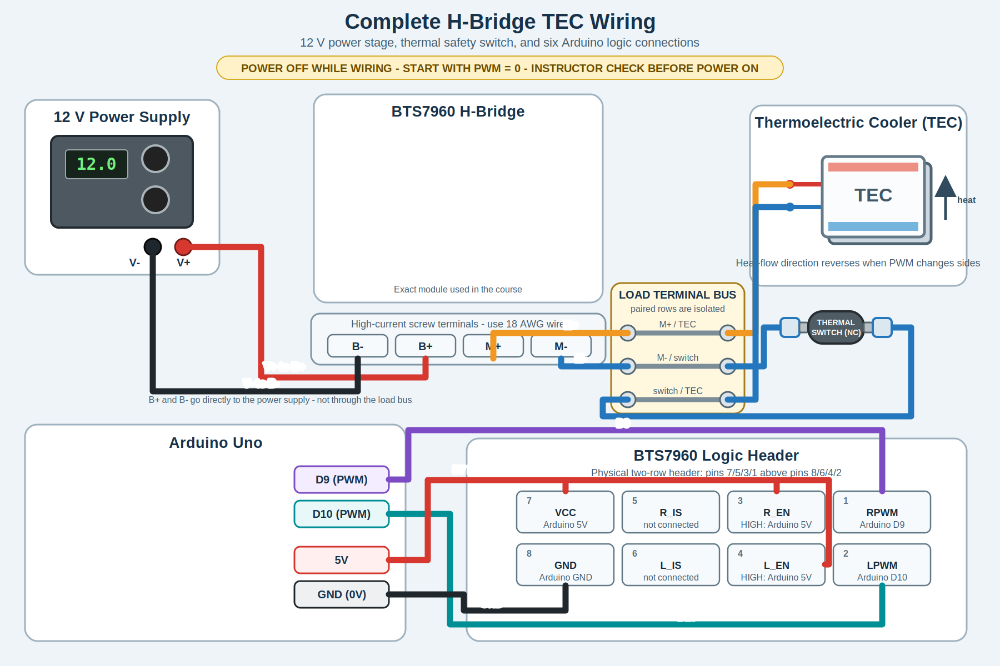

# Lab 3 Assignment: Manual TEC Heat/Cool And First Python GUI

## Purpose

Lab 3 connects measurement to thermal actuation. In Lab 2 you measured
temperature, verified the H-bridge signals, and used a small motor to make PWM
magnitude and direction immediately visible. In Lab 3 you replace the motor
with the TEC and thermal switch, operate the TEC at low power, record heating
and cooling traces, and begin treating the Python GUI as an editable part of
the instrument.

This is still not feedback control. You are learning how to drive the actuator,
how to recognize safe behavior, and how the software interface should represent
the state of the hardware.

### Class-Session Boundary

Lab 2 introduced the H-bridge, external power supply, brushed DC motor, and
stripping and tinning 18 AWG wire. Lab 3 begins the Class 4 or 5 TEC-wiring
session. Do not wire or energize the TEC and thermal switch until the instructor
begins that session.

## Theme

**Manual TEC Heat/Cool And First Python GUI**

Manual TEC direction and PWM, temperature traces, and a first small GUI
modification.

## Safety Boundary

Before TEC power is connected:

1. PWM starts at zero.
2. H-bridge inputs have been verified on the oscilloscope.
3. Arduino ground, H-bridge ground, and oscilloscope ground are understood.
4. The power supply current limit is set by the instructor.
5. The thermal safety cutoff is identified.
6. The Lab 2 motor-first H-bridge test has been completed with the TEC disconnected.
7. All wiring in the power-supply, H-bridge, TEC, and thermal-switch
   current path is 18 AWG stranded copper wire.
8. Female spade connectors have been crimped onto both thermal-switch wires,
   tug-tested, and checked for continuity.

Stop immediately if the temperature moves in the wrong direction, the TEC or
driver heats unexpectedly, the power supply current is too high, or the serial
trace disappears.

## Before Class

1. Review your Lab 2 thermistor conversion notes.
2. Review which Arduino pins drive the H-bridge on the class board.
3. Open the Python GUI or strip-chart code in VS Code and identify:
   - imports,
   - the serial parser,
   - the plot update function,
   - the place where labels or displayed values are set.
4. Write down one small GUI change you would like to make.

## Pre-Class Questions

1. Why should the H-bridge be checked with the oscilloscope before the TEC power
   supply is turned on?
2. What does PWM control in this experiment?
3. Why is heat/cool direction a physical question, not only a software label?
4. What part of the GUI code do you expect to modify first?

## What You Will Do

- Rebuild or inspect the thermistor measurement circuit.
- Verify the H-bridge input signals again with TEC power off.
- Wire the TEC and thermal switch with 18 AWG stranded copper wire.
- Crimp female spade connectors onto the two thermal-switch wires.
- Run the manual trim-pot or manual PWM TEC sketch.
- Record low-power heating and cooling traces.
- Run the Python strip chart while the TEC is manually driven.
- Add Python GUI controls for PWM and heat/cool direction.
- Write an Arduino sketch that receives PWM and heat/cool commands from Python.
- Clean up your Arduino, Python, and notes into a readable project checkpoint.

## Part 1: Pre-Power Checklist

Before turning on TEC power, fill in this checklist in your lab notes.

| Item | Value Or Observation |
| --- | --- |
| Arduino board and port |  |
| Thermistor pin |  |
| H-bridge heat pin |  |
| H-bridge cool pin |  |
| PWM starts at zero? |  |
| Lab 2 motor test completed with TEC disconnected? |  |
| High-current leads are 18 AWG? |  |
| Both female spade crimps tug-tested and checked for continuity? |  |
| Power supply voltage |  |
| Power supply current limit |  |
| Thermal cutoff identified? |  |
| Instructor check complete? |  |

## Part 2: Manual TEC Sketch

Use or inspect the instructor reference sketch:

```text
arduino/tec_manual_trim_pot/tec_manual_trim_pot.ino
```

The essential behavior is:

```text
trim pot -> averaged analog input -> PWM command -> H-bridge -> TEC
thermistor -> 100-1000 raw ADC readings -> average voltage -> temperature -> serial line -> laptop plot
```

If you write your own version, keep it simple. Do not add feedback control yet.
Every temperature value must be calculated only after averaging between 100
and 1000 raw thermistor-voltage measurements, as established in Lab 2.

This sketch is intentionally not polished. Before improving its structure, make
sure you can explain the measurement path, the PWM command path, and the
heat/cool direction path.

## Part 3: Oscilloscope Verification

With TEC power off, check the H-bridge input signals.

Record a table:

| Command | Pin 9 Observation | Pin 10 Observation | Expected TEC Direction |
| --- | --- | --- | --- |
| PWM = 0 |  |  | off |
| heat, low PWM |  |  | heat |
| cool, low PWM |  |  | cool |

Only one H-bridge side should be active at a time. The PWM duty cycle should
match the command from the trim pot or manual setting.

## Part 4: Low-Power Heating And Cooling

This part begins in Class 4 or 5. Do not begin unless the instructor has started
the TEC-wiring session.

After completing the Lab 2 motor-first test, turn off actuator power and replace
the motor with the TEC high-current circuit. Use 18 AWG stranded copper for the
power-supply-to-H-bridge wiring, `M+`/`M-` wiring, and both sides of the thermal
switch. Make the TEC-side connections on the isolated paired positions of the
terminal bus; do not solder two wires together. The power-supply `V+`/`V-`
leads connect directly to H-bridge `B+`/`B-` and do not go through the bus.
After instructor approval, connect TEC power.



[Open the complete Arduino, H-bridge, TEC, and thermal-switch wiring diagram full size](../../assets/hbridge_tec_arduino_wiring.svg)

### Physical Wiring On The Class Apparatus

The complete diagram above shows the electrical relationships. On the actual
class apparatus, the motor, TEC, and thermal-switch leads terminate on the
barrier-style terminal bus visible in the labeled photograph below. Wires that
need to be electrically joined are secured on the same paired bus position;
they are not soldered together. Each pair is isolated from the other pairs, so
this is not a single common electrical bus.

The photograph shows these three paired connections:

- H-bridge `M+` paired with one thermal-switch lead,
- the other thermal-switch lead paired with `TEC+`, and
- `TEC-` paired with H-bridge `M-`.

Thus, the photographed apparatus places the normally closed thermal switch in
series in the `M+` path. This is functionally equivalent to placing it in the
`M-` path as shown in the electrical diagram: opening the switch interrupts the
same series current path and removes power from the TEC. When wiring the class
apparatus, follow the photograph and the labels on your setup. Use female spade
connectors at the thermal switch. The power-supply `V+` and `V-` leads still go
directly to H-bridge `B+` and `B-`; they do not terminate on this bus.


[Open the labeled class-apparatus photograph full size](../../assets/tec_apparatus_a.svg)

### Crimp The Thermal-Switch Spade Connectors

1. Prepare two 18 AWG stranded copper leads for the two sides of the thermal
   switch.
2. Strip only enough insulation for the conductor to fit fully inside the crimp
   barrel. The strands captured inside the crimp barrel must remain untinned.
3. Crimp a female spade connector onto each lead using the correctly sized crimp
   tool position.
4. Tug-test each crimp gently.
5. Use a multimeter to verify continuity through each lead and through the
   closed thermal switch.
6. Ask the instructor to inspect the wire gauge, crimped spades, thermal-switch
   placement, polarity, and power-supply current limit.

Before making the crimps, review these technique illustrations:

- [How to crimp an electrical connector: illustrated instructions](https://learn.sparkfun.com/tutorials/working-with-wire/how-to-crimp-an-electrical-connector)
- [How to crimp quick disconnects (spade terminals): YouTube demonstration](https://www.youtube.com/watch?v=Ed4rbTW7LTw)

Do not enable actuator power until the instructor approves the completed
wiring.

1. Start with PWM at zero.
2. Increase PWM slowly to a low value.
3. Watch the temperature trace.
4. Record which command heats the thermistor and which command cools it.
5. Return PWM to zero between trials.

Take at least one short heating trace and one short cooling trace. Do not chase
a target temperature; this is open-loop manual actuation.

## Part 5: Python Display-Only Strip Chart

Write a Python program that reads the Arduino serial output and displays two
live strip charts:

1. temperature in Celsius versus time,
2. PWM value versus time.

This first Python version is display-only. It must not send commands to the
Arduino.

The Arduino serial lines look like this:

```text
Temperature (C): 27.73, Time (s): 645.06, PWM: 120, Heat/Cool: 1
```

Your strip chart should let you set, near the top of the Python file:

- the serial port and baud rate,
- the visible strip-chart window duration,
- the plot update interval,
- the temperature-axis limits,
- the PWM-axis limits.

You may work with an AI agent to produce the first version. A good prompt is:

```text
I am writing a Python display-only strip chart for a physics instrumentation lab.

Write a simple Python program using PySide6 and pyqtgraph that reads Arduino
serial data and displays two live strip charts:
1. temperature in Celsius versus time
2. PWM value versus time

The program must not send commands to the Arduino.

Serial lines from the Arduino look like this:
Temperature (C): 27.73, Time (s): 645.06, PWM: 120, Heat/Cool: 1

Requirements:
- Use pyserial to read from a serial port.
- Let me set the serial port and baud rate near the top of the file.
- Plot only the most recent N seconds of data, where N is a variable called
  window_seconds.
- Let me set the plot update interval in milliseconds.
- Let me set y-axis limits for temperature and PWM near the top of the file.
- Parse temperature_C, time_s, PWM, and Heat/Cool from each serial line.
- Ignore startup/status lines that do not match the data format.
- Use Celsius only.
- Keep the code simple enough for an advanced physics student who is new to
  Python to understand.
- Include comments explaining imports, serial reading, parsing, data storage,
  and plot updating.
```

After the code runs, identify the parts of the program that read serial data,
parse one line, store recent data, and update the plots.

## Part 6: Add Python Manual Controls

Modify the display-only Python strip chart so it has manual controls:

1. a heat/cool switch,
2. a PWM slider from `0` to `255`,
3. a PWM text box.

The slider and text box should stay synchronized. If you move the slider, the
text box should show the new PWM value. If you type a number in the text box,
the slider should move to that value. Clamp invalid PWM values to the range
`0` to `255`.

When the controls change, the Python program should send one serial command to
the Arduino:

```text
SET PWM 120 DIR HEAT
SET PWM 45 DIR COOL
```

Keep the two strip charts from Part 5. The PWM plot should show heating in red
and cooling in blue.

Use this prompt to ask your AI agent for help:

```text
Modify my existing PySide6 + pyqtgraph display-only strip chart.

Add manual controls:
1. a heat/cool switch,
2. a PWM slider from 0 to 255,
3. a PWM text box.

The PWM slider and PWM text box must stay synchronized:
- moving the slider updates the text box,
- typing a number in the text box updates the slider,
- invalid values are clamped to 0 through 255.

When the PWM or heat/cool setting changes, send a text command to the Arduino
serial port in this format:
SET PWM 120 DIR HEAT
SET PWM 45 DIR COOL

Keep the existing temperature and PWM strip charts. Plot PWM heating samples in
red and PWM cooling samples in blue. Do not implement feedback control. Use
Celsius only.

Include comments explaining how the GUI widgets, serial command sending, and
plot updates work.
```

At this stage, the old trim-pot Arduino sketch will not obey these commands.
That is expected. The goal of this part is to build the Python interface and
define the serial command format.

## Part 7: Arduino Serial-Command Control Sketch

Write a new Arduino sketch descended from the manual trim-pot sketch. It should
keep the thermistor measurement and H-bridge output behavior, but replace the
trim pot and physical direction wire with commands from the Python GUI.

The new Arduino sketch should:

- read the thermistor divider on `A0` and average between 100 and 1000 raw ADC
  measurements before converting the average voltage to temperature,
- output PWM on pin `9` for heat and pin `10` for cool,
- start with PWM `0`,
- receive commands such as `SET PWM 120 DIR HEAT`,
- clamp PWM to the range `0` to `255`,
- keep printing the same measurement line used by the Python strip chart:

```text
Temperature (C): 27.73, Time (s): 645.06, PWM: 120, Heat/Cool: 1
```

Use this prompt to ask your AI agent for help:

```text
I have an Arduino sketch for a physics instrumentation lab. The old version
measures temperature from a thermistor on A0, reads a trim pot on A1 to choose
PWM, reads pin 11 to choose heat or cool, and drives an H-bridge with PWM on
pins 9 and 10.

Write a new Arduino sketch with clear comments explaining its lineage from the
trim-pot version.

Requirements:
- Keep thermistor temperature measurement on A0. Average between 100 and 1000
  raw ADC measurements before converting the average voltage to temperature.
- Keep H-bridge outputs on pins 9 and 10.
- Remove the trim-pot input on A1.
- Remove the physical direction input on pin 11.
- Start safely with PWM = 0.
- Receive serial commands from Python in this format:
  SET PWM 120 DIR HEAT
  SET PWM 45 DIR COOL
- Clamp PWM values to 0 through 255.
- In HEAT mode, write PWM to pin 9 and 0 to pin 10.
- In COOL mode, write 0 to pin 9 and PWM to pin 10.
- Keep printing measurement lines in exactly this format:
  Temperature (C): 27.73, Time (s): 645.06, PWM: 120, Heat/Cool: 1
- Use Heat/Cool = 1 for heat and Heat/Cool = 0 for cool.
- Do not add feedback control.
- Include comments explaining the serial command parser and safety startup.
```

With TEC power off, verify on the oscilloscope that Python commands change the
Arduino outputs as expected. Only after that check may you repeat a low-power
manual heat/cool test.

## Part 8: Project Cleanup And GitHub Checkpoint

By the end of Lab 3, you may have several Arduino sketches, Python files,
AI-generated drafts, notes, screenshots, and data files. Before moving on, take
time to organize the work so that another person, including your future self,
can understand what you built.

Use the course [Git, GitHub, VS Code, and AI workflow](../../git-vscode-ai-workflow.md)
page as your reference for the minimal Git commands and documentation habits
expected in this course.

Create one clean project folder for the code and documentation you want to keep.
A reasonable structure is:

```text
phys39-tec-control/
  README.md
  arduino/
    thermistor_serial/
    tec_manual_control/
    tec_python_control/
  python/
    display_strip_chart/
    manual_control_gui/
  docs/
    wiring_notes/
    screenshots/
  data/
    example_runs/
```

You may use a different structure if it is clear and consistent.

Write or revise `README.md` so it explains:

- what your project does,
- what hardware is connected to which Arduino pins,
- which Arduino sketch goes with which Python program,
- how to upload the Arduino sketch,
- how to run the Python program,
- one example serial line and what each field means,
- what Git commits you made to organize and preserve your work,
- what you tested yourself,
- what you still do not fully understand.

Use Git and GitHub to make a checkpoint:

```bash
git status
git add README.md arduino python docs
git commit -m "Organize Lab 3 TEC control project"
git push
```

Do not blindly commit everything in the folder. Look at `git status` first.
Temporary files, duplicate AI drafts, and large accidental data files should not
be included unless there is a reason to keep them.

In VS Code, use the file explorer to inspect your folder structure, edit your
Arduino sketches, edit your Python code, and preview your `README.md`. Use this
checkpoint to remove duplicate code and give files names that describe what they
actually do.

Also include a short AI use note in your `README.md`:

- Which parts of the code did AI help generate?
- Which parts did you modify yourself?
- Which parts did you test on real hardware?
- Which parts can you explain without looking at the AI transcript?

## What To Submit

Submit a short lab note containing:

- Completed pre-power checklist.
- Wiring or signal-path sketch.
- Oscilloscope table for H-bridge inputs.
- Confirmation that both female spade crimps passed a tug test and continuity
  check.
- One heating trace and one cooling trace.
- The Arduino sketch used or modified.
- Python strip-chart screenshot.
- The Python strip-chart code.
- The AI prompt you used, if you used one.
- A short description of where the Python code reads serial data, parses one
  line, updates the plots, and sends commands.
- The Arduino serial-command sketch from Part 7.
- An oscilloscope check showing that Python commands change pins `9` and `10`
  correctly with TEC power off.
- A link to your organized GitHub project repository.
- Your `README.md` from Part 8.
- A paragraph answering: What is the difference between measuring temperature,
  manually actuating the TEC, and feedback-controlling temperature?
