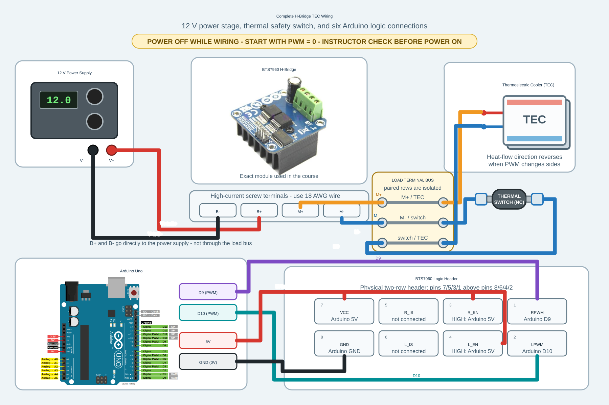
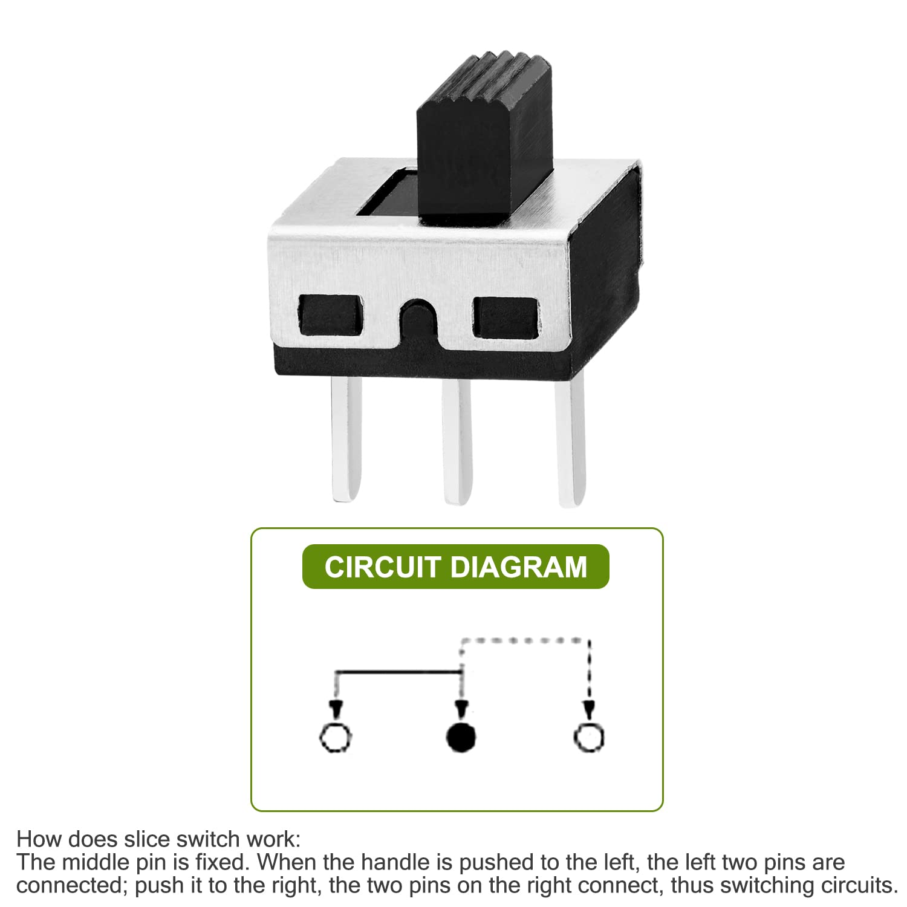

# Module 3 Assignment: Manual TEC Heat/Cool And First Python GUI

## Purpose

Module 3 connects measurement to thermal actuation. In Module 2 you measured
temperature, verified the H-bridge signals, and used a small motor to make PWM
magnitude and direction immediately visible. In Module 3 you replace the motor
with the TEC and thermal switch, operate the TEC at low power, record heating
and cooling traces, and begin treating the Python GUI as an editable part of
the instrument.

This is still not feedback control. You are learning how to drive the actuator,
how to recognize safe behavior, and how the software interface should represent
the state of the hardware.

### Class-Session Boundary

Module 2 introduced the thermistor, H-bridge, external power supply, and test
motor. Module 3 spans Sessions S5-S7 and replaces the motor with the TEC. Do
not energize the TEC until the instructor checks the prepared high-current
wiring, thermal switch, and power-supply current limit.

## Theme

**Manual TEC Heat/Cool And First Python GUI**

Manual TEC direction and PWM, temperature traces, and a first small GUI
modification.

## Safety Boundary

Before TEC power is connected:

1. PWM starts at zero.
2. H-bridge inputs have been verified on the oscilloscope.
3. Arduino ground, H-bridge ground, and oscilloscope ground are understood.
5. The thermal safety cutoff is identified.
6. The Module 2 motor-first H-bridge test has been completed with the TEC disconnected.
7. The prepared high-current wiring and thermal-switch connections have been
   inspected for loose or damaged connections.

Stop immediately if the temperature moves in the wrong direction, the TEC or
driver heats unexpectedly, the power supply current is too high, or the serial
trace disappears.

## Before Class

1. Review your Module 2 thermistor conversion notes.
2. Review which Arduino pins drive the H-bridge on the class board.
3. Locate your Module 2 Arduino sketch in VS Code. Identify the thermistor
   input, trim-pot input, two H-bridge outputs, and direction input.
4. Confirm that your Python environment has `pyserial`, `PySide6`, and
   `pyqtgraph`, following the [Getting Started](../../getting-started.md) page.

## Outside-Class Workload Budget

| Session | Work | Planned time |
| --- | --- | ---: |
| S5 | Read this assignment; review the wiring, safety boundary, and prior thermistor code | 75 minutes |
| S5 | Inspect the Python strip-chart structure and prepare one proposed change | 45 minutes |
| S5 | **Total associated with S5** | **2 hours** |
| S6 | Develop or revise the display-only GUI using the provided prompt | 120 minutes |
| S6 | Update run instructions and record unresolved questions | 30 minutes |
| S6 | **Total associated with S6** | **2 hours 30 minutes** |
| S7 | Develop and test the GUI controls and serial-command code without TEC power | 120 minutes |
| S7 | Organize the repository, README, evidence, and C3 receipt | 60 minutes |
| S7 | **Total associated with S7** | **3 hours** |

Stop when the planned time is exhausted. Preserve the current working state and
bring a precise description of the blocker to class; do not trade away safety
or understanding to finish an AI-generated feature.

## Pre-Class Questions

1. Why should the H-bridge be checked with the oscilloscope before the TEC power
   supply is turned on?
2. What does PWM control in this experiment?
3. Why is heat/cool direction a physical question, not only a software label?
4. What part of the GUI code do you expect to modify first?

## What You Will Do

- Write a fixed-direction Arduino sketch using the trim pot for PWM.
- Reverse direction  by swapping the two Arduino-to-H-bridge control leads.
- Write a second Arduino sketch that uses a digital input on pin `11` to select heat or cool.
- Display in real time the complete measurement and command record in Serial Monitor.
- Write a Python strip chart that plots only temperature and echoes the full
  Arduino line in the terminal.
- Add PWM and direction controls and displays to make the complete manual GUI.
- Write the final Arduino sketch that receives PWM and direction commands from
  Python.
- Verify the complete paired Arduino-Python manual control system.
- Clean up your Arduino, Python, and notes into a readable project checkpoint.

## Part 1: TEC Wiring And Pre-Power Checklist

Do not begin until the instructor starts the TEC session. Turn off actuator
power and remove the Module 2 motor. Look for 18G wires in your box. If you don't have them you will need to solder them. See appendix below. Next, connect the 18G TEC and thermal
switch wiring. The power-supply `V+` and `V-` leads connect directly to
H-bridge `B+` and `B-`; they do not go through the terminal bus.

Connect the TEC heat exchanger directly to the 12 V power supply, with its
positive lead connected to `V+` and its negative lead connected to `V-`.
Before applying current to the TEC, verify that the heat-exchanger pump and
radiator fans are operating. Do not operate the TEC without its heat exchanger
running.



[Open the complete Arduino, H-bridge, TEC, and thermal-switch wiring diagram full size](../../assets/hbridge_tec_arduino_wiring.svg)


### Physical Wiring On The Class Apparatus

Use the labels on your apparatus and the photograph below. The three isolated
terminal-bus pairs connect H-bridge `M+` to one thermal-switch lead, the other
thermal-switch lead to `TEC+`, and `TEC-` to H-bridge `M-`. Opening the normally
closed thermal switch therefore interrupts the TEC current. Most setups have
prepared wires. If your setup lacks either the two 18 AWG thermal-switch leads or the four 18G H-bridge leads, use the
appendix at the end of this module for instruction for how to fabricate the wires after consulting the instructor.


[Open the labeled class-apparatus photograph full size](../../assets/tec_apparatus_a.svg)

Before turning on TEC power, fill in this checklist in your module notes.

| Item | Value Or Observation |
| --- | --- |
| Arduino board and port |  |
| Thermistor pin |  |
| H-bridge heat pin |  |
| H-bridge cool pin |  |
| PWM starts at zero? |  |
| Module 2 motor test completed with TEC disconnected? |  |
| High-current leads are 18 AWG? |  |
| Prepared TEC and thermal-switch wiring inspected? |  |
| Heat exchanger connected to 12 V and operating? |  |
| Power supply voltage |  |
| Power supply current limit |  |
| Thermal cutoff identified? |  |
| Instructor check complete? |  |

## Part 2: First Manual Sketch - Fixed Direction

Write a simple Arduino sketch with two input paths and one fixed-direction
output path:

```text
A0 thermistor -> average -> temperature
A1 trim pot -> ADC value -> PWM command
fixed direction -> H-bridge -> TEC
```

For the first version, make pin `9` remain `LOW` and send the trim-pot PWM
command to pin `10`. It does not matter whether this assignment initially
heats or cools the thermistor embedded in the TEC plate. Arduino pins `9` and `10` are logic-level
H-bridge control signals; they are not ground and they are not the H-bridge
power outputs `M+` and `M-`.

Print one labeled line containing time, temperature, PWM, and the fixed
direction. For example:

```text
Temperature (C): 27.73, Time (s): 645.06, PWM: 120, Heat/Cool: 0
```

Use Serial Monitor only; do not plot yet. After instructor approval, apply low
power and determine whether the fixed command heats or cools.

To reverse direction for a second test, set PWM to zero and swap only the two Arduino-to-H-bridge control leads connected to
pins `9` and `10`. Then increase the PWM signal and observe if the heating/cooling function has reversed.  Do not swap TEC
power leads (M+/M-) for this exercise.

## Part 3: Second Manual Sketch - Hardware Direction Input

Save the first working sketch, then make a second sketch that replaces the
wire swap with the flipping of a switch. Keep `A0` for temperature and `A1` for the trim-pot PWM command. Add
a direction input on pin `11`:

Use the single-pole, double-throw (SPDT) slide switch shown below. Connect its
center, common terminal to Arduino pin `11`, and connect its two outer
terminals to Arduino `5V` and `GND`.



[Open the SPDT slide-switch photograph full size](../../assets/1pole2throwSwitch.jpg)

| Pin `11` input | Mode | Pin `9` output | Pin `10` output |
| --- | --- | --- | --- |
| `5V` | heat (cool) | PWM | `LOW` |
| `0V` | cool (heat) | `LOW` | PWM |

Do not leave pin `11` unconnected. Read it with `digitalRead()` and use an
`if`/`else` statement to select which H-bridge input receives PWM. Keep the
same labeled serial output so Serial Monitor shows temperature, elapsed time,
PWM, and heat/cool direction. Do not plot yet.

Use the oscilloscope to compare the Arduino control signals with the H-bridge
power outputs for both switch positions. First, with TEC power off, observe
Arduino pins `9` and `10`. Then show the instructor your wiring and current
limit. After approval, turn on the 12 V supply, use a low PWM value, and
observe H-bridge outputs `M+` and `M-`, each measured relative to Arduino
ground.

**Oscilloscope ground warning:** Connect every oscilloscope probe ground clip
to Arduino `GND`. **Never connect a scope ground clip to `M+` or `M-`.** A
ground clip is earth-referenced and can short an H-bridge output. Place the
probe tip on the signal being measured. To display `M+` and `M-` simultaneously,
use two channels with both ground clips connected to Arduino `GND`, one probe
tip on `M+`, and the other probe tip on `M-`.

Record your observations for both positions of the direction switch:

| Pin `11` input | Pin `9` waveform | Pin `10` waveform | `M+` waveform | `M-` waveform | PWM frequency | PWM duty cycle |
| --- | --- | --- | --- | --- | --- | --- |
| `5V` |  |  |  |  |  |  |
| `0V` |  |  |  |  |  |  |

Confirm that changing the switch reverses which Arduino control pin carries
PWM and reverses the corresponding `M+`/`M-` output behavior.

After completing the oscilloscope observations, continue at low PWM and watch
the temperature reported in Serial Monitor. Test both settings of the pin `11`
direction input. Record several consecutive serial lines for heating and for
cooling, including the PWM and direction fields. Do not chase a target
temperature; this remains open-loop manual actuation.

## Part 4: Python Display-Only Strip Chart

Write a Python program that reads the complete Arduino serial output but plots
only **temperature in Celsius versus time**. This first version is display-only:
it must not send commands to the Arduino.

The Arduino serial lines look like this:

```text
Temperature (C): 27.73, Time (s): 645.06, PWM: 120, Heat/Cool: 1
```

First confirm the line format in Arduino Serial Monitor. The Arduino provides
only **one USB serial connection**, and access to it is all or nothing. On the
laptop, either Arduino Serial Monitor or Serial Plotter can open that connection,
or the Python program can open it. They cannot use it at the same time. Close
Serial Monitor and Serial Plotter completely before starting Python; later,
close Python before reopening either Arduino serial window.

Because Serial Monitor cannot remain open while Python runs, have the Python
program print each complete received line in the VS Code terminal while it
extracts and plots only temperature. The terminal output then provides the
same human-readable information that you previously saw in Serial Monitor.

The program should let you set near the top of the file:

- the serial port and baud rate,
- the visible strip-chart window duration,
- the plot update interval,
- the temperature-axis limits.

You may work with an AI agent to produce the first version. A good prompt is:

```text
I am writing a Python display-only strip chart for a physics instrumentation lab.

Write a simple Python program using PySide6 and pyqtgraph that reads Arduino
serial data and displays one live strip chart: temperature in Celsius versus
time.

The program must not send commands to the Arduino.

Serial lines from the Arduino look like this:
Temperature (C): 27.73, Time (s): 645.06, PWM: 120, Heat/Cool: 1

Requirements:
- Use pyserial to read from a serial port.
- Print each complete line received from the Arduino in the terminal so I can
  compare the text with the plotted temperature.
- Let me set the serial port and baud rate near the top of the file.
- Plot only the most recent N seconds of data, where N is a variable called
  window_seconds.
- Let me set the plot update interval in milliseconds.
- Let me set the temperature y-axis limits near the top of the file.
- Parse temperature_C, time_s, PWM, and Heat/Cool from each serial line.
- Store all four parsed values, but plot only temperature versus time.
- Ignore startup/status lines that do not match the data format.
- Use Celsius only.
- Keep the code simple enough for an advanced physics student who is new to
  Python to understand.
- Include comments explaining imports, serial reading, parsing, data storage,
  and plot updating.
```

After the code runs, identify the parts that read serial data, print the raw
line, parse one line, store recent data, and update the temperature plot.

## Part 5: Add Python Manual Controls

Modify the display-only Python strip chart into the course's complete manual
control GUI. Add:

1. a heat/cool switch,
2. a PWM slider from `0` to `255`,
3. a PWM text box that allows input from the keyboard and output from the slider,
4. displayed values for temperature, PWM, direction, and elapsed time,
5. a second strip chart showing PWM versus time, with a red solid line when heating and a blue solid line when cooling. 

The slider and text box should stay synchronized. If you move the slider, the
text box should show the new PWM value. If you type a number in the text box,
the slider should move to that value. Clamp invalid PWM values to the range
`0` to `255`.

When the controls change, the Python program should send one serial command to
the Arduino:

```text
SET PWM 120 DIR HEAT
SET PWM 45 DIR COOL
```

Keep the temperature strip chart from Part 4. The new PWM plot should show
heating in red and cooling in blue. Continue printing the complete Arduino
measurement lines in the VS Code terminal while developing and debugging the
GUI.

Use this prompt to ask your AI agent for help:

```text
Modify my existing PySide6 + pyqtgraph display-only strip chart.

Turn it into a complete manual TEC control GUI. Add:
1. a heat/cool switch,
2. a PWM slider from 0 to 255,
3. a PWM text box,
4. displayed values for temperature, PWM, direction, and elapsed time,
5. a second strip chart showing PWM versus time.

The PWM slider and PWM text box must stay synchronized:
- moving the slider updates the text box,
- typing a number in the text box updates the slider,
- invalid values are clamped to 0 through 255.

When the PWM or heat/cool setting changes, send a text command to the Arduino
serial port in this format:
SET PWM 120 DIR HEAT
SET PWM 45 DIR COOL

Keep the existing temperature strip chart. Plot PWM heating samples in red and
PWM cooling samples in blue on the new PWM strip chart. Continue printing each
complete Arduino line in the terminal. Do not implement feedback control. Use
Celsius only.

Include comments explaining how the GUI widgets, serial command sending, and
plot updates work.
```

At this stage, the hardware-direction Arduino sketch will not obey these
commands. That is expected. Part 5 builds the interface and defines the command
format; Part 6 completes the matching Arduino program.

## Part 6: Arduino Serial-Command Control Sketch

Write a new Arduino sketch descended from the manual trim-pot sketch. It should
keep the thermistor measurement and H-bridge output behavior, but replace the
trim pot and physical direction wire with commands from the Python GUI.

The new Arduino sketch should:

- read the thermistor divider on `A0` and average between 100 and 1000 raw ADC
  measurements before converting the average voltage to temperature,
- output PWM on pin `9` for heat and pin `10` for cool,
- start with PWM `0`,
- receive commands such as `SET PWM 120 DIR HEAT`,
- clamp PWM to the range `0` to `255`,
- keep printing the same measurement line used by the Python strip chart:

```text
Temperature (C): 27.73, Time (s): 645.06, PWM: 120, Heat/Cool: 1
```

Use this prompt to ask your AI agent for help:

```text
I have an Arduino sketch for a physics instrumentation lab. The old version
measures temperature from a thermistor on A0, reads a trim pot on A1 to choose
PWM, reads pin 11 to choose heat or cool, and drives an H-bridge with PWM on
pins 9 and 10.

Write a new Arduino sketch with clear comments explaining its lineage from the
trim-pot version.

Requirements:
- Keep thermistor temperature measurement on A0. Average between 100 and 1000
  raw ADC measurements before converting the average voltage to temperature.
- Keep H-bridge outputs on pins 9 and 10.
- Remove the trim-pot input on A1.
- Remove the physical direction input on pin 11.
- Start safely with PWM = 0.
- Receive serial commands from Python in this format:
  SET PWM 120 DIR HEAT
  SET PWM 45 DIR COOL
- Clamp PWM values to 0 through 255.
- In HEAT mode, write PWM to pin 9 and 0 to pin 10.
- In COOL mode, write 0 to pin 9 and PWM to pin 10.
- Keep printing measurement lines in exactly this format:
  Temperature (C): 27.73, Time (s): 645.06, PWM: 120, Heat/Cool: 1
- Use Heat/Cool = 1 for heat and Heat/Cool = 0 for cool.
- Do not add feedback control.
- Include comments explaining the serial command parser and safety startup.
```

## Part 7: Integrated Manual-Control Test

Pair the Part 5 Python GUI with the Part 6 Arduino sketch. With TEC power off,
verify on the oscilloscope that Python commands change the Arduino outputs as
expected. Only after that check may you repeat a low-power manual heat/cool
test.

The final product of Part 7 is the canonical manual control system: Python sets
and displays PWM and direction, Arduino applies the command and measures
temperature, and the GUI displays temperature and PWM versus time while the
Arduino continues to report the complete state.

## Part 8: Project Cleanup And GitHub Checkpoint

By the end of Module 3, you may have several Arduino sketches, Python files,
AI-generated drafts, notes, screenshots, and data files. Before moving on, take
time to organize the work so that another person, including your future self,
can understand what you built.

Use the course [Git, GitHub, VS Code, and AI workflow](../../git-vscode-ai-workflow.md)
page as your reference for the minimal Git commands and documentation habits
expected in this course.

Use the one private team repository supplied for the course; do not create a
second project repository. Follow the workflow page to clone it with GitHub
Desktop and open the repository folder in VS Code.

Organize the code and documentation you want to keep. By this point, the
working part of the repository should resemble:

```text
phys39-instrumentation/
  README.md
  .gitignore
  requirements.txt
  arduino/
    tec_manual_fixed_direction/
      tec_manual_fixed_direction.ino
    tec_manual_hardware_direction/
      tec_manual_hardware_direction.ino
    tec_python_control/
      tec_python_control.ino
  python/
    tec_temperature_strip_chart.py
    tec_control_gui.py
    models/
    analysis/
  docs/
    module_notes/
    wiring/
    figures/
  data/
```

You may customize this structure if it remains clear and consistent. Do not
create empty future data folders merely to fill out the diagram. Remember that
each Arduino sketch folder and its `.ino` file must have exactly the same name.

Use VS Code Explorer to create folders and files and to move earlier work into
the repository. After moving code, compile and test the Arduino sketch and run
the Python program from their new locations. Do not delete a known working copy
until the moved version has passed the same test.

Write or revise `README.md` so it explains:

- what your project does,
- what hardware is connected to which Arduino pins,
- which Arduino sketch goes with which Python program,
- how to upload the Arduino sketch,
- how to run the Python program,
- one example serial line and what each field means,
- what Git commits you made to organize and preserve your work,
- what you tested yourself,
- what you still do not fully understand.

Use GitHub Desktop to make the checkpoint:

1. Inspect every changed file and exclude temporary or duplicate drafts.
2. Commit with the summary `Organize Module 3 TEC control project`.
3. Push the commit to GitHub.
4. Choose **Repository > View on GitHub** and verify that the new folders,
   `README.md`, and latest commit appear in the private team repository.

Do not blindly commit everything in the folder. Look at `git status` first.
Temporary files, duplicate AI drafts, and large accidental data files should not
be included unless there is a reason to keep them.

In VS Code, use the file explorer to inspect your folder structure, edit your
Arduino sketches, edit your Python code, and preview your `README.md`. Use this
checkpoint to remove duplicate code and give files names that describe what they
actually do.

Also include a short AI use note in your `README.md`:

- Which parts of the code did AI help generate?
- Which parts did you modify yourself?
- Which parts did you test on real hardware?
- Which parts can you explain without looking at the AI transcript?

## Collect Your C3 Evidence During Class

Module 3 spans S5-S7. Save evidence as each capability works; do not wait until
the end and try to reconstruct which code produced which trace. Before the C3
demonstration, save:

- the signed pre-power checklist and final wiring record,
- oscilloscope checks for the fixed-direction and hardware-direction sketches
  with TEC power off,
- one labeled low-power heating serial record and one labeled cooling serial
  record,
- a raw data file with units and acquisition metadata,
- screenshots of the temperature-only strip chart and complete control GUI,
- the exact paired Arduino and Python versions used for the final test,
- a record of the zero-PWM startup and invalid-command tests, and
- the organized repository README and AI-use note from Part 8.

Keep the module record in `docs/module_notes/module_03_tec_gui.md`. Put raw data
under `data/module_03/`, figures under `docs/figures/module_03/`, and the
authoritative programs under `arduino/` and `python/`. Complete each row or
caption while the corresponding test is running.

## C3 Evidence Record

This material supports [`C3`, TEC Instrument And First Python
GUI](../../assessment.md#c3-tec-instrument-and-first-python-gui), demonstrated
during S7 on Wednesday, September 23. The `P1` check during S6 is a rehearsal:
show that Python reads real serial data, updates the display, and saves a
labeled file. It has no separate Moodle submission.

After the experimental evidence is complete, reserve about **60 minutes** to check
paths, finish captions, commit, push, and prepare the `C3 Team Checkoff` Moodle
receipt. The receipt is due by **11:55 AM in S7** and must cite the exact pushed
commit. Use the [C3 rubric and oral-question
bank](../../assessment.md#c3-tec-instrument-and-first-python-gui).

Keep a short module note containing:

- Completed pre-power checklist.
- Wiring or signal-path sketch.
- Oscilloscope checks for both manual Arduino sketches.
- One heating serial record and one cooling serial record.
- Both manual Arduino sketches and the final serial-command sketch.
- Temperature-only Python strip-chart screenshot and code.
- Complete Python manual-control GUI screenshot and code.
- The AI prompt you used, if you used one.
- A short description of where the Python code reads serial data, parses one
  line, updates the plots, and sends commands.
- The Arduino serial-command sketch from Part 6.
- An oscilloscope check showing that Python commands change pins `9` and `10`
  correctly with TEC power off.
- A link to your organized GitHub project repository.
- Your `README.md` from Part 8.
- A paragraph answering: What is the difference between measuring temperature,
  manually actuating the TEC, and feedback-controlling temperature?

## Appendix: Prepare Missing 18 AWG Thermal-Switch Leads

Most setups already have both thermal-switch leads. Complete this appendix
only if the instructor confirms that your setup is missing one or both leads.
Do not replace prepared wiring merely for practice.

Disconnect USB and actuator power before working on these leads. Each lead
must use 18 AWG stranded copper wire. Wires to B+, B-, M+ and M- are tinned on both ends. Wires to the thermal switch  must have a female spade connector at
the thermal-switch and tinned wire at the terminal block end.

1. Compare with a completed setup and cut the missing 18 AWG lead to the
   required length.
2. Strip only enough insulation at the thermal-switch end for the conductor to
   fit fully inside the female-spade crimp barrel.
3. Do **not** tin the strands that go inside the crimp barrel. The crimp must
   close directly onto bare copper strands.
4. Insert all strands fully into the barrel and crimp it with the correctly
   sized crimp-tool position.
5. Gently tug-test the wire. If it moves inside the terminal, cut off the
   connector and repeat with a new connector.
6. Prepare the terminal block end to match the completed class apparatus. Tin
   this end only if the instructor directs you to do so.
7. Use a multimeter to verify continuity through each completed lead and
   through the normally closed thermal switch.
8. Have the instructor inspect the wire gauge, exposed-conductor length,
   crimps, continuity, and final connections before restoring power.

### Crimping References

- [How to crimp an electrical connector: illustrated instructions](https://learn.sparkfun.com/tutorials/working-with-wire/how-to-crimp-an-electrical-connector)
- [How to crimp quick disconnects: video demonstration](https://www.youtube.com/watch?v=Ed4rbTW7LTw)

### Soldering And Tinning References

- [Tinning stranded wire: illustrated instructions](https://cei-lab.github.io/ece3400-2017/tutorials/Soldering/Soldering_Tutorial.html#tinning-stranded-wire)
- [How to tin a wire: video demonstration](https://www.youtube.com/watch?v=pRPF4wpXX9Q)
