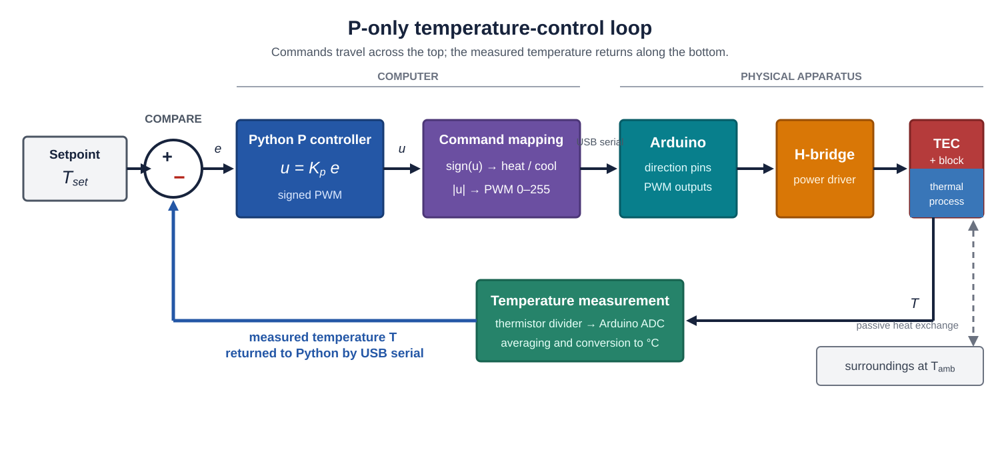
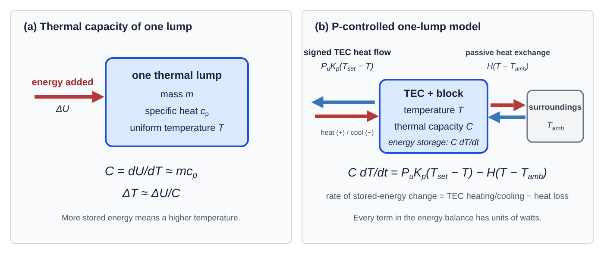

# Module 5 Assignment: P-Only Temperature Control

## Module At A Glance

Module 4 measured the TEC response to manually chosen commands. Module 5 closes
the feedback loop: Python calculates the signed PWM, $u$ [PWM], proportional to the error, $e$ [°C], with

\[
e=T_{\mathrm{set}}-T, \qquad u=K_p e
\]

and $K_p$ a conversion constant. The sign of $u$ selects heat or cool; its magnitude becomes the nonnegative
8-bit PWM value sent to the Arduino. The Arduino applies the command and retains
independent shutdown authority. During S9-S10 you will verify the feedback sign,
measure droop versus gain, explore high-gain behavior, and compare the data with
a simple model. PI control follows in Module 6.

## Optional Background Sources

These are optional; Laplace transforms are not required in Module 5:

- [Module 6](../lab-06/index.md): [droop](../lab-06/index.md#part-1-algebraic-droop-model)
  and [first-order stability](../lab-06/index.md#part-6-why-the-first-order-model-may-not-oscillate)
- Bechhoefer, [*Feedback for Physicists*](../../references/bechhoefer-feedback-for-physicists-2005.pdf),
  pp. 788-790 and 804-805
- [Wikipedia: PID controller](https://en.wikipedia.org/wiki/PID_controller)
- [NI: PID theory explained](https://www.ni.com/en/shop/labview/pid-theory-explained.html)

## Safety Boundary

Before using feedback control:

1. The Module 4 software temperature limit is present.
2. PWM starts at zero.
3. The Python GUI shows plausible temperature.
4. Heat and cool directions have the correct sign.
5. The power supply current limit is set by the instructor.
6. The setpoint is between **20 °C and 35 °C** unless the instructor approves a
   different range.

Stop immediately if the temperature moves in the wrong direction, the GUI
freezes, the PWM saturates unexpectedly, or sustained oscillations grow in
amplitude.

## Vocabulary

| Quantity | Meaning | Units |
| --- | --- | --- |
| $T_{\mathrm{set}}$ | Desired temperature | °C |
| $e=T_{\mathrm{set}}-T$ | Temperature error; steady nonzero error is **droop** | °C |
| $u=K_p e$ | Signed PWM calculated by Python | PWM counts |
| $P=\lvert u\rvert$ | Nonnegative Arduino PWM magnitude, limited to 0-255 | PWM counts |
| $K_p$ | Proportional gain | PWM counts/°C |

**Saturation** occurs when the requested PWM exceeds its allowed range.
**Instability** means the response oscillates or diverges instead of settling.

## Before Class

1. From Module 4, identify the appropriate temperature susceptibility
   \(\chi_T=dT/d(\mathrm{PWM})\) near room temperature.
   In Module 4, `PWM` means the nonnegative magnitude (P=|u|). Keep the
   direction fixed when measuring this slope: for heating,
   \(\chi_{T,h}=dT/dP>0\); for cooling, \(dT/dP\) is usually negative, and
   its magnitude is the cooling susceptibility.
2. Confirm that your Arduino safety shutdown still works.
3. Choose a preliminary setpoint and calculate
   \(e_0=T_{\mathrm{set}}-T_{\mathrm{amb}}\).
4. Record the convention: positive $u$ selects heat, negative $u$ selects
   cool, and the Arduino receives $P=|u|$ as PWM magnitude.

## Outside-Class Workload Budget

| Session | Required outside work | Total |
| --- | --- | ---: |
| S9 | Read the assignment; answer the questions; review Module 4; prepare the controller and gain range | **2 hours 15 minutes** |
| S10 | Prepare the data plan; analyze and label evidence; update the note; commit and push | **2 hours 30 minutes** |

Optional background reading is not included in the required workload budget.

## Pre-Class Questions

1. If \(T_{\mathrm{set}}=30\ ^\circ\mathrm{C}\) and
   \(T=25\ ^\circ\mathrm{C}\), should the TEC heat or cool?
2. If $u$ is measured in PWM counts and $e$ is measured in °C, what are the
   units of $K_p$?
3. Why does proportional control require a nonzero error to produce a nonzero
   output?
4. What experimental symptoms might indicate that $K_p$ is too large?

## Part 1: Implement P-Only Control

The feedback loop you will implement is shown below.

[](../../assets/module5_p_feedback_loop.svg)

*Figure 1. The computer calculates the signed PWM. The Arduino and
H-bridge apply it to the thermal apparatus, and the thermistor measurement
closes the loop.*

Python subtracts the measured temperature from $T_{\mathrm{set}}$, calculates
$u=K_p e$, and converts the sign and magnitude of $u$ into the heat/cool
direction and nonnegative PWM magnitude. The Arduino applies those commands to
the H-bridge, measures the resulting temperature through the thermistor, and
sends the measurement back to Python to close the loop.

Add a P-only mode to your Python GUI. Python calculates the signed PWM and
sends direction and PWM magnitude to the Arduino. The Arduino continues to
measure temperature, parse commands, drive the H-bridge, and enforce the
independent software temperature limit developed in Module 4.

The controller should:

1. read the measured temperature only after averaging between 100 and 1000 raw
   thermistor-voltage measurements and converting the average voltage to
   temperature,
2. calculate $e=T_{\mathrm{set}}-T$,
3. calculate $u=K_p e$,
4. convert the sign of $u$ into heat/cool direction,
5. convert $P=|u|$ into an integer PWM magnitude,
6. clamp $P$ to the range 0 to 255,
7. send direction and PWM magnitude to the Arduino,
8. keep plotting temperature, PWM, direction, setpoint, and error.

Start with a very small gain. Do not tune aggressively at first.

## Part 2: Sign Test At Low Gain

Before trying to regulate temperature:

1. Choose a setpoint slightly above room temperature.
2. Use a very small $K_p$.
3. Confirm that positive error produces heating.
4. Choose a setpoint slightly below room temperature.
5. Confirm that negative error produces cooling.

If the sign is wrong, stop and fix the sign convention before continuing.

## Part 3: Measure Droop Versus Gain

Choose one setpoint, for example **30 °C**, and use the corresponding Module 4
temperature susceptibility to select your own gain range. First estimate the
PWM magnitude required to produce the desired open-loop temperature change:

\[
P_{\mathrm{required}}\approx
\frac{|T_{\mathrm{set}}-T_{\mathrm{amb}}|}{|\chi_T|}.
\]

For every candidate gain, predict the initial PWM magnitude:

\[
P_0=K_p|e_0|,
\qquad e_0=T_{\mathrm{set}}-T_{\mathrm{amb}}.
\]

Select a sequence that starts with $P_0$ well below
$P_{\mathrm{required}}$ and progresses toward values comparable to or larger
than $P_{\mathrm{required}}$, without beginning outside the 0-to-255 PWM
range. Record your reasoning and have the instructor approve the range before
running it.

Use a table like this:

| $K_p$ (PWM/°C) | Predicted $P_0$ | Setpoint (°C) | Final Temperature (°C) | Droop (°C) | Final PWM | Notes |
| ---: | ---: | ---: | ---: | ---: | ---: | --- |
|  |  |  |  |  |  |  |

For each gain:

1. Start from PWM `0`.
2. Turn on P-only control.
3. Wait for the temperature to settle or clearly fail to settle.
4. Record final temperature, error, and PWM.
5. Save a strip chart trace.

Plot droop versus $K_p$.

## Part 4: Predict Droop From Module 4

For a heating setpoint above room temperature, use the heating susceptibility
$\chi_{T,h}>0$ measured in Module 4:

\[
T=T_{\mathrm{amb}}+\chi_{T,h}P,
\qquad
P=K_p(T_{\mathrm{set}}-T).
\]

Combining the equations predicts the steady-state droop:

\[
T_{\mathrm{set}}-T=
\frac{T_{\mathrm{set}}-T_{\mathrm{amb}}}
{1+\chi_{T,h}K_p}.
\]

The product in the denominator is dimensionless:

\[
[\chi_{T,h}K_p]
=\frac{^\circ\mathrm C}{\text{PWM count}}
\frac{\text{PWM count}}{^\circ\mathrm C}=1.
\]

If you instead select a cooling setpoint, use the magnitude of the cooling
susceptibility and the magnitude of the cooling error in the analogous model.
Calculate the predicted droop for each tested gain and overlay predicted and
measured droop on the same graph.

This model will not be perfect. Its job is to explain the main trend.

## Part 5: Explore The High-Gain Response

Continue through your instructor-approved gain range. Do not assume that the
apparatus must oscillate. For every retained gain, record the setpoint, mean or
steady temperature, response shape, PWM behavior, and whether PWM saturates.

If sustained oscillations appear, measure their amplitude, period, and
frequency. State how you define amplitude. If they do not appear within the
safe range, report the highest gain tested and describe how that response
differs from the low-gain response.

| $K_p$ (PWM/°C) | Settles? | Mean Temperature (°C) | Amplitude (°C) | Period (s) | Frequency (Hz) | Saturation? |
| ---: | --- | ---: | ---: | ---: | ---: | --- |
|  |  |  |  |  |  |  |

Do not let oscillations grow without supervision. Stop control and set PWM to
zero if the run becomes unsafe.

## Part 6: Interpret And Preserve The Results

### Thermal Capacity And The One-Lump Model

To describe time dependence, first treat the TEC, block, and thermistor as one
object at one uniform temperature $T$. Its thermal capacity is

$$
C=\frac{dU}{dT}\approx mc_p,
$$

where $U$ is stored thermal energy, $m$ is the mass of the lump in kg, and
$c_p$ is its specific heat capacity in J/(kg K), equivalently J/(kg °C) for
a temperature change. The units of $C$ are J/°C (equivalently J/K): it is
the energy needed to raise the lump's temperature by one degree.

For P-only control, the one-lump energy balance is

$$
C\frac{dT}{dt}
=P_uK_p(T_{\mathrm{set}}-T)-H(T-T_{\mathrm{amb}}).
$$

[](../../assets/module5_one_lump_energy_balance.svg)

*Figure 2. Panel (a) connects added energy to the temperature change of a
massive object. Panel (b) shows the signed TEC heat flow, energy storage in the
lump, and passive heat exchange with the surroundings.*

The left side is the rate of stored-energy change with units watts (joules/sec). The first term on the right
is TEC heating or cooling, where $P_u$ has units W/PWM count and $K_p$ has units PWM/°C. The second term on the right is
heat transfer to the room, where $H$ has units W/°C, thus every term in the equation has units of
watts. The model assumes one uniform temperature, linear heat loss,
instantaneous measurement and actuation, and no saturation.

The coefficient $P_u$ describes the strength of the TEC actuator in the
operating range being modeled. It is the change in thermal power delivered to
the lump per signed PWM count, with units W/PWM count. Thus, $P_u$ is not itself
a power: $P_uK_p(T_{\mathrm{set}}-T)$ is the signed TEC heat-transfer rate in
watts. With our convention, a positive temperature error adds heat to the lump
and a negative temperature error removes heat from it. Treating $P_u$ as
constant is an approximation that is most reasonable over a limited PWM and
temperature range.

The coefficient $H$ is the lump's total passive thermal conductance to its
surroundings, with units W/°C or W/K. It combines all modeled paths by which the
lump exchanges heat with the room. When $T>T_{\mathrm{amb}}$, the quantity
$H(T-T_{\mathrm{amb}})$ is positive and heat leaves the lump. When
$T<T_{\mathrm{amb}}$, it is negative, so the minus sign in the energy balance
makes the room transfer heat into the colder lump. A larger $H$ means a
stronger pull toward room temperature; its reciprocal $1/H$ is the thermal
resistance, with units °C/W or K/W.

The susceptibility used in Module 4 and the signed-PWM derivative are related
but are not identical definitions. With the signed convention used here,

\[
\chi_{T,u}=\frac{dT}{du}=\frac{P_u}{H}.
\]

For heating, \(u=P>0\), so \(\chi_{T,h}=dT/dP=P_u/H\). For cooling,
the Arduino still receives the positive magnitude \(P=-u\), so
\(dT/dP=-P_u/H\). Thus the cooling magnitude is
\(|\chi_{T,c}|=P_u/H\), while the signed derivative with respect to \(u\)
remains \(P_u/H\) in both directions.

### Student Derivation: Recover The Droop Equation

Show that the dynamic one-lump model predicts the same steady-state droop as
the experimental susceptibility model in Part 4. Work through these steps in
your notes:

**Hint.** First temporarily regard the loop as open, so that $u$ is an
independent signed input rather than $K_p(T_{\mathrm{set}}-T)$. At steady state,
the one-lump model becomes

\[
0=P_u u-H(T-T_{\mathrm{amb}}),
\]

so

\[
T-T_{\mathrm{amb}}=\frac{P_u}{H}u.
\]

For the signed-PWM convention used in this section, the open-loop susceptibility
is therefore

\[
\chi_{T,u}=\frac{dT}{du}=\frac{P_u}{H},
\qquad\text{and hence}\qquad
\boxed{P_u=H\chi_{T,u}}.
\]

Relate this signed susceptibility to the heating or cooling magnitude slope
from Module 4 before substituting the proportional-control law. The hint gives
the physical relationship among $P_u$, $H$, and susceptibility; the remaining
steps are yours.

1. At steady state, set $dT/dt=0$.
2. Starting from the expanded P-only equation above, collect the terms that
   contain $T$.
3. Solve algebraically for the droop $T_{\mathrm{set}}-T$.
4. Compare your result with the Part 4 equation and identify the relationship
   among the appropriate directional susceptibility, $P_u$, and $H$.
5. Check the units of that relationship.
6. Explain physically why the thermal capacity $C$ affects the transient
   response but does not appear in the steady-state droop.
7. State which assumptions must hold for the two droop predictions to agree.

Preserve this derivation for A3. It should make clear how the measured
susceptibility in Part 4 is connected to the heat-transfer parameters in the
one-lump model.

### First-Order Expectation

The algebraic model predicts droop but says nothing about time dependence. Let
$T_{\mathrm{ss}}$ denote the steady-state temperature predicted for the chosen
$T_{\mathrm{set}}$, $K_p$, and $T_{\mathrm{amb}}$. It is found by setting
$dT/dt=0$ in the one-lump equation and generally differs from the setpoint
because of droop. For the one-lump model developed fully in
[Module 6](../lab-06/index.md), define the deviation from steady state as
$\theta=T-T_{\mathrm{ss}}$. Under P-only control, this deviation obeys

$$
\frac{d\theta}{dt}=-\frac{\theta}{\tau_{\mathrm{cl}}},
$$

with solution

$$
\theta(t)=\theta(0)e^{-t/\tau_{\mathrm{cl}}}.
$$

This response approaches the steady state exponentially and cannot sustain an
oscillation. If the apparatus oscillates, the one-lump model is missing
important physics or implementation details. Discuss plausible causes such as
thermal delay between the TEC and thermistor, another thermal mass, discrete
sampling, sensor noise, or PWM saturation.

### Evidence For A3 And C4

Module 5 requires no separate paper. Its results support the later
[`A3` feedback-and-model memo](../lab-06/index.md#a3-feedback-data-and-lumped-model-memo)
and the C4 demonstration. During S9-S10, preserve:

- the low-gain feedback sign test,
- the chosen gain range and the calculation used to justify it,
- dimensional droop and high-gain response tables,
- measured and predicted droop on one graph,
- the derivation connecting the Part 4 droop equation to the one-lump model of Part 6,
- representative low- and high-gain strip-chart traces,
- the exact Python controller, Arduino sketch, and raw-data filenames, and
- a brief explanation of droop and of why oscillations did or did not appear.

Keep the note in `docs/module_notes/module_05_p_control.md`, data in
`data/module_05/`, and figures in `docs/figures/module_05/`. Calculate droop and
any oscillation quantities in class. Reserve about **90 minutes** afterward for
analysis, captions, and the Git checkpoint.

### GitHub Checkpoint

```bash
git status
git add README.md arduino python docs data
git commit -m "Measure P-only temperature control"
git push
```

Before Module 6, confirm that all listed evidence is present in the pushed
repository and that it is clear which code and data produced each figure.
