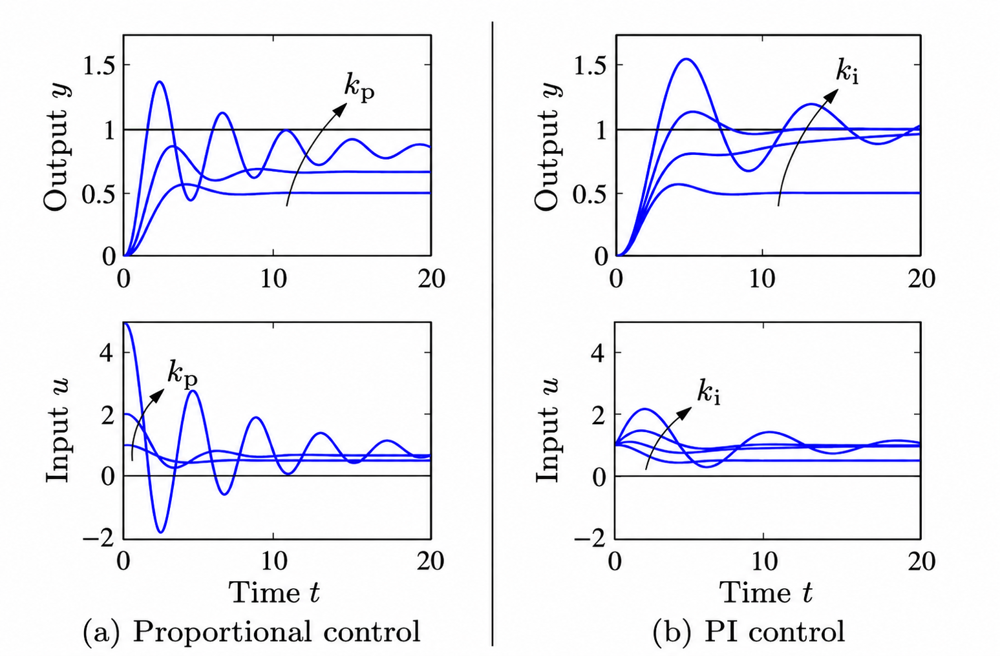
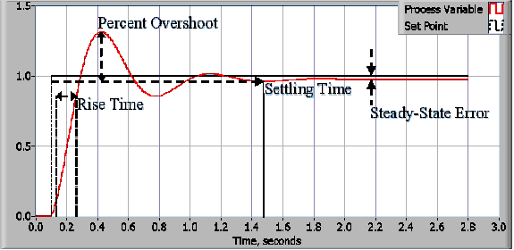

# Module 6, Part I: P/PI Control And Lumped Modeling

Module 6 has two linked parts:

1. **Part I (this page):** develop one-lump P and PI models and connect them to
   the Module 4 and Module 5 measurements.
2. [**Part II: TEC Process Model And Simulation**](../lab-07/index.md):
   extend the model, compare one- and two-lump descriptions, and test the model
   with the same prepared simulation.

## Purpose

Module 5 showed that proportional feedback reduces steady-state error but can
overshoot, ring, and oscillate. Module 6 develops the theory needed to
distinguish what a one-lump model explains from behavior that requires
additional thermal dynamics.

The goal is to connect thermal physics, feedback equations, and the data you measured from the TEC.

You will begin with algebra, then simulate the one-lump model in time, then
extend the model just enough to understand why integral control is useful and
why real feedback loops can oscillate.

## Learning Objectives

By the end of Module 6, Parts I and II, you should be able to:

- derive and interpret the one-lump energy balance, open-loop susceptibility,
  thermal time constant, and P-control droop;
- use the prepared simulation to compare open-loop, P, and PI control;
- connect the model parameters and predictions to measured values of
  susceptibility, time constant, droop, and transient response;
- explain why the one-lump P-control model cannot overshoot and use measured
  overshoot to identify the need for additional thermal dynamics;
- implement PI control on the physical TEC, including integral reset and
  anti-windup;
- characterize how changing $K_p$ and $K_i$ affects both the process output
  (measured temperature) and process input (signed PWM) for P and PI control;
- quantify step responses in both directions using rise time, percent
  overshoot, settling time, steady-state error, and oscillation period when
  applicable; and
- select and justify $K_p$ and $K_i$ using those measurements and actuator
  saturation.

## Theme

**Time-Domain Models For P And PI Control**

Droop, time constants, numerical simulation, and the first model of integral
action.

## Reading

Read selectively:

1. Lienhard and Lienhard, [*A Heat Transfer Textbook*](https://ahtt.mit.edu/).

    - Section 1.3: read for energy-balance language and units.
    - Chapter 4, especially Section 4.5: read for transient response and thermal
      time constants.

2. Review your Module 4 and Module 5 data.
3. Optional after class: [Bechhoefer, *Feedback for Physicists*,
   pp. 795-797](../../references/bechhoefer-feedback-for-physicists-2005.pdf),
   on feedback and stability.

Do not try to learn all of transient heat transfer at once. For this module, you
need the idea that a physical object has heat capacity, exchanges heat with its
environment, and responds over a time scale.

## Vocabulary

### Terms

- **Thermal capacitance (thermal mass):** energy required to raise the lump's
  temperature by one degree. In this module, *thermal mass* is an informal
  synonym for thermal capacitance.
- **Thermal resistance:** opposition to passive heat flow between the lump and
  its surroundings.
- **Heat-loss conductance:** the inverse of thermal resistance; passive heat
  transfer per degree of temperature difference.
- **Time constant:** characteristic decay time. A first-order system has one
  time constant; a higher-order system can have more than one decay time.
- **Open-loop temperature susceptibility:** steady-state temperature change per
  applied PWM command, with direction held fixed.
- **P control:** command proportional to the current temperature error.
- **PI control:** command equal to the sum of a proportional term and a term
  proportional to accumulated temperature error.
- **Windup:** continued growth of the integral term while the actuator is
  saturated.
- **Droop:** nonzero steady-state temperature error in P-only control.

### Symbols Used In Module 6, Part I

A temperature difference has the same numerical value in K and °C. Earlier
modules wrote the generic open-loop susceptibility as $\chi_{T,u}$. For
concision, this module writes it as $\chi$ and uses $\chi_h$ and $\chi_c$ when
the heating and cooling values must be distinguished. Similarly, $P_u$ means
the coefficient for the active direction; $P_{u,h}$ and $P_{u,c}$ distinguish
heating from cooling.

| Symbol | Meaning | Units |
| --- | --- | --- |
| $C$ | Thermal capacitance of one lump | J/K or J/°C |
| $T$ | Lump temperature | °C |
| $t$ | Time | s |
| $dT/dt$ | Rate of temperature change | K/s or °C/s |
| $P_u$ | Effective TEC thermal-power coefficient per signed PWM count | W/PWM count |
| $u$ | Signed PWM command: positive heats and negative cools | PWM counts |
| $H$ | Passive heat-loss conductance to the surroundings | W/K or W/°C |
| $T_{\mathrm{amb}}$ | Ambient (room) temperature | °C |
| $U$ | Thermal energy stored in the lump | J |
| $\dot Q_{\mathrm{in}}$ | Rate at which heat enters the lump | W |
| $\dot Q_{\mathrm{out}}$ | Rate at which heat leaves the lump | W |
| $m$ | Mass of the lump | kg |
| $c_p$ | Specific heat capacity of the lump material | J/(kg K) |
| $\chi$ | Open-loop temperature susceptibility for the active direction | °C/PWM count |
| $\chi_h$, $\chi_c$ | Heating and cooling susceptibilities | °C/PWM count |
| $r=\chi_h/\chi_c$ | Ratio of heating to cooling susceptibility | dimensionless |
| $\tau=C/H$ | Open-loop thermal time constant | s |
| $K_p$ | Proportional gain | PWM counts/°C |
| $K_i$ | Integral gain | PWM counts/(°C s) |
| $T_{\mathrm{set}}$ | Requested temperature setpoint | °C |
| $e=T_{\mathrm{set}}-T$ | Temperature error | °C |
| $q=\int e\,dt$ | Accumulated temperature error | °C s |
| $u_P=K_pe$, $u_I=K_iq$ | Proportional and integral contributions to the PWM command | PWM counts |
| $\mathrm{droop}=T_{\mathrm{set}}-T_{\mathrm{ss}}$ | Steady-state temperature error | °C |
| $\theta$, $z$ | Temperature and integral-state displacements from steady state | °C, °C s |
| $\lambda$ | Eigenvalue governing exponential growth or decay | 1/s |
| $\zeta$ | PI damping ratio | dimensionless |

## Before Class

Review your Module 4 and Module 5 results. Before class, make sure you can
locate and open these existing files on your laptop:

- Module 4 steady-state temperature versus PWM data,
- Module 5 droop-versus-gain data,
- one Module 5 strip-chart trace at a stable gain,
- one Module 5 high-gain strip-chart trace showing overshoot or ringing; if no
  overshoot was safely observed, bring the highest-gain trace, and
- your current Python plotting or modeling environment.

Do not create new figures, tables, or written work for this section. The files
will be used during the in-class model comparison.

## Outside-Class Workload Budget

| Session | Work | Planned time |
| --- | --- | ---: |
| S12 | Read this assignment and the selected heat-transfer material | 90 minutes |
| S12 | Complete and check the guided one-lump derivation | 120 minutes |
| S12 | **Total associated with S12** | **3 hours 30 minutes** |
| S13 | Review PI control and windup; answer the preparation questions | 60 minutes |
| S13 | Explore PI behavior in the simulation and prepare the physical-controller change | 105 minutes |
| S13 | **Total associated with S13** | **2 hours 45 minutes** |
| S14 | Analyze matched physical P/PI results and select gains | 90 minutes |
| S14 | Write, check, commit, push, and prepare A3 | 120 minutes |
| S14 | **Total associated with S14** | **3 hours 30 minutes** |

Do not add optional reading until the required derivation and A3 evidence are
complete and understood.

## Pre-Class Questions

1. What physical part of the apparatus stores heat?
2. What physical paths let heat leave the measured block?
3. What evidence from your data suggests a thermal time constant?
4. Why does the algebraic droop model not predict oscillation?

## What You Will Do Across Parts I And II

- Derive the algebraic P-control droop model.
- Estimate an open-loop thermal slope from Module 4.
- Estimate a time constant from a temperature step.
- Simulate a first-order TEC/block model.
- Explore P-only feedback in the simulation.
- Compare simulated droop with measured droop.
- Compare P and PI control in the simulation.
- Implement PI control on the physical TEC with anti-windup.
- Tune $K_p$ and $K_i$ and compare matched experimental P and PI responses.
- Explain why integral action reduces droop and why windup is a problem.

## Part 1: Algebraic Droop Model

The dimensional one-lump model is

\[
C\frac{dT}{dt}=P_u u-H(T-T_{\mathrm{amb}}).
\]

This is the one-lump heat balance written in terms of the lump's temperature.
It follows from the more general First Law in rate form. The change of energy in time is equal to the rate of heat into the lump minus the rate of heat out:

\[
\frac{dU}{dt}=\dot Q_{\mathrm{in}}-\dot Q_{\mathrm{out}}.
\]

If the lump has constant thermal capacitance \(C\), then \(dU=C\,dT\), so

\[
\frac{dU}{dt}=C\frac{dT}{dt}.
\]

Each of the three terms in the one-lump model therefore has units of power:

**1. Energy storage**

\[
C\frac{dT}{dt}.
\]

The thermal capacitance \(C=mc_p\) has units J/K, and \(dT/dt\) has units
K/s or °C/s. Their product has units J/s = W. A positive value means the
lump is warming; a negative value means it is cooling.

**2. TEC heating or cooling**

\[
P_u u.
\]

The signed PWM command \(u\) is positive for heating and negative for
cooling. The effective TEC coefficient \(P_u\) has units W/PWM, so
\(P_u u\) has units W. This term treats the rapidly switched PWM drive as
an average thermal power.

**3. Heat transfer to the surroundings**

\[
-H(T-T_{\mathrm{amb}}).
\]

The total heat-loss conductance \(H\) has units W/K, while
\(T-T_{\mathrm{amb}}\) is a temperature difference in K or °C. Their
product has units W. If \(T>T_{\mathrm{amb}}\), this term is negative and
the lump loses heat. If \(T<T_{\mathrm{amb}}\), the term is positive: the
room transfers heat into the colder lump.

The algebraic droop model below is the steady-state limit of this energy
balance, where \(dT/dt=0\).

### Guided Derivation And Numerical Check

The measured Module 4 open-loop relationship is

\[
T=T_{\mathrm{amb}}+\chi u,
\]

where $\chi=dT/du$ is the open-loop susceptibility with respect to signed
PWM. With the signed convention, $\chi$ is positive: positive $u$ heats
and raises $T$, while negative $u$ cools and lowers $T$. P-only feedback supplies

\[
u=K_p(T_{\mathrm{set}}-T).
\]

Substitute the controller law into the measured open-loop relationship:

\[
T=T_{\mathrm{amb}}+\chi K_p(T_{\mathrm{set}}-T).
\]

At steady state, collect the terms containing $T$:

\[
(1+\chi K_p)T
=T_{\mathrm{amb}}+\chi K_pT_{\mathrm{set}}.
\]

Subtract this result from $T_{\mathrm{set}}$ to obtain the droop:

\[
\boxed{
T_{\mathrm{set}}-T=
\frac{T_{\mathrm{set}}-T_{\mathrm{amb}}}{1+\chi K_p}.
}
\]

The product $L=\chi K_p$ is dimensionless. It is the loop gain for this
steady-state model. Part 2 derives $\chi=P_u/H$ from the dimensional
model.

Using one of your Module 5 runs, use $\chi$, $T_{\mathrm{amb}}$,
$T_{\mathrm{set}}$, and $K_p$ in the boxed equation to calculate the predicted
settled temperature and droop. Compare the prediction with the measured Module
5 droop, then state one physical reason they may differ.

## Part 2: Express The One-Lump Model Using Measured Parameters

Continue with the dimensional one-lump energy balance from Part 1:

\[
C\frac{dT}{dt}=P_u u-H(T-T_{\mathrm{amb}}).
\]

This remains the physical foundation for the rest of Module 6. Divide by $C$:

\[
\frac{dT}{dt}
=\frac{P_u}{C}u-\frac{H}{C}(T-T_{\mathrm{amb}}).
\]

At steady state, $dT/dt=0$, so

\[
T=T_{\mathrm{amb}}+\frac{P_u}{H}u.
\]

Comparison with the Module 4 measurement
$T=T_{\mathrm{amb}}+\chi u$ identifies

\[
\boxed{\chi=\frac{P_u}{H}}.
\]

For constant $u$, define the steady-state temperature

\[
T_{\mathrm{ss}}
=T_{\mathrm{amb}}+\frac{P_u}{H}u
=T_{\mathrm{amb}}+\chi u.
\]

Now define the displacement from that steady state:

\[
\theta(t)=T(t)-T_{\mathrm{ss}}.
\]

Because $u$ and $T_{\mathrm{ss}}$ are constant, substitution into the
one-lump energy balance gives

\[
C\frac{d\theta}{dt}=-H\theta,
\]

or

\[
\frac{d\theta}{dt}=-\frac{H}{C}\theta.
\]

Its solution is

\[
\theta(t)=\theta(0)e^{-(H/C)t}
=\theta(0)e^{-t/\tau}.
\]

Comparison of the exponents identifies the open-loop thermal time constant:

\[
\boxed{\tau=\frac{C}{H}}.
\]

The units confirm that this ratio is a time:

\[
[\tau]=\frac{\mathrm{J/K}}{\mathrm{W/K}}
=\frac{\mathrm{J}}{\mathrm{J/s}}=\mathrm{s}.
\]

<details class="note" markdown="1">
<summary>Sidebar: From dimensional analysis to a dimensionless model</summary>

This follows the progression in [Howard Stone, Sections 1.5.1-1.5.2:
characteristic time and rescaling a differential
equation](../../references/stone-dimensional-analysis-size-and-scale.pdf#page=21).
Stone examines a model four related ways: inspect the dimensions, balance
the sizes of terms, solve the equation when possible, and then rescale it
so that only dimensionless variables and parameters remain.

**1. Inspect the dimensions.** For the unforced departure from steady state,

\[
C\frac{d\vartheta}{dt}=-H\vartheta,
\qquad \vartheta=T-T_{\mathrm{ss}},
\]

the parameters that contain time are $C$ and $H$. Their ratio has units of
time:

\[
\frac{C}{H}
=\frac{\mathrm{J/K}}{\mathrm{W/K}}
=\mathrm{s}.
\]

Dimensional analysis therefore identifies $C/H$ as the characteristic
time, but cannot by itself determine the complete function of time.

**2. Balance the sizes of the terms.** If a typical temperature departure
$\Delta T$ changes over a typical time $t_c$, then

\[
C\frac{\Delta T}{t_c}\sim H\Delta T.
\]

The temperature scale cancels because this equation is linear, leaving

\[
t_c\sim\frac{C}{H}.
\]

**3. Solve the equation.** Separation of variables gives

\[
\vartheta(t)=\vartheta(0)e^{-tH/C}.
\]

The solution supplies what dimensional reasoning alone cannot: the decay
is exponential, and its exact time constant is $\tau=C/H$.

**4. Nondimensionalize time and temperature.** Following Stone, choose the
initial departure as the temperature scale and define

\[
\Theta=\frac{\vartheta}{\vartheta(0)}
=\frac{T-T_{\mathrm{ss}}}{T(0)-T_{\mathrm{ss}}},
\qquad
\hat t=\frac{t}{\tau}.
\]

Substitution removes every dimensional parameter:

\[
\frac{d\Theta}{d\hat t}=-\Theta,
\qquad \Theta(0)=1,
\qquad \Theta=e^{-\hat t}.
\]

This is also the form used in [Lienhard and Lienhard, Section 5.2:
dimensional analysis of a lumped-capacity
system](../../references/lienhard-heat-transfer-textbook-v6.pdf#page=208).
They use

\[
\Theta=\frac{T-T_\infty}{T_i-T_\infty},
\qquad
\frac{t}{\mathcal{T}},
\qquad
\mathcal{T}=\frac{\rho cV}{hA}.
\]

In our notation, $C=\rho cV$, $H=hA$, and $T_\infty=T_{\mathrm{amb}}$,
so Lienhard's $\mathcal{T}$ is our $\tau=C/H$. See also [Lienhard and
Lienhard, Section 4.3](../../references/lienhard-heat-transfer-textbook-v6.pdf#page=164)
for why temperature is nondimensionalized using a temperature
*difference*: the absolute temperature level is not significant in a
linear conduction problem.

**What changes when the TEC drives the system?** Choose a characteristic
command $u_0$ and a characteristic temperature change $\Delta T$, then
define

\[
\hat t=\frac{t}{\tau},\qquad
\hat T=\frac{T-T_{\mathrm{amb}}}{\Delta T},\qquad
\hat u=\frac{u}{u_0}.
\]

Substitution into the one-lump model gives

\[
\frac{d\hat T}{d\hat t}
=\Gamma\hat u-\hat T,
\qquad
\Gamma=\frac{\chi u_0}{\Delta T}.
\]

Thus the dimensional parameters enter through the single dimensionless
group $\Gamma$. Choosing $\Delta T=\chi u_0$, the steady temperature
change produced by $u_0$, makes $\Gamma=1$ and leaves

\[
\frac{d\hat T}{d\hat t}=\hat u-\hat T.
\]

Thus, for an open-loop step, the natural temperature scale is either the
measured step size or $\chi u_0$, its predicted steady-state value.
For setpoint control, use
$\Delta T=|T_{\mathrm{set}}-T_{\mathrm{amb}}|$. Absolute temperature is not
useful here because the model depends only on temperature differences.
Absolute kelvin temperature would become relevant for thermal radiation or
strongly temperature-dependent material properties.

Nondimensionalization is useful because it reveals which experiments are
dynamically equivalent. For P control, scaling by the setpoint offset gives

\[
\frac{d\hat T}{d\hat t}
=L(\hat T_{\mathrm{set}}-\hat T)-\hat T,
\qquad
L=\chi K_p,
\]

where $L$ is the dimensionless loop gain and
$\hat T_{\mathrm{set}}=+1$ for heating or $-1$ for cooling. The response
shape is therefore controlled by $L$, while $\tau$ restores the physical
time scale.

</details>

The two measured quantities are the thermal time constant and the open-loop
susceptibility:

\[
\boxed{\tau=\frac{C}{H}},
\qquad
\boxed{\chi=\frac{P_u}{H}}.
\]

These two measured quantities determine the two parameter ratios that govern
the dynamics:

\[
\boxed{\frac{H}{C}=\frac{1}{\tau}},
\qquad
\boxed{\frac{P_u}{C}
=\frac{P_u/H}{C/H}
=\frac{\chi}{\tau}}.
\]

Module 4 provides the heating and cooling susceptibilities, and a temperature
step from Module 4 or Module 5 provides $\tau$. Use the susceptibility for the
corresponding direction. Therefore, once
$T_{\mathrm{amb}}$ and the command $u$ are specified, the model has **no free
parameters**. Its transient temperature prediction can be compared directly
with the measurement rather than fitted to it.

The same dimensional energy balance can therefore be written entirely in
terms of $\chi$ and $\tau$:

\[
\boxed{
\frac{dT}{dt}
=\frac{T_{\mathrm{amb}}+\chi u-T}{\tau}.
}
\]

This is not a different model. It is the one-lump energy balance expressed in
a form that can be simulated using your measured susceptibility and time
constant. The quantity $T_{\mathrm{amb}}+\chi u$ is the steady temperature toward
which the model moves for a constant command $u$; $\tau$ determines how
quickly it moves there.

## Part 3: Estimate $\tau$

Use a temperature step from Module 4 or Module 5.

Use a trace in which every temperature value was calculated by averaging
exactly 1,000 raw thermistor-voltage measurements, as required in Modules 2
through 5.

One practical method:

1. Identify the initial temperature, $T_{\mathrm{initial}}$.
2. Identify the approximate final temperature, $T_{\mathrm{final}}$.
3. Calculate 63 percent of the total change using
   $T_{63}=T_{\mathrm{initial}}
   +0.63\left(T_{\mathrm{final}}-T_{\mathrm{initial}}\right)$.

4. Estimate $\tau$ as the elapsed time when the temperature first reaches
   $T_{63}$.

Record how uncertain your estimate is. The trace may not be a perfect
exponential. In the dimensional model, this measurement determines the ratio
$C/H$; it does not separately determine $C$ and $H$.

## Part 4: Simulate Open-Loop Response

Download [the prepared Module 6/7 TEC
simulation](../../downloads/Lab_6_7_modeling_tec.py). Save it in your
project repository as `python/Lab_6_7_modeling_tec.py`, then run it from the
repository root:

```bash
python python/Lab_6_7_modeling_tec.py
```

For Module 6, select the **one-lump** physical model. The program performs an
Euler integration of the dimensional energy balance:

\[
T_{n+1}=T_n+\frac{\Delta t}{C}
\left[P_u u_n-H(T_n-T_{\mathrm{amb}})\right].
\]

Because your experiment measures $\chi=P_u/H$ and $\tau=C/H$, the
equivalent measured-parameter update is

\[
\boxed{
T_{n+1}=T_n+\frac{\Delta t}{\tau}
\left(T_{\mathrm{amb}}+\chi u_n-T_n\right).
}
\]

Select **measured** under **Physical parameters**. Enter your measured
$\chi_c$, $\chi_h$, and $\tau$, the on-state voltage measured across the TEC,
and the TEC module resistance from the datasheet. The voltage control is
limited to the apparatus maximum of $12\ \mathrm{V}$. The program uses these
measurements to calculate $r$, $P_{u,c}$, $H$, and the total one-lump
capacitance $C$. Select **direct constants** only when you want to enter $H$,
$C$, $P_{u,c}$, and $r$ independently for a modeling study. Before running,
use the steady-state equation to predict the final temperature for one heating
command and one cooling command.

### Guided Simulation Exercise: Open Loop And Thermal Mass

Work in pairs. Select **one_lump**, **measured**, and **open_loop**. Use the
current simulation defaults

\[
T_{\mathrm{amb}}=22\ ^\circ\mathrm{C},
\qquad
\chi_c=0.23\ ^\circ\mathrm{C/PWM},
\qquad
\chi_h=0.46\ ^\circ\mathrm{C/PWM},
\qquad
r=2.
\]

Before each run, predict the steady-state temperature from
$T_{\mathrm{ss}}=T_{\mathrm{amb}}+\chi u$:

| Command | Predicted $T_{\mathrm{ss}}$ |
| ---: | ---: |
| $u=+25$ PWM | $33.5\ ^\circ\mathrm{C}$ |
| $u=-25$ PWM | $16.25\ ^\circ\mathrm{C}$ |
| $u=-50$ PWM | $10.5\ ^\circ\mathrm{C}$ |

Run each case and answer:

1. Why do $+25$ PWM and $-25$ PWM produce unequal temperature changes?
2. Which displayed quantities reveal $\chi_h$, $\chi_c$, and their ratio?

Next, keep one open-loop command fixed and note the displayed value of $C$.
Select **direct constants**, double $C$, and leave $H$, $P_{u,c}$, and $r$
unchanged. Predict both the steady temperature and the response time before
resuming. Confirm that the steady temperature is unchanged while
$\tau=C/H$ doubles. Explain why thermal mass changes the transient but not the
steady-state energy balance. Return to **measured** before continuing.

After the guided exercise, choose one heating command and one cooling command
that match your experimental runs. Compare the simulated curves with measured
open-loop traces. Record the values and units of $\chi_c$, $\chi_h$, $\tau$,
$T_{\mathrm{amb}}$, $u$, and $\Delta t$. Choose $\Delta t$ much smaller than
$\tau$ and verify that making it smaller does not appreciably change the
result. Explain any important difference between the model and the apparatus.

## Part 5: Simulate P-Only Feedback

Continue with the same one-lump parameters in the simulation. Select **P**
control, which replaces the constant command with

\[
u_n=K_p(T_{\mathrm{set}}-T_n).
\]

The program clamps $u_n$ to the allowed signed PWM range before applying the
Euler update from Part 4.

### Guided Simulation Exercise: P Control And Droop

Return to **measured**, select **P**, and set

\[
T_{\mathrm{set}}=30\ ^\circ\mathrm{C},
\qquad
K_p=10\ \mathrm{PWM}/^\circ\mathrm{C}.
\]

With the default $\chi_h=0.46\ ^\circ\mathrm{C/PWM}$, predict

\[
L_h=\chi_hK_p=4.6,
\]

\[
T_{\mathrm{set}}-T_{\mathrm{ss}}
=\frac{30-22}{1+4.6}
\approx1.43\ ^\circ\mathrm{C},
\qquad
T_{\mathrm{ss}}\approx28.57\ ^\circ\mathrm{C}.
\]

Run the simulation, compare the displayed droop with the prediction, and then
increase $K_p$. Answer:

1. Does the droop vanish or merely become smaller?
2. Which dimensionless number determines whether the gain is small or large?
3. What happens when the required command reaches the PWM limit?

Before each run, predict the droop and closed-loop time constant from the
equations in Parts 1 and 6. Simulate several values of $K_p$. Record or capture:

- temperature versus time,
- PWM command versus time,
- final droop versus $K_p$; use the recorded values to make one droop plot.

Compare with Module 5. The one-lump model should capture some trends, but it
may not reproduce oscillations.

## Part 6: Solve The P-Controlled One-Lump Model

Now analyze the same dimensional one-lump model used throughout this module.
The solution explains why its P-controlled response cannot oscillate. If the
real apparatus oscillates, the difference identifies physics missing from the
model.

Substituting the P-control law into the energy balance gives

\[
C\frac{dT}{dt}
=P_uK_pT_{\mathrm{set}}+HT_{\mathrm{amb}}
-(H+P_uK_p)T.
\]

Setting \(dT/dt=0\) recovers the steady-state result from Part 1:

\[
\boxed{
T_{\mathrm{set}}-T_{\mathrm{ss}}
=\frac{T_{\mathrm{set}}-T_{\mathrm{amb}}}{1+\chi K_p}.
}
\]

Now define the displacement from steady state,

\[
\theta(t)=T(t)-T_{\mathrm{ss}}.
\]

Substitution reduces the entire closed-loop P model to

\[
C\frac{d\theta}{dt}=-(H+P_uK_p)\theta.
\]

Separate variables and integrate:

\[
\frac{d\theta}{\theta}
=-\frac{H+P_uK_p}{C}\,dt,
\]

\[
\ln\!\left(\frac{\theta(t)}{\theta(0)}\right)
=-\frac{H+P_uK_p}{C}t.
\]

Therefore the temperature is explicitly

\[
\boxed{
T(t)=T_{\mathrm{ss}}
+\left[T(0)-T_{\mathrm{ss}}\right]
\exp\!\left(-\frac{H+P_uK_p}{C}t\right)
}.
\]

Equivalently,

\[
T(t)=T_{\mathrm{ss}}
+\left[T(0)-T_{\mathrm{ss}}\right]e^{-t/\tau_{\mathrm{cl}}},
\qquad
\tau_{\mathrm{cl}}=\frac{C}{H+P_uK_p}.
\]

Using $\tau=C/H$ and the dimensionless loop gain $L=\chi K_p$,

\[
\boxed{
\tau_{\mathrm{cl}}=\frac{\tau}{1+\chi K_p}=\frac{\tau}{1+L}.
}
\]

!!! important "Increasing gain has two effects"

    Increasing $K_p$ does two things at the same time:

    1. **It decreases droop.**

        \[
        T_{\mathrm{set}}-T_{\mathrm{ss}}
        =\frac{T_{\mathrm{set}}-T_{\mathrm{amb}}}{1+\chi K_p}.
        \]

    2. **It speeds up the response** by decreasing the closed-loop time
       constant.

        \[
        \tau_{\mathrm{cl}}=\frac{\tau}{1+\chi K_p}.
        \]

    Thus, in this unsaturated one-lump model, both droop and response time are
    reduced by the same factor, $1+\chi K_p$. Larger gain moves the
    temperature closer to the setpoint and makes it approach its steady value
    more quickly.

To find the eigenvalue directly, try an exponential mode,

\[
\theta(t)=\theta_0e^{\lambda t},
\qquad
\frac{d\theta}{dt}=\lambda\theta.
\]

Substitute this trial solution into the homogeneous P equation:

\[
C\lambda\theta=-(H+P_uK_p)\theta.
\]

Cancel the nonzero factor \(\theta\). There is only one eigenvalue,

\[
\lambda=-\frac{H+P_uK_p}{C},
\]

and it is real and negative for positive physical parameters and negative
feedback. The exponential is always positive, so
\(T(t)-T_{\mathrm{ss}}\) retains its
initial sign while shrinking toward zero. The response therefore cannot cross
the steady state, overshoot, or oscillate. Increasing \(K_p\) decreases both
droop and \(\tau_{\mathrm{cl}}\); it does not create the additional dynamical
state or time delay needed for oscillation.

Return to the high-gain trace saved in Module 5. Mark the late-time value
$T_{\mathrm{ss}}$ and the first overshoot. If the measured temperature crosses
$T_{\mathrm{ss}}$, its behavior is incompatible with this one-lump solution.
State the contradiction directly: the model predicts a monotonic exponential,
whereas the apparatus shows an underdamped transient. This is evidence that the
model is inadequate, not that the exponential solution is wrong.

The one-lump model is missing thermal lag between where the TEC applies heat
and where the thermistor measures temperature. The simplest extension is a
second thermal mass coupled to the measured block. Part II develops that model
in detail.

### Guided Simulation Exercise: From No Overshoot To Overshoot

Preview the two-lump explanation before studying it systematically in Part II.
In the simulation, select **two_lump**, **measured**, and **P**. Use

\[
T_{\mathrm{amb}}=22\ ^\circ\mathrm{C},
\qquad
T_{\mathrm{set}}=30\ ^\circ\mathrm{C},
\qquad
\chi_c=0.23\ ^\circ\mathrm{C/PWM},
\qquad
\chi_h=0.46\ ^\circ\mathrm{C/PWM},
\qquad
\tau=80\ \mathrm{s},
\]

and the experimental-scale two-lump parameters

\[
\frac{C_T}{C}=0.25,
\qquad
G=25\ \mathrm{W/K}.
\]

Set $K_i=0$. Reset before each run and compare $K_p=50$ PWM/°C, which should
approach monotonically, with $K_p=120$ PWM/°C, near the experimentally observed
underdamped regime. Compare the measured temperature $T_m$ with the one-lump
temperature at the same gain. Explain why $T_m$ can continue rising after the
controller begins reducing the TEC command.

This brief comparison establishes that an additional thermal state can permit
overshoot. Carry out the systematic variation of $K_p$, $G$, $C_T$, and $C_m$
in [Module 6, Part II](../lab-07/index.md#part-3-two-temperature-thermal-mass-model).

## Part 7: Add Integral Action In Simulation

Keep the same dimensional one-lump energy balance. PI control changes only the
command supplied to the TEC. Define the temperature error and its accumulated
value as

\[
e=T_{\mathrm{set}}-T,
\qquad
q(t)=q(0)+\int_0^t e(t')\,dt'.
\]

The PI command is

\[
u=K_p e+K_iq,
\]

so the physical model remains

\[
\boxed{
C\frac{dT}{dt}
=P_u\left[K_p(T_{\mathrm{set}}-T)+K_iq\right]
-H(T-T_{\mathrm{amb}}),
\qquad
\frac{dq}{dt}=T_{\mathrm{set}}-T.
}
\]

The simulation calculates and clamps the command from the current state,
then updates both state variables according to

\[
u_n=K_p(T_{\mathrm{set}}-T_n)+K_iq_n,
\]

\[
T_{n+1}=T_n+\frac{\Delta t}{\tau}
\left(T_{\mathrm{amb}}+\chi u_n-T_n\right).
\]

\[
q_{n+1}=q_n+(T_{\mathrm{set}}-T_n)\Delta t.
\]

Select **PI** in the simulation and begin with a stable $K_p$. Use **Zero integral** to
clear the controller memory before a comparison. Watch the displayed values of
$e$, $u_P$, $u_I$, and the applied command while the temperature approaches
the setpoint.

Compare P-only and PI simulations:

- final droop,
- time to approach setpoint,
- overshoot,
- sensitivity to saturation.

The main point is that integral action can reduce steady-state error, but it can
also create overshoot and windup.

### Guided Simulation Exercise: Watch The Integral Contribution

Begin from the P-control case after it has developed visible droop. Select
**PI**, press **Zero integral**, and resume. Watch $e$, $u_P$, $u_I$, and the
applied command $u$ while the temperature approaches the setpoint. Answer:

1. While $e>0$, why does $u_I$ continue to grow?
2. As $T$ reaches the setpoint, why does $u_P$ approach zero?
3. Why can $u_I$ remain nonzero when $e=0$?
4. After steady state, press **Zero integral** again. Why does the temperature
   initially move away from the setpoint?

The steady integral contribution replaces the nonzero proportional error that
was required to provide the steady command under P-only control.

### Why PI Can Be Underdamped

PI control adds the accumulated error as a second state variable. Unlike the
one-state P model, a two-state PI model can therefore have a pair of complex
eigenvalues and an underdamped response. The optional derivation below is
included for mathematical culture, curiosity, and completeness; it is not an
A3 assessment requirement.

<details class="note" markdown="1">
<summary>Optional advanced derivation: PI eigenvalues, damping ratio, and time scales</summary>

From the definitions above,

\[
\frac{dq}{dt}=e,
\qquad
u=K_p e+K_i q,
\qquad
e=T_{\mathrm{set}}-T.
\]

For an unsaturated PI controller at steady state, the temperature reaches the
setpoint and the integral term supplies the PWM needed to balance heat loss:

\[
T_{\mathrm{ss}}=T_{\mathrm{set}},
\qquad
q_{\mathrm{ss}}
=\frac{H(T_{\mathrm{set}}-T_{\mathrm{amb}})}{P_uK_i}.
\]

Now define the **two state variables as displacements from steady state**:

\[
\boxed{
\theta(t)=T(t)-T_{\mathrm{set}}
},
\qquad
\boxed{
z(t)=q(t)-q_{\mathrm{ss}}
}.
\]

Thus \(\theta\) is the temperature displacement and \(z\) is the integral-state
displacement. Because \(e=-\theta\), their time derivatives obey

\[
\frac{d\theta}{dt}
=-\frac{H+P_uK_p}{C}\theta
+\frac{P_uK_i}{C}z,
\qquad
\frac{dz}{dt}=-\theta.
\]

In matrix form,

\[
\frac{d}{dt}
\begin{pmatrix}
\theta\\ z
\end{pmatrix}
=
\underbrace{
\begin{pmatrix}
-\dfrac{H+P_uK_p}{C} & \dfrac{P_uK_i}{C}\\
-1 & 0
\end{pmatrix}
}_{A}
\begin{pmatrix}
\theta\\ z
\end{pmatrix}.
\]

<details class="note" markdown="1">
<summary>Sidebar: Solving a matrix ODE by diagonalization</summary>

Write the two state variables as one vector,

\[
\mathbf{x}(t)=
\begin{pmatrix}
\theta(t)\\ z(t)
\end{pmatrix},
\qquad
\frac{d\mathbf{x}}{dt}=A\mathbf{x}.
\]

First look for one exponential mode,

\[
\mathbf{x}(t)=\mathbf{v}e^{\lambda t},
\]

where the constant vector \(\mathbf{v}\) gives the relative amounts of
temperature displacement and integral-state displacement in that mode.
Substitution gives

\[
\lambda\mathbf{v}e^{\lambda t}
=A\mathbf{v}e^{\lambda t},
\]

and cancellation of the nonzero exponential leaves

\[
(A-\lambda I)\mathbf{v}=0.
\]

We want a nonzero eigenvector \(\mathbf{v}\). A homogeneous matrix equation
has a nonzero solution only when its matrix is singular, so

\[
\boxed{\det(A-\lambda I)=0}.
\]

This determinant equation therefore finds the values of \(\lambda\) for which
exponential solutions are possible. For each eigenvalue, solving
\((A-\lambda I)\mathbf{v}=0\) gives its eigenvector.

If the two eigenvectors are independent, place them in the columns of

\[
V=\begin{pmatrix}\mathbf{v}_+&\mathbf{v}_-\end{pmatrix},
\qquad
\Lambda=
\begin{pmatrix}
\lambda_+&0\\0&\lambda_-
\end{pmatrix}.
\]

The eigenvalue equations together say \(AV=V\Lambda\), or

\[
A=V\Lambda V^{-1}.
\]

Now change coordinates by writing \(\mathbf{x}=V\mathbf{y}\). The coupled
matrix equation becomes

\[
\frac{d\mathbf{y}}{dt}=\Lambda\mathbf{y}.
\]

Because \(\Lambda\) is diagonal, this is just two independent scalar
equations:

\[
\frac{dy_+}{dt}=\lambda_+y_+,
\qquad
\frac{dy_-}{dt}=\lambda_-y_-.
\]

Their solutions are \(y_\pm(t)=y_\pm(0)e^{\lambda_\pm t}\). Transforming back
gives

\[
\boxed{
\mathbf{x}(t)
=V
\begin{pmatrix}
e^{\lambda_+t}&0\\0&e^{\lambda_-t}
\end{pmatrix}
V^{-1}\mathbf{x}(0)
=e^{At}\mathbf{x}(0)
}.
\]

Thus diagonalization reveals the matrix exponential as a combination of two
ordinary exponential modes. If the eigenvalues are complex conjugates, those
two modes combine to produce a real decaying oscillation. At critical damping,
the repeated eigenvalue may provide only one eigenvector; the matrix
exponential still exists, but its solution can also contain a term
proportional to \(t e^{\lambda t}\).

</details>

The eigenvalues satisfy

\[
\det(A-\lambda I)=0.
\]

Evaluating this determinant gives the characteristic equation

\[
\lambda^2
+\frac{H+P_uK_p}{C}\lambda
+\frac{P_uK_i}{C}=0.
\]

The quadratic formula gives both eigenvalues:

\[
\boxed{
\lambda_{\pm}
=-\frac{H+P_uK_p}{2C}
\pm
\sqrt{
\left(\frac{H+P_uK_p}{2C}\right)^2
-\frac{P_uK_i}{C}
}
}.
\]

- Two negative real eigenvalues give an overdamped response.
- One repeated negative eigenvalue gives critical damping.
- A complex-conjugate pair with negative real parts gives an underdamped
  oscillation.
- An eigenvalue with a positive real part gives an unstable response.

The damping ratio is a dimensionless number the transition from under- to over-damped:

\[
\boxed{
\zeta=\frac{H+P_uK_p}{2\sqrt{CP_uK_i}}
}.
\]

The linear PI response is underdamped when

\[
\zeta<1
\qquad\Longleftrightarrow\qquad
(H+P_uK_p)^2<4CP_uK_i.
\]

Increasing $C$ or $K_i$ increases the tendency to oscillate while increasing $H$ or $K_p$ dampens the system.

<details class="note" markdown="1">
<summary>Time constants for open-loop, P, and PI control</summary>

The open-loop one-lump model has one time constant,

\[
\tau=\frac{C}{H}.
\]

P control changes the coefficient multiplying the temperature displacement
but does not add a state variable. Its response is still a single
exponential, with

\[
\boxed{
\tau_P=\frac{C}{H+P_uK_p}
=\frac{\tau}{1+\chi K_p}
}.
\]

Thus P control makes the one-lump response faster as $K_p$ increases,
although it retains steady-state droop.

PI control adds the integral state, so it is a second-order system and
generally does **not** have one time constant. Its two eigenvalues are
$\lambda_+$ and $\lambda_-$, as derived above.

**Overdamped PI control.** If both eigenvalues are real and negative, the
response contains two exponentials. Their time constants are

\[
\tau_+=-\frac{1}{\lambda_+},
\qquad
\tau_-=-\frac{1}{\lambda_-}.
\]

The eigenvalue closer to zero gives the slow time constant and usually
controls the final approach to the setpoint. The other gives the fast
transient.

**Underdamped PI control.** If the eigenvalues are complex, write

\[
\lambda_{\pm}=-\zeta\omega_n\pm i\omega_d,
\qquad
\omega_n=\sqrt{\frac{P_uK_i}{C}},
\qquad
\omega_d
=\sqrt{
\frac{P_uK_i}{C}
-\left(\frac{H+P_uK_p}{2C}\right)^2
}
=\omega_n\sqrt{1-\zeta^2}.
\]

The oscillation envelope decays with time constant

\[
\boxed{
\tau_{\mathrm{env}}
=\frac{1}{\zeta\omega_n}
=\frac{2C}{H+P_uK_p}
=2\tau_P
}.
\]

The oscillation frequency in hertz and the corresponding period are

\[
\boxed{
f_{\mathrm{osc}}
=\frac{\omega_d}{2\pi}
=\frac{1}{2\pi}
\sqrt{
\frac{P_uK_i}{C}
-\left(\frac{H+P_uK_p}{2C}\right)^2
}
},
\qquad
T_{\mathrm{osc}}=\frac{1}{f_{\mathrm{osc}}}
=\frac{2\pi}{\omega_d}.
\]

The period and decay time are different quantities: $T_{\mathrm{osc}}$
describes how rapidly the response oscillates, while
$\tau_{\mathrm{env}}$ describes how rapidly those oscillations decay.

**Critically damped PI control.** The two eigenvalues coincide. The
characteristic decay time is

\[
\tau_{\mathrm{crit}}
=\frac{1}{\omega_n}
=\frac{2C}{H+P_uK_p}.
\]

Therefore, report one time constant for open-loop or P control. For PI
control, report the two real time constants when overdamped, or report the
decay-envelope time and oscillation period when underdamped.

</details>

**Optional exploration.** Use the simulation to find one overdamped and one
underdamped parameter set.
For each case, record \(C\), \(H\), \(P_u\), \(K_p\), \(K_i\), the displayed
value of \(\zeta\), and whether the temperature trace agrees with the
prediction. The formula applies only while the model is linear and the PWM is
not saturated.

</details>

### Using The Prepared Simulation

The simulation is the modeling tool for Parts 4 through 7. It runs
continuously in a rolling time window, and its sliders change physical and
controller parameters while the simulation runs. The display separates the
proportional and integral PWM contributions and shows the dimensional energy
balance, controller equations, heating and cooling susceptibilities, time
constants, P droop prediction, required steady-state command and power, and PI
damping ratio. The **two-lump** option supports the process-model extension in
Module 6, Part II.

Your work is to predict behavior from the equations, choose controlled
parameter comparisons, record quantitative results, and explain the physics
and control. The prepared program supplies the numerical integration; it does
not replace comparison with your experimental data.

## Part 8: October 14, Implement PI Control On The Physical TEC

Use your working Module 5 P controller as the starting point. Do not replace
the Arduino's independent temperature shutdown or the existing signed-PWM
clamp. Add only the integral state and anti-windup needed for PI control:

\[
q_{n+1}=q_n+e_n\Delta t,
\qquad
u_n=K_pe_n+K_iq_n.
\]

Calculate $\Delta t$ from the actual elapsed time between accepted temperature
measurements. Display and save $e$, $u_P=K_pe$, $u_I=K_iq$, the requested
command, and the applied command. Provide a control that sets $q=0$ before a
new comparison.

Use **conditional integration** for anti-windup: if the requested command is
already beyond the PWM limit and the current error would drive it farther into
saturation, do not update $q$ on that step. The output clamp and independent
Arduino safety shutdown remain active even when anti-windup is working.

Before applying actuator power, show the instructor the lines that calculate
$e$, $q$, $u_P$, $u_I$, and the clamped command. Then:

1. Use the same safe setpoint and a stable $K_p$ from Module 5.
2. Set $K_i=0$, zero the integral state, and record a P-only baseline.
3. Set PWM to zero before changing controller mode or resetting the integral.
4. Choose a small positive $K_i$ after exploring it in the simulation. Zero the integral
   state, enable PI, and record the response from comparable initial conditions.
5. Confirm that $u_I$ grows while a persistent error remains and that the
   steady error becomes smaller than in the P-only run.
6. Stop and set PWM to zero if the temperature moves in the wrong direction,
   the display freezes, saturation persists unexpectedly, or oscillations grow.

Preserve both traces and the exact $K_p$, $K_i$, setpoint, starting
temperature, PWM limit, sample interval, and anti-windup setting. Gain tuning
continues on October 19 in [Module 6, Part II](../lab-07/index.md#october-19-tune-the-physical-pi-controller).

## Part 9: Windup Thought Experiment

Suppose the setpoint is far away and the controller demands more PWM than the
hardware can supply. The PWM saturates, but the integral error may keep growing.

Answer:

1. What happens to the integral term while PWM is saturated?
2. What happens after the temperature finally approaches the setpoint?
3. Why might this cause overshoot?
4. How could software prevent or reduce windup?

## Part 10: A3 Modeling-Evidence Checkpoint

Before closing the simulation or dismantling the apparatus, save the settings,
data, plots, and calculations needed for A3. Commit the simulation and your
Markdown record so the analysis is reproducible.

```bash
git status
git add README.md docs data python/Lab_6_7_modeling_tec.py
git commit -m "Analyze open-loop P and PI temperature control"
git push
```

## A3: Feedback Data And Lumped-Model Memo

- **Due:** Wednesday, October 21, at **6:00 PM**
- **Type:** team, 10 points
- **Moodle file:** `A3_Lastname_Lastname.pdf`
- **Moodle submission:** Each student uploads the team PDF separately;
  teammates may upload the same PDF
- **Repository file:** `docs/assessments/a3_feedback_model.md`
- **Analysis and submission target:** about **2 hours** after the in-class analysis is
  complete

The final A3 assembly consists of selecting the already completed comparison
plots and table, writing the short interpretation, checking paths, committing,
pushing, and submitting the PDF. The one-lump derivation is part of this paper,
not a separate graded document.

### Required Six-Run Experimental Protocol

Use one apparatus, one PWM limit, and the same two temperature setpoints for
all six retained runs. Each run must contain an upward setpoint step and a
downward setpoint step so that heating and cooling are compared under matched
conditions. Begin each step from a settled or clearly documented initial
temperature.

| Run | Controller | Gain choice | Purpose |
| ---: | --- | --- | --- |
| 1 | P | Low $K_p$ | No overshoot; relatively slow response or large droop |
| 2 | P | Intermediate $K_p$ | Best P-only compromise |
| 3 | P | High $K_p$ | Clear overshoot or ringing |
| 4 | PI | Run 2 $K_p$; low $K_i$ | Slow integral correction |
| 5 | PI | Run 2 $K_p$; intermediate $K_i$ | Best PI compromise |
| 6 | PI | Run 2 $K_p$; high $K_i$ | Excess overshoot, ringing, or saturation |

For P runs, set $K_i=0$. For PI runs, hold $K_p$ fixed at the Run 2 value and
change only $K_i$. Reset the integral state before every run. Preserve time
series for measured temperature, setpoint, signed applied PWM, $u_P$, $u_I$,
and error. Record the actual gains, initial temperatures, PWM limit, sample
interval, and anti-windup setting. The Arduino temperature shutdown and PWM
clamp remain active for every run.

Use these same six runs for A3 Questions 5 and 6; no second set of experiments
is required.

### A3 Questions

Answer the following questions concisely. Support each answer with equations,
measured values, or plots where requested.

1. **Open-loop model and measured parameters.** Starting from the dimensional
   one-lump energy balance, show that
   $\tau=C/H$ and $\chi=P_u/H$. Use your measured $\tau$ and heating or cooling
   $\chi$ to write the corresponding model with no free parameters. Compare
   one simulated open-loop response with one measured response: what agrees,
   and what does not?

2. **P control, droop, and response speed.** Derive the P-control droop,
   \(T_{\mathrm{set}}-T_{\mathrm{ss}}
   =(T_{\mathrm{set}}-T_{\mathrm{amb}})/(1+\chi K_p)\), and the closed-loop
   time constant, \(\tau_{\mathrm{cl}}=\tau/(1+\chi K_p)\). Explain why
   increasing $K_p$ both decreases droop and speeds up the
   response. Identify the dimensionless loop gain and compare the predicted
   trends with your Module 5 measurements.

3. **Overshoot and model limits.** Explain mathematically why the one-lump
   P-control model cannot overshoot or oscillate. Present your low- and
   high-gain experimental evidence. How does the two-lump simulation explain
   behavior that the one-lump model cannot reproduce?

4. **Integral action and windup.** Use $u=u_P+u_I=K_pe+K_iq$ and
   $dq/dt=e$ to explain how integral action removes droop. Explain integral
   windup, describe your anti-windup rule, and state what happens when the
   integral state is reset after PI control has reached steady state.

5. **P And PI Gain Characterization.** Use the six-run protocol to show how
   changing $K_p$ and $K_i$ changes the response. For each gain, plot the
   process output (measured temperature) and process input (signed applied
   PWM). From the Arduino's perspective, the thermistor measurement is an
   input and PWM is an output; the terminology is reversed here because the
   PWM enters the physical process and temperature leaves it. Arrange the
   plots so that the P and PI trends can be compared with the reference below.

    

    *Reference responses for (a) proportional control and (b) PI control. In
    this course, the input $u$ is the signed PWM command applied to the TEC, and
    the output $y$ is the measured temperature.*

6. **Step-Response Characterization.** From the upward and downward steps in
   the same six runs, report rise time, percent overshoot, settling time, and
   steady-state error. When oscillations occur, also report their period.
   Define the thresholds you use for rise time and settling time, then compare
   heating with cooling and explain the most important gain-dependent trends.
   For additional background, see [LabVIEW guidance on PID response
   metrics](https://www.ni.com/docs/en-US/bundle/labview/page/using-pid-on-fpga-targets.html).

    

    *Step-response attributes: rise time, percent overshoot, settling time, and steady-state error.*

7. **Gain selection and the theory-simulation-measurement connection.** Explain
   how the simulation informed your experimental choices of $K_p$ and $K_i$.
   Identify one agreement and one disagreement among theory, simulation, and
   measurement. Justify your final gains and identify one physical effect that
   a better model should include.

### What To Submit

Submit one PDF containing concise responses to all seven questions, the
six-run comparison table and plots, and links to the underlying data, analysis
code, and GitHub modeling checkpoint. Integrate the [Module 5 interpretation
questions](../lab-05/index.md#student-derivation-recover-the-droop-equation)
into A3 Questions 2 and 3, and integrate the windup thought experiment into
Question 4 rather than repeating either set separately.

### A3 Rubric

| Criterion | Points |
| --- | ---: |
| One-lump energy balance, $\chi=P_u/H$, $\tau=C/H$, units, and the no-free-parameter open-loop comparison are correct | 2 |
| P-control droop, response speed, dimensionless gain, and overshoot or underdamped-response evidence are explained quantitatively | 2 |
| All six P and PI runs use matched conditions, documented gains, and reproducible temperature and PWM records | 2 |
| Heating and cooling steps are quantified using defined rise time, overshoot, settling time, steady-state error, and oscillation period when applicable | 2 |
| Integral action, anti-windup, final gain selection, and agreements and limitations among theory, simulation, and measurement are justified | 2 |

### Oral Review Questions: PI Control

Use this PI-control question to check your understanding and prepare A3:

1. Why can integral action remove droop, and what is integral windup?
2. How did changing $K_p$ and $K_i$ affect rise time, overshoot, settling time,
   steady-state error, and saturation in the physical apparatus?

Also prepare the [Module 5 P-control questions](../lab-05/index.md#oral-review-questions-p-control)
and [Module 7 modeling questions](../lab-07/index.md#oral-review-questions-process-modeling).
The [A3 deadline and rubric](#a3-feedback-data-and-lumped-model-memo) are above.
