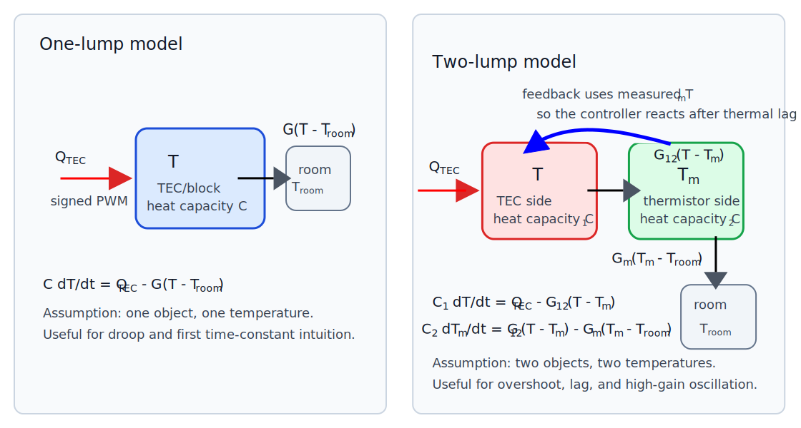

# Lab 7 Assignment: Process Model And Python Simulation

## Introductory Material

### Purpose

Lab 7 is the first modeling lab after you have built enough of the instrument to
measure temperature, drive the TEC, and see feedback behavior. The goal is to
connect three things:

1. the physical TEC/block/thermistor system,
2. the feedback-control equations,
3. a Python simulation GUI that lets you change model parameters and watch the
   predicted temperature response.

This lab is not about perfect prediction. It is about learning how a simple
model can explain droop, overshoot, lag, and the onset of instability.

### Class Theme

**Model The Process Before You Trust The Controller**

The "process" is the part of the feedback loop that the controller is trying to
control: the TEC, aluminum block, thermistor, heat loss to the room, and thermal
lag between where heat enters and where temperature is measured.

### At A Glance

Before class, spend your time in this order:

- **45-60 min**: Read Lienhard Chapter 1 with emphasis on energy balance,
  heat flux, conduction, thermal resistance, heat capacity, and lumped models.
- **30-45 min**: Prepare Problems 1.3 and 1.8 for possible board work.
- **10-15 min**: Skim Examples 1.1, 1.2, and 1.5 for worked-modeling patterns.
- **15-20 min**: Run the Python demo and GUI once so class time can focus on
  interpretation instead of setup.
- **15-20 min**: Copy and annotate the three model equations; complete Theory
  Assignment 1 and begin Theory Assignment 2 if time permits.

During class, the approximate schedule for one 170-minute meeting is:

1. **0-20 min**: Opening discussion and board work on Lienhard Problems 1.3 and
   1.8.
2. **20-40 min**: Connect the board work to the Lab 7 model equations and the
   one-lump/two-lump diagram.
3. **40-60 min**: Run the manual model and identify the physical meaning of each
   term and control.
4. **60-85 min**: Run the one-temperature proportional model and measure droop
   as `Kp` changes.
5. **85-115 min**: Run the two-temperature thermal-mass model and find cases
   with lag, overshoot, or oscillation.
6. **115-140 min**: Complete Theory Assignment 2 in groups and connect the
   two-lump equations to thermistor placement.
7. **140-160 min**: Make one small code modification and confirm that it changes
   something visible or understandable.
8. **160-170 min**: Wrap up: what the model explains, what it leaves out, and
   why the long-rod experiment will require a spatial model.

### Vocabulary

- **Process**: the physical system being controlled. Here, the process is the
  TEC/block/thermistor thermal system.
- **State variable**: a number that describes the current state of the model,
  such as temperature.
- **Lumped model**: a model that treats an extended object as if it the entire object is at the same temperature. The lump can be viewed as a point object of finite thermal mass.
- **Thermal mass**: is synomonous with heat capacity. A larger thermal mass changes temperature more slowly.
- **Thermal lag**: delay between changing the actuator and observing the
  measured temperature response.
- **Droop**: steady-state error in proportional-only control.
- **Saturation**: the actuator command reaches its limit, such as PWM 255. This could be a physical or software imposed limit.
- **Residual**: measured data minus model prediction.

### Model Equations

The Python GUI shows three models.

#### Manual Drive

```text
C dT/dt = G_room*(T_room - T) + Q_max*(PWM/255)*HC
Tm = T
```

The units of this equation are Watts - energy/time. Check that each term has these units. Here `T` is the TEC/block temperature in °C, `T_room` is room temperature in °C,
`Tm` is the measured temperature in °C, `C` is the heat capacity of the lump in
J/°C, `G_room` is the thermal conductance to the room in W/°C, `Q_max` is the
approximate heat flow supplied by the TEC at full PWM in W, `PWM` is an Arduino
PWM command from 0 to 255, and `HC` is `+1` for heat or `-1` for cool. The first
term represents heat transfer between the block and the room. The second term
represents the heat transferred to the block by the TEC.

An equivalent form, after dividing by `C`, is:

```text
dT/dt = k_room*(T_room - T) + beta_tec*(PWM/255)*HC
```

where `k_room = G_room/C` has units of 1/s and `beta_tec = Q_max/C` has units of
°C/s.

#### Proportional Control

```text
error = T_set - T
PWM = min(Kp*abs(error), 255)
HC = sign(error)
C dT/dt = G_room*(T_room - T) + Q_max*(PWM/255)*HC
Tm = T
```

This model turns the temperature error into a PWM command. The larger `Kp` is,
the more strongly the controller reacts to error. If `error` is measured in °C,
then `Kp` has units of PWM counts per °C. The `min(...)` function represents
actuator saturation: the Arduino cannot command a PWM value larger than 255.

#### Proportional Control With Measured Thermal Mass

```text
error = T_set - Tm
PWM = min(Kp*abs(error), 255)
HC = sign(error)
C1 dT/dt  = Q_max*(PWM/255)*HC - G12*(T - Tm)
C2 dTm/dt = G12*(T - Tm) - Gm*(Tm - T_room)
```

This is the most important model for today. The controller responds to `Tm`, the
measured thermistor/block temperature, but the TEC-side temperature `T` can move
first. This lag can produce overshoot and oscillation. Here `C1` and `C2` are
heat capacities in J/°C, `G12` is the thermal conductance between the TEC-side
lump and the measured lump in W/°C, and `Gm` is the conductance from the measured
lump to room air in W/°C.

After dividing by the heat capacities, the coupling terms become rate constants:

```text
dT/dt  = beta_tec*(PWM/255)*HC - k12*(T - Tm)
dTm/dt = k21*(T - Tm) - km*(Tm - T_room)
```

where `beta_tec = Q_max/C1`, `k12 = G12/C1`, `k21 = G12/C2`, and `km = Gm/C2`.
All of these rate constants have units of 1/s, except `beta_tec`, which has
units of °C/s.



*Course-specific lumped-model diagram. The thermal-resistance/electrical-circuit
analogy is introduced in Lienhard, A Heat Transfer Textbook, Section 2.3; see
especially Figures 2.8 and 2.12 for the textbook version of the resistance
analogy.*

### Thermal Transport Theory Assignments

This part of the course uses **lumped thermal models**. A lumped model assumes
that one object, such as the TEC/block assembly, can be described by one
temperature. This is an approximation. It is useful before we move to the long
rod, where temperature depends on position.

#### Theory Assignment 1: One Lumped Temperature

Start from an energy balance:

```text
rate of change of thermal energy = heat added by TEC - heat lost to room
```

Use:

```text
C dT/dt = Q_tec - G*(T - T_room)
```

where:

- `C` is the heat capacity of the object in J/°C,
- `G` is the thermal conductance to the room in W/°C,
- `Q_tec` is the heat flow supplied by the TEC in W,
- `T` is the object's temperature in °C,
- `T_room` is the room temperature in °C.

Divide by `C`:

```text
dT/dt = -(T - T_room)/tau + A*signed_PWM
```

where:

```text
tau = C/G
```

and `A` is the conversion between signed PWM and heating/cooling rate. The time
constant `tau` has units of seconds. If `signed_PWM` is an Arduino PWM count
between -255 and +255, then `A` has units of °C/(s PWM count).

Do this before class:

1. Show the algebra that converts `C dT/dt = Q_tec - G*(T - T_room)` into the
   simplified model above.
2. Explain in words what `tau` means.
3. Predict what happens when `tau` is large.
4. Predict what happens when `G` is large.
5. Find the steady-state temperature for a constant `signed_PWM`.

#### Theory Assignment 2: Two Lumped Temperatures

The one-temperature model assumes that the measured temperature instantly equals
the actuator-side temperature. The next model separates them:

```text
T  = actuator-side TEC/block temperature
Tm = measured thermistor/block temperature
```

A simple two-temperature model is:

```text
C1 dT/dt  = Q_tec - G12*(T - Tm)
C2 dTm/dt = G12*(T - Tm) - Gm*(Tm - T_room)
```

Here `C1` and `C2` are heat capacities in J/°C, `G12` and `Gm` are thermal
conductances in W/°C, and each term has units of W. The left side is a rate of
thermal-energy change. The right side is the sum of heat flows into and out of
each lump.

Do this before class:

1. Identify which term transfers heat from the TEC side to the measured
   thermistor/block side.
2. Identify which term describes heat loss from the measured block to room air.
3. Explain why `Tm` can lag behind `T`.
4. Explain why a controller that uses `Tm` may react too late.
5. Compare this model to the simplified rate-constant form:

   ```text
   dTm/dt = k21*(T - Tm) - km*(Tm - T_room)
   ```

#### Later In The Course: Differential Equations In Space

The long-rod experiment cannot be described by a single temperature. It will
need a temperature field. In its simplest form as a long, thin rod, temperature depends only on lonngitudinal position and is independent of radius.

\[
T = T(x,t)
\]

For the rod we will move toward diffusion equations of the form:

\[
\frac{\partial T}{\partial t}
=
\alpha \frac{\partial^2 T}{\partial x^2}
\]

and, for a rod exchanging heat with the room from its sides, a term that pulls the rod toward room
temperature:

\[
\frac{\partial T}{\partial t}
=
\alpha \frac{\partial^2 T}{\partial x^2}
-
\beta\left(T - T_{\mathrm{room}}\right)
\]

In these equations, `alpha` is the thermal diffusivity in m²/s and `beta` is a
side-loss rate constant in 1/s.

You do not need to solve these equations in Lab 7. For now, your job is to
understand how conservation of energy produces the simple lumped equations. The
spatial differential equations come later, when we measure temperature along the
long metal cylinder.

## Pre-Class Assignment

### Before Class

1. Read Lienhard, **Chapter 1: Introduction**. Focus on the parts that connect
   directly to this lab: conservation of energy, heat flux, conduction, thermal
   resistance, heat capacity, and lumped thermal models.

2. Prepare to work selected Chapter 1 problems at the board. You may be randomly
   selected to present one of these:

   - **Problem 1.3**: heat flux through a slab. This reinforces Fourier's law,
     units, and the meaning of a temperature gradient.
   - **Problem 1.8**: cooling of a copper sphere in an air stream. This is the
     cleanest Chapter 1 example of a one-lump first-order temperature model.

   For each problem, be ready to identify the physical system, write the heat
   balance or heat-flow law, check units, and explain what approximation makes
   the problem solvable.

3. Pay special attention to these Chapter 1 examples:

   - **Example 1.1**: conduction through a slab. This is the cleanest worked
     example of Fourier's law and heat flux.
   - **Example 1.2**: a copper slab protected by stainless steel. This is useful
     because the same steady heat flow passes through multiple layers, like
     thermal resistances in series.
   - **Example 1.5**: a thermocouple affected by convection and radiation. This
     is a good reminder that a temperature sensor does not always read the
     temperature you think it reads.

4. Open the Python simulation code:

   ```text
   legacy_matlab/converted/modeling_tec_v2.py
   ```

5. Run the non-interactive demo:

   ```bash
   cd /Users/fraden/Documents/GitHub/Phys39F26
   .venv/bin/python legacy_matlab/converted/modeling_tec_v2.py --demo
   ```

6. Look at the generated plot:

   ```text
   legacy_matlab/converted/modeling_tec_v2_demo.png
   ```

   The bottom of the PNG and the terminal output list the model parameters used
   to make the plot. Record those values so the plot is reproducible.

7. Run the GUI:

   ```bash
   cd /Users/fraden/Documents/GitHub/Phys39F26
   .venv/bin/python legacy_matlab/converted/modeling_tec_v2.py
   ```

8. In your notebook, copy the three model equations and label the meaning of
   each variable.
9. Complete Theory Assignment 1. Begin Theory Assignment 2 if you have time.

### Pre-Class Questions

Write short answers before class.

1. In the manual model, what happens if `PWM = 0`?
2. In proportional control, why does the PWM become small when the measured
   temperature gets close to the setpoint?
3. Why can proportional-only control leave a steady-state error?
4. In the thermal-mass model, why might `T` and `Tm` be different?
5. Which parameter in the model most directly changes the amount of thermal
   lag?

## In-Class Assignment

### What You Will Do

You will:

- run the Python simulation GUI,
- identify the physical meaning of each control,
- reproduce droop in proportional control,
- produce overshoot or oscillation by increasing gain or lag,
- compare the one-temperature model to the two-temperature model,
- make one small model-code modification,
- explain what this model teaches you about the real TEC experiment.

### Part 1: Manual Model

Set the GUI to `manual`.

1. Turn TEC power off. Run the model. Confirm that the temperature relaxes
   toward room temperature.
2. Turn TEC power on.
3. Set `HC` to heat and try several PWM values.
4. Set `HC` to cool and try several PWM values.
5. Record what changes in the temperature plot and the PWM plot.

Answer:

- What term in the equation represents heat exchange with the room?
- What term represents the TEC actuator?
- Why is this not feedback control?

### Part 2: One-Temperature Proportional Model

Set the GUI to `proportional`.

1. Set `T_set` above room temperature.
2. Set a small `Kp`.
3. Run until the trace settles.
4. Record the final temperature, setpoint, error, and approximate PWM.
5. Increase `Kp` and repeat.

Make a table:

| Trial | `T_set` | `Kp` | final `T` | final error | final PWM | Notes |
| --- | --- | --- | --- | --- | --- | --- |
| 1 |  |  |  |  |  |  |
| 2 |  |  |  |  |  |  |
| 3 |  |  |  |  |  |  |

Answer:

- Does increasing `Kp` reduce droop?
- Does increasing `Kp` eliminate droop completely?
- What happens when PWM saturates?

### Part 3: Two-Temperature Thermal-Mass Model

Set the GUI to `mass`.

1. Use the same setpoint as Part 2.
2. Start with moderate `Kp`.
3. Change the lag/coupling rate constant, such as `k21`.
4. Watch the difference between `T` and `Tm`.
5. Find a case where the model overshoots.
6. Find a case where the model oscillates or nearly oscillates.

Make a table:

| Trial | `Kp` | lag/coupling rate constant | overshoot? | oscillation? | qualitative behavior |
| --- | --- | --- | --- | --- | --- |
| 1 |  |  |  |  |  |
| 2 |  |  |  |  |  |
| 3 |  |  |  |  |  |

Answer:

- Which temperature does the controller use to calculate error?
- Why does measuring the delayed temperature make high gain dangerous?
- What does this suggest about placing a thermistor far from the TEC?

### Part 4: Connect The Model To PI Feedback

The same feedback structure can be written in compact mathematical form:

```text
error = setpoint - measured temperature
controller output = proportional part + integral part
process turns controller output into a new temperature
```

For proportional-only control:

```text
output = Kp * error
```

For PI control:

```text
integral = integral + error*dt
output = Kp*error + Ki*integral
```

In your notebook:

1. Draw the feedback loop: setpoint, error, controller, process, measured
   temperature.
2. Identify where the Python model calculates each part.
3. Explain why the integral term should reduce droop.
4. Explain why integral control can overshoot if the actuator saturates.

### Part 5: Complete The Two-Temperature Theory Assignment

Finish Theory Assignment 2. Then answer:

1. Which model variable is closest to what the thermistor measures?
2. Which model variable is closest to where the TEC applies heat?
3. If the thermistor is moved farther from the TEC, which model parameter should
   change?
4. Why is this still a lumped model rather than a full heat-equation model?

### Part 6: Make One Model-Code Modification

Open:

```text
legacy_matlab/converted/modeling_tec_v2.py
```

Choose one small modification:

- Change the default setpoint.
- Change the default `Kp`.
- Add a displayed label for the current error.
- Add a horizontal setpoint line to the GUI plots.
- Add a new output column to the demo data if you choose to save data.
- Add a short comment explaining one model equation.

Do not rewrite the whole GUI. The goal is to connect one line of code to one
visible model behavior.

### Part 7: Bridge To The Long Rod

The TEC-only model has no spatial coordinate. The later long-rod experiment
will require a model in which temperature depends on both position and time.

The stationary fin model adds space:

```text
temperature depends on x
heat conducts along the rod
heat leaks from the side of the rod to room air
```

The oscillating fin model adds time-periodic boundary forcing:

```text
base temperature oscillates
amplitude decays with distance
phase lags with distance
```

Answer:

- What is missing from the TEC-only model that the rod model must include?
- Why will the rod experiment need more than one thermistor?
- Why are amplitude and phase more useful than just maximum and minimum
  temperature?

## Post-Class Assignment

### What To Submit

Submit a short lab note containing:

- Your copied and labeled model equations.
- Theory Assignment 1.
- Theory Assignment 2.
- Manual-model observations.
- Proportional-control droop table.
- Thermal-mass overshoot/oscillation table.
- Screenshot of the Python GUI.
- A short description of your code modification.
- A paragraph answering:

  ```text
  What did the model explain well, and what would it fail to explain about the
  real TEC hardware?
  ```

### Optional Extension

Use data from a real TEC step response. Adjust model parameters until the
simulated trace roughly overlays the measured trace. Do not worry about a
perfect fit. Report which part of the curve the model explains poorly.

## Instructor Notes

- This lab is a consolidation point after manual control and P/PI control.
- Keep the emphasis on physical interpretation, not formal control theory.
- Students should leave understanding why delay plus gain causes trouble.
- The long-rod model should be introduced as a preview, not fully derived here
  unless the class is ready.
