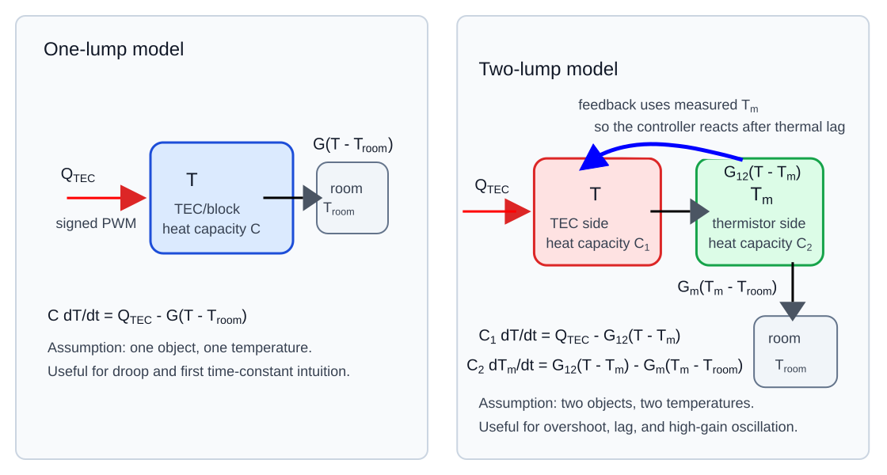

# Module 6, Part II: TEC Process Model And The v3 Simulation

This is the second part of Module 6. Complete
[Part I: P/PI Control And Lumped Modeling](../lab-06/index.md) first.
Both parts use the same prepared
[v3 simulation](../../downloads/Lab_6_7_modeling_tec_v3.py): Part I emphasizes
the one-lump model, while Part II compares the one- and two-lump models.

## Introductory Material

### Purpose

This part follows the first Module 6 modeling work, after you have built enough of the instrument to
measure temperature, drive the TEC, and see feedback behavior. The goal is to
connect three things:

1. the physical TEC/block/thermistor system,
2. the feedback-control equations,
3. a [Python simulation GUI](#how-to-run-the-python-gui) that lets you change
   model parameters and watch the predicted temperature response.

This module is not about perfect prediction. It is about learning how a simple
model can explain droop, overshoot, lag, and the onset of instability.

### Class Theme

**Model The Process Before You Trust The Controller**

The "process" is the part of the feedback loop that the controller is trying to
control: the TEC, aluminum block, thermistor, heat loss to the room, and thermal
lag between where heat enters and where temperature is measured.

### At A Glance

Before class, spend your time in this order:

- **45-60 min**: Read [Lienhard](../../references/lienhard-heat-transfer-textbook-v6.pdf)
  Chapter 1 with emphasis on energy balance, heat flux, conduction, thermal
  resistance, heat capacity, and [lumped models](#lumped-model-figure). Read through p. 28. Skip most of the last section on radiation.
- **30-45 min**: Prepare Problems 1.3 and 1.8 for possible board work.
- **10-15 min**: Skim Examples 1.1, 1.2, and 1.5 for worked-modeling patterns.
- **15-20 min**: Run the [Python demo and GUI](#how-to-run-the-python-gui)
  once so class time can focus on interpretation instead of setup.
- **15-20 min**: Copy and annotate the three model equations; complete Theory
  Assignment 1 and begin Theory Assignment 2 if time permits.

During class, the approximate schedule for one 170-minute meeting is:

1. **0-20 min**: Opening discussion and board work on
   [Lienhard](../../references/lienhard-heat-transfer-textbook-v6.pdf)
   Problems 1.3 and 1.8.
2. **20-40 min**: Connect the board work to the model equations in Module 6 and the
   one-lump/two-lump diagram.
3. **40-60 min**: Run the manual model and identify the physical meaning of each
   term and control.
4. **60-85 min**: Run the one-lumped-temperature proportional model and measure droop
   as `Kp` changes.
5. **85-115 min**: Run the two-lumped-temperature thermal-mass model and find cases
   with lag, overshoot, or oscillation.
6. **115-140 min**: Complete Theory Assignment 2 in groups and connect the
   two-lump equations to thermistor placement.
7. **140-160 min**: Trace one parameter through the equations and numerical
   algorithm, then confirm its predicted effect in the simulation.
8. **160-170 min**: Wrap up: what the model explains, what it leaves out, and
   why the long-rod experiment will require a spatial model.

### Outside-Class Workload Budget

| Session | Work | Planned time |
| --- | --- | ---: |
| S14 | Read this assignment and the assigned Lienhard Chapter 1 material | 90 minutes |
| S14 | Prepare Problems 1.3 and 1.8 and inspect Examples 1.1, 1.2, and 1.5 | 60 minutes |
| S14 | Install/run the model and annotate the equations | 45 minutes |
| S14 | **Total associated with S14** | **3 hours 15 minutes** |
| S15 | Complete the model comparisons and A3 evidence | 120 minutes |
| S15 | Complete the theory-bridge questions used in the oral discussion | 60 minutes |
| S15 | Commit, push, and prepare the A3 submission | 30 minutes |
| S15 | **Total associated with S15** | **3 hours 30 minutes** |

The Chapter 1 time is for reading with equations and physical interpretation,
not for a quick skim. The optional extension is not part of the four-hour
budget and should be attempted only after required work is complete.

### Vocabulary

- **Process**: the physical system being controlled. Here, the process is the
  TEC/block/thermistor thermal system.
- **State variable**: a number that describes the current state of the model,
  such as temperature.
- **Heat**: energy transferred because of a temperature difference. Heat is not
  the same thing as temperature; temperature tells how hot something is, while
  heat is energy moving into or out of the system.
- **Lumped model**: a model that treats an extended object as if it the entire object is at the same temperature. The lump can be viewed as a point object of finite thermal mass. See the [one-lump/two-lump figure](#lumped-model-figure).
- **Thermal mass**: is synomonous with heat capacity. A larger thermal mass changes temperature more slowly.
- **Thermal lag**: delay between changing the actuator and observing the
  measured temperature response.
- **Droop**: steady-state error in proportional-only control.
- **Saturation**: the actuator command reaches its limit, such as PWM 255. This could be a physical or software imposed limit.

### Model Equations And Numerical Algorithm

The [v3 Python GUI](#how-to-run-the-python-gui) separates the physical model
from the controller. Select either a one-lump or two-lump process, then select
open-loop, P, or PI control.

#### One-Lump Physical Model

The one-lump model treats the TEC and measured block as one temperature:

\[
C=C_T+C_m,
\qquad
C\frac{dT}{dt}=P_u(u)u-H(T-T_{\mathrm{amb}}).
\]

Every term has units of watts. The TEC coefficient is piecewise: the program
uses $P_{u,h}$ for a positive heating command and $P_{u,c}$ for a negative
cooling command. Their ratio is

\[
r=\frac{P_{u,h}}{P_{u,c}}=\frac{\chi_h}{\chi_c}.
\]

#### Two-Lump Physical Model

The two-lump model separates the TEC-side temperature $T$ from the measured
temperature $T_m$:

\[
C_T\frac{dT}{dt}=P_u(u)u-G(T-T_m),
\]

\[
C_m\frac{dT_m}{dt}=G(T-T_m)-H(T_m-T_{\mathrm{amb}}).
\]

Here $C_T$ and $C_m$ are thermal capacitances, $G$ couples the two lumps, and
$H$ describes passive heat transfer from the measured lump to the room. The
controller responds to $T_m$, but $T$ can move first. That lag can produce
overshoot or oscillation.

#### Controller Choices

The measured temperature is $T$ for the one-lump model and $T_m$ for the
two-lump model. Define

\[
e=T_{\mathrm{set}}-T_{\mathrm{meas}}.
\]

The three controller choices are

\[
u=u_{\mathrm{user}}\quad\text{(open loop)},
\]

\[
u=K_pe\quad\text{(P control)},
\]

\[
u=K_pe+K_i\int e\,dt=u_P+u_I\quad\text{(PI control)}.
\]

The signed command is clamped to the PWM limit. If the anti-windup option is
enabled, the program prevents the integral state from continuing to grow when
the actuator is saturated in the same direction as the error.

#### What The Algorithm Does At Each Time Step

The supplied program performs the numerical work, but you should understand
its sequence:

1. Read the model's measured temperature, $T$ or $T_m$.
2. Calculate the error and the requested open-loop, P, or PI command.
3. Clamp the command to the signed PWM limit.
4. Select $P_{u,h}$ or $P_{u,c}$ from the sign of the applied command.
5. Evaluate the heat-balance derivatives.
6. Advance $T$ and, for the two-lump model, $T_m$ by one Euler step.
7. Update the integral state when PI control is active and anti-windup permits
   the update.

For example, the first two-lump Euler updates are

\[
T_{n+1}=T_n+\frac{\Delta t}{C_T}
\left[P_u(u_n)u_n-G(T_n-T_{m,n})\right],
\]

\[
T_{m,n+1}=T_{m,n}+\frac{\Delta t}{C_m}
\left[G(T_n-T_{m,n})-H(T_{m,n}-T_{\mathrm{amb}})\right].
\]

You are not required to write this code. Your task is to connect each
algorithmic step to the heat balance, make predictions, and test them with
controlled parameter changes.

<a id="lumped-model-figure"></a>



*Course-specific lumped-model diagram.*

### Thermal Transport Theory Assignments

This part of the course uses **lumped thermal models**. A lumped model assumes
that one object, such as the TEC/block assembly, can be described by one
temperature. This is an approximation. It is useful before we move to the long
rod, where temperature depends on position.

#### Theory Assignment 1: One Lumped Temperature

Start from an energy balance:

```text
rate of change of thermal energy = heat added by TEC - heat lost to room
```

Use:

```text
C dT/dt = Q_tec - G*(T - T_room)
```

where:

- `C` is the heat capacity of the object in J/°C,
- `G` is the thermal conductance to the room in W/°C,
- `Q_tec` is the heat flow supplied by the TEC in W,
- `T` is the object's temperature in °C,
- `T_room` is the room temperature in °C.

Divide by `C`:

```text
dT/dt = -(T - T_room)/tau + A*signed_PWM
```

where:

```text
tau = C/G
```

and `A` is the conversion between signed PWM and heating/cooling rate. The time
constant `tau` has units of seconds. If `signed_PWM` is an Arduino PWM count
between -255 and +255, then `A` has units of °C/(s PWM count).

Do this before class:

1. Show the algebra that converts `C dT/dt = Q_tec - G*(T - T_room)` into the
   simplified model above.
2. Explain in words what `tau` means.
3. Predict what happens when `tau` is large.
4. Predict what happens when `G` is large.
5. Find the steady-state temperature for a constant `signed_PWM`.

#### Theory Assignment 2: Two Lumped Temperatures

The one-temperature model assumes that the measured temperature instantly equals
the actuator-side temperature. The next model separates them:

```text
T  = actuator-side TEC/block temperature
Tm = measured thermistor/block temperature
```

A simple two-temperature model is:

```text
C1 dT/dt  = Q_tec - G12*(T - Tm)
C2 dTm/dt = G12*(T - Tm) - Gm*(Tm - T_room)
```

Here `C1` and `C2` are heat capacities in J/°C, `G12` and `Gm` are thermal
conductances in W/°C, and each term has units of W. The left side is a rate of
thermal-energy change. The right side is the sum of heat flows into and out of
each lump.

Do this before class:

1. Identify which term transfers heat from the TEC side to the measured
   thermistor/block side.
2. Identify which term describes heat loss from the measured block to room air.
3. Explain why `Tm` can lag behind `T`.
4. Explain why a controller that uses `Tm` may react too late.
5. Compare this model to the simplified rate-constant form:

   ```text
   dTm/dt = k21*(T - Tm) - km*(Tm - T_room)
   ```

#### Later In The Course: Differential Equations In Space

The long-rod experiment cannot be described by a single temperature. It will
need a temperature field. In its simplest form as a long, thin rod, temperature depends only on lonngitudinal position and is independent of radius.

\[
T = T(x,t)
\]

For the rod we will move toward diffusion equations of the form:

\[
\frac{\partial T}{\partial t}
=
\alpha \frac{\partial^2 T}{\partial x^2}
\]

and, for a rod exchanging heat with the room from its sides, a term that pulls the rod toward room
temperature:

\[
\frac{\partial T}{\partial t}
=
\alpha \frac{\partial^2 T}{\partial x^2}
-
\beta\left(T - T_{\mathrm{room}}\right)
\]

In these equations, `alpha` is the thermal diffusivity in m²/s and `beta` is a
side-loss rate constant in 1/s.

You do not need to solve these equations in Module 6. For now, your job is to
understand how conservation of energy produces the simple lumped equations. The
spatial differential equations come later, when we measure temperature along the
long metal cylinder.

## Pre-Class Assignment

### How To Run The Python GUI

Clicking the Python source-code link opens or downloads the `.py` file. It does
not run the simulation. To run the model, download the file and run it from a
folder on your own computer.

First make a working folder and put the Python file there:

```bash
mkdir -p ~/phys39-lab7
cd ~/phys39-lab7
```

Download this file into that folder:
[Lab_6_7_modeling_tec_v3.py](../../downloads/Lab_6_7_modeling_tec_v3.py).

Set up Python the first time you use this folder:

```bash
python3 -m venv .venv
source .venv/bin/activate
python -m pip install matplotlib
```

Run the non-interactive demo:

```bash
python Lab_6_7_modeling_tec_v3.py --demo --output Lab_6_7_modeling_tec_v3_demo.png
```

This saves a plot in the same folder:

```text
Lab_6_7_modeling_tec_v3_demo.png
```

Then run the desktop GUI:

```bash
python Lab_6_7_modeling_tec_v3.py
```

After the first setup, start from this folder and run:

```bash
cd ~/phys39-lab7
source .venv/bin/activate
python Lab_6_7_modeling_tec_v3.py
```

### Before Class

1. Read [Lienhard](../../references/lienhard-heat-transfer-textbook-v6.pdf),
   **Chapter 1: Introduction**. Focus on the parts that connect directly to
   this module: conservation of energy, heat flux, conduction, thermal resistance,
   heat capacity, and lumped thermal models. Read through p. 28. Skip most of the last section on radiation.

2. Prepare to work selected Chapter 1 problems at the board. You may be randomly
   selected to present one of these:

   - **Problem 1.3**: heat flux through a slab. This reinforces Fourier's law,
     units, and the meaning of a temperature gradient.
   - **Problem 1.8**: cooling of a copper sphere in an air stream. This is the
     cleanest Chapter 1 example of a one-lump first-order temperature model.

   For each problem, be ready to identify the physical system, write the heat
   balance or heat-flow law, check units, and explain what approximation makes
   the problem solvable.

3. Pay special attention to these Chapter 1 examples:

   - **Example 1.1**: conduction through a slab. This is the cleanest worked
     example of Fourier's law and heat flux.
   - **Example 1.2**: a copper slab protected by stainless steel. This is useful
     because the same steady heat flow passes through multiple layers, like
     thermal resistances in series.
   - **Example 1.5**: a thermocouple affected by convection and radiation. This
     is a good reminder that a temperature sensor does not always read the
     temperature you think it reads.

4. Open the [prepared v3 Python simulation](../../downloads/Lab_6_7_modeling_tec_v3.py):

   ```text
   Lab_6_7_modeling_tec_v3.py
   ```

5. Run the non-interactive demo:

   ```bash
   python Lab_6_7_modeling_tec_v3.py --demo --output Lab_6_7_modeling_tec_v3_demo.png
   ```

6. Look at the generated plot:

   ```text
   Lab_6_7_modeling_tec_v3_demo.png
   ```

   The bottom of the PNG and the terminal output list the model parameters used
   to make the plot. Record those values so the plot is reproducible.

7. Run the [Python GUI](#how-to-run-the-python-gui):

   ```bash
   python Lab_6_7_modeling_tec_v3.py
   ```

8. In your notebook, copy the three model equations and label the meaning of
   each variable.
9. Complete Theory Assignment 1. Begin Theory Assignment 2 if you have time.

### Pre-Class Questions

Write short answers before class.

1. In open-loop mode, what happens if the signed PWM command is zero?
2. In proportional control, why does the PWM become small when the measured
   temperature gets close to the setpoint?
3. Why can proportional-only control leave a steady-state error?
4. In the thermal-mass model, why might `T` and `Tm` be different?
5. Which parameter in the model most directly changes the amount of thermal
   lag?

## In-Class Assignment

### What You Will Do

You will:

- run the [Python simulation GUI](#how-to-run-the-python-gui),
- identify the physical meaning of each control,
- reproduce droop in proportional control,
- produce overshoot or oscillation by increasing gain or lag,
- compare the one-temperature model to the two-temperature model,
- trace one controlled parameter through the equations and numerical algorithm,
- explain what this model teaches you about the real TEC experiment.

### Part 1: One-Lump Open-Loop Model

Set the physical model to `one_lump` and the controller to `open_loop`.

1. Set the signed PWM command to zero. Run the model and confirm that the
   temperature relaxes toward room temperature.
2. Enter a positive signed PWM command and try several values.
3. Enter a negative signed PWM command and try several values.
4. Record what changes in the temperature plot and the PWM plot.

Answer:

- What term in the equation represents heat exchange with the room?
- What term represents the TEC actuator?
- Why is this not feedback control?

### Part 2: One-Temperature Proportional Model

Set the physical model to `one_lump` and the controller to `p`.

1. Set `T_set` above room temperature.
2. Set a small `Kp`.
3. Run until the trace settles.
4. Record the final temperature, setpoint, error, and approximate PWM.
5. Increase `Kp` and repeat.

Make a table:

| Trial | `T_set` | `Kp` | final `T` | final error | final PWM | Notes |
| --- | --- | --- | --- | --- | --- | --- |
| 1 |  |  |  |  |  |  |
| 2 |  |  |  |  |  |  |
| 3 |  |  |  |  |  |  |

Answer:

- Does increasing `Kp` reduce droop?
- Does increasing `Kp` eliminate droop completely?
- What happens when PWM saturates?

### Part 3: Two-Temperature Thermal-Mass Model

Set the physical model to `two_lump` and the controller to `p`.

1. Use the same setpoint as Part 2.
2. Start with moderate `Kp`.
3. Change the coupling conductance $G$ or one thermal capacitance.
4. Watch the difference between `T` and `Tm`.
5. Find a case where the model overshoots.
6. Find a case where the model oscillates or nearly oscillates.

Make a table:

| Trial | `Kp` | $G$, $C_T$, or $C_m$ | overshoot? | oscillation? | qualitative behavior |
| --- | --- | --- | --- | --- | --- |
| 1 |  |  |  |  |  |
| 2 |  |  |  |  |  |
| 3 |  |  |  |  |  |

Answer:

- Which temperature does the controller use to calculate error?
- Why does measuring the delayed temperature make high gain dangerous?
- What does this suggest about placing a thermistor far from the TEC?

### Part 4: Connect The Model To PI Feedback

The same feedback structure can be written in compact mathematical form:

```text
error = setpoint - measured temperature
controller output = proportional part + integral part
process turns controller output into a new temperature
```

For proportional-only control:

```text
output = Kp * error
```

For PI control:

```text
integral = integral + error*dt
output = Kp*error + Ki*integral
```

In your notebook:

1. Draw the feedback loop: setpoint, error, controller, process, measured
   temperature.
2. Identify where the Python model calculates each part.
3. Explain why the integral term should reduce droop.
4. Explain why integral control can overshoot if the actuator saturates.

### Part 5: Complete The Two-Temperature Theory Assignment

Finish Theory Assignment 2. Then answer:

1. Which model variable is closest to what the thermistor measures?
2. Which model variable is closest to where the TEC applies heat?
3. If the thermistor is moved farther from the TEC, which model parameter should
   change?
4. Why is this still a lumped model rather than a full heat-equation model?

### Part 6: Trace One Parameter Through The Algorithm

Choose one parameter: $C_T$, $C_m$, $G$, $H$, $K_p$, or $K_i$.

1. Identify every model or controller equation containing that parameter.
2. Predict how increasing it will affect the temperature trace, command, error,
   or lag.
3. Pause the simulation, change only that parameter, and resume.
4. Compare the observed change with your prediction.
5. Explain where the parameter enters the Euler-update sequence described
   above.

The goal is to understand how the prepared algorithm represents the physics
and controller, not to modify its source code.

### Part 7: Bridge To The Long Rod

The TEC-only model has no spatial coordinate. The later long-rod experiment
will require a model in which temperature depends on both position and time.

The stationary fin model adds space:

```text
temperature depends on x
heat conducts along the rod
heat leaks from the side of the rod to room air
```

The oscillating fin model adds time-periodic boundary forcing:

```text
base temperature oscillates
amplitude decays with distance
phase lags with distance
```

Answer:

- What is missing from the TEC-only model that the rod model must include?
- Why will the rod experiment need more than one thermistor?
- Why are amplitude and phase more useful than just maximum and minimum
  temperature?

## Post-Class Assignment

### Preserve The Model Evidence

Before leaving S15, save the copied equations, completed theory assignments,
parameter tables, screenshots, algorithm-tracing explanation, and exact run
command. Keep the team record in
`docs/module_notes/module_07_process_model.md` and preserve the prepared v3
program in your repository.

### Oral Review Questions: Process Modeling

Use this modeling question bank to check your understanding and prepare A3:

1. Which physical lag in the apparatus can produce overshoot or oscillation as
   gain increases?
2. Identify one model parameter, give its units, and explain its physical
   effect on the simulated response.

Also prepare the [Module 5 P-control questions](../lab-05/index.md#oral-review-questions-p-control)
and [Module 6 PI-control question](../lab-06/index.md#oral-review-questions-pi-control).

### Model Evidence Record

Keep a short module note containing:

- Your copied and labeled model equations.
- Theory Assignment 1.
- Theory Assignment 2.
- Open-loop observations.
- Proportional-control droop table.
- Thermal-mass overshoot/oscillation table.
- Screenshot of the [Python GUI](#how-to-run-the-python-gui).
- Your parameter prediction and algorithm-tracing explanation.
- A paragraph answering:

  ```text
  What did the model explain well, and what would it fail to explain about the
  real TEC hardware?
  ```

## Instructor Notes

- This module is a consolidation point after manual control and P/PI control.
- Keep the emphasis on physical interpretation, not formal control theory.
- Students should leave understanding why delay plus gain causes trouble.
- The long-rod model should be introduced as a preview, not fully derived here
  unless the class is ready.
