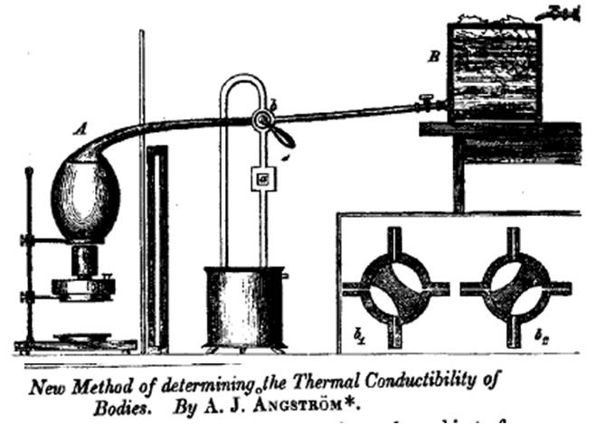

# Module 9: The Angstrom Method

## Purpose

In this module the TEC controller creates a sinusoidal temperature boundary at the
base of the aluminum rod. Thermal diffusion causes the oscillation amplitude to
decrease and its phase to lag with distance. Measuring both effects allows you
to separate thermal diffusion from heat loss to the air.

## Schedule And Due Work

| Session | In class | Due |
| --- | --- | --- |
| S20, Mon. Nov. 9 | Guided radial-model study; tune sinusoidal base-temperature tracking; collect a pilot run | `P3` model and pilot check |
| S21, Wed. Nov. 11 | Fit pilot amplitudes and phases; choose production period | **A9: Angstrom derivation and model-validity plan** |
| S22, Mon. Nov. 16 | Acquire settled production data at one or more periods | Data-readiness check |
| S23, Wed. Nov. 18 | Fit spatial decay and phase slopes; infer `kappa` and `nu` | Modeling-app draft |

## Learning Objectives

By the end of this module, you should be able to:

- impose and verify a sinusoidal temperature boundary with PI control,
- choose a useful forcing period using physical and practical constraints,
- fit a sinusoid to noisy temperature data,
- distinguish temporal frequency from spatial decay and phase coefficients,
- unwrap phase and maintain consistent sign conventions,
- determine thermal diffusivity and side-loss rate with uncertainty,
- compare one-dimensional and axisymmetric predictions as the transverse Biot
  number increases,
- test the model using residuals and frequency consistency.

## Periodic Solution

*Historical drawing of Angstrom's method for determining thermal
conductivity. The course replaces the alternating hot and cold reservoirs with
a TEC-controlled sinusoidal boundary temperature.*

Use excess temperature `theta = T - T_room` and the rod equation

\[
\frac{\partial\theta}{\partial t}
=\kappa\frac{\partial^2\theta}{\partial x^2}-\nu\theta.
\]

Drive the measured base temperature approximately as

\[
\theta(0,t)=\theta_b\cos(\omega t),
\qquad
\omega=\frac{2\pi}{\tau},
\]

where `tau` is the period. After transients decay, the semi-infinite-rod
solution has the form

\[
\theta(x,t)=B_0e^{-qx}\cos(\omega t-q'x+\phi_0).
\]

The amplitude-decay coefficient `q` and phase coefficient `q_prime` both have
units of inverse meters:

\[
q=\sqrt{\frac{\nu+\sqrt{\nu^2+\omega^2}}{2\kappa}},
\qquad
q'=\sqrt{\frac{-\nu+\sqrt{\nu^2+\omega^2}}{2\kappa}}.
\]

The useful inverse relations are

\[
\kappa=\frac{\omega}{2qq'},
\qquad
\nu=\kappa(q^2-q'^2).
\]

These equations use a one-dimensional, semi-infinite rod. Before selecting
sensors for the fit, carry forward the finite-length error calculation from
Module 8 and complete the radial-model study below. State which sensors and
conditions satisfy your chosen approximation tolerances.

## Part 0: Guided Radial-Model Study

The one-dimensional rod equation assumes
\(\mathrm{Bi}_{\perp}=HR/(2k)\ll1\). Retaining radial variation gives the
axisymmetric equation

\[
\frac{\partial T}{\partial t}
=\alpha\left[
\frac{\partial^2T}{\partial x^2}
+\frac{1}{r}\frac{\partial}{\partial r}
\left(r\frac{\partial T}{\partial r}\right)
\right],
\]

with cylindrical-surface boundary condition

\[
-k\left.\frac{\partial T}{\partial r}\right|_{r=R}
=H\left[T(R,x,t)-T_\infty\right].
\]

Use the supplied numerical scaffold; you are not expected to write a
two-dimensional PDE solver from scratch. Run otherwise identical cases with
\(\mathrm{Bi}_{\perp}=0.01, 0.1,\) and \(1\). For each case:

1. plot centerline, surface, and cross-sectional mean temperature,
2. compare them with the one-dimensional prediction,
3. quantify surface-versus-mean amplitude and phase differences at a sensor
   location, and
4. explain how a surface thermistor analyzed with a one-dimensional model could
   bias inferred \(k\) or \(H\).

This numerical study follows the radial-model lecture from S18. Finish it
before using the one-dimensional periodic solution for the production
Angstrom analysis.

## Part 1: Establish The Boundary Condition

1. Choose a safe mean base temperature and an amplitude of approximately
   5-10 degrees Celsius unless the instructor specifies otherwise.
2. Begin with a period in the range 100-300 seconds.
3. Tune PI settings so measured base temperature is close to sinusoidal without
   strong clipping, drift, or phase jumps.
4. Record setpoint, measured base temperature, PWM, and all rod temperatures.
5. Quantify boundary tracking with amplitude error, phase error, and residuals.
6. If tracking is imperfect, use the measured base temperature rather than the
   requested setpoint as the model boundary condition.

## Part 2: Pilot Analysis And Experiment Plan

For each sensor, fit

\[
T_i(t)=a_i+B_i\cos(\omega t+\phi_i).
\]

1. Remove the initial transient or justify the selected fitting interval.
2. Fit at least five complete settled periods.
3. Plot the data and fitted sinusoid for every sensor.
4. Plot amplitude `B_i` versus position on a logarithmic vertical scale.
5. Unwrap phase and plot phase versus position.
6. Select a production period for which several sensors have measurable
   amplitude and phase differences while the run still fits available time.

Your experiment plan must state the period, mean, amplitude, run duration,
sampling interval, safety limits, settling criterion, channels, files, and the
tests you will use to decide whether the run is usable.

## Part 3: Production Data

1. Record at least five complete settled periods.
2. Repeat the run at a second period if time and signal quality permit.
3. Keep the rod geometry and sensor map unchanged.
4. Record room temperature and check for drift.
5. Preserve raw data. Apply calibration and exclusions in analysis code, not by
   overwriting the original file.

## Part 4: Spatial Fits And Modeling-App Draft

Fit

\[
B(x)=B_0e^{-qx},
\qquad
\phi(x)=\phi_0-q'x.
\]

Your Python app, notebook, or script must visibly show:

- imported raw data and selected fitting interval,
- measured base tracking,
- sinusoid fit for every retained sensor,
- amplitude and unwrapped phase versus position,
- fitted `q` and `q_prime` with units and uncertainty,
- calculated `kappa` and `nu`,
- residuals and any excluded data with justification,
- the finite-length and transverse-Biot-number checks that justify the
  one-dimensional semi-infinite analysis for the retained sensors.

## Modeling-App Draft Submission

Submit runnable code, a short README with the exact command or procedure, the
data file or stable link, intermediate plots, preliminary `kappa` and `nu`, the
guided radial-model comparison, and a note describing any AI assistance. Every
team member must be able to explain the input format, the sequence of fits, and
why the selected one-dimensional approximation is acceptable or not.
