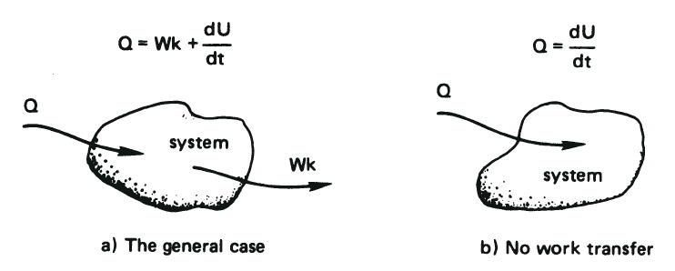
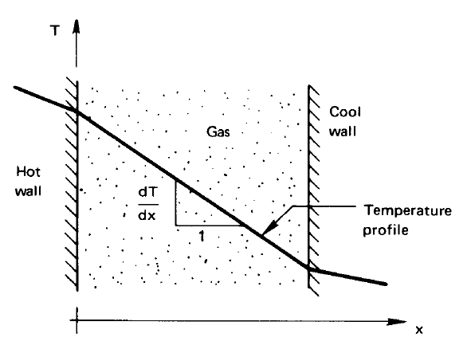
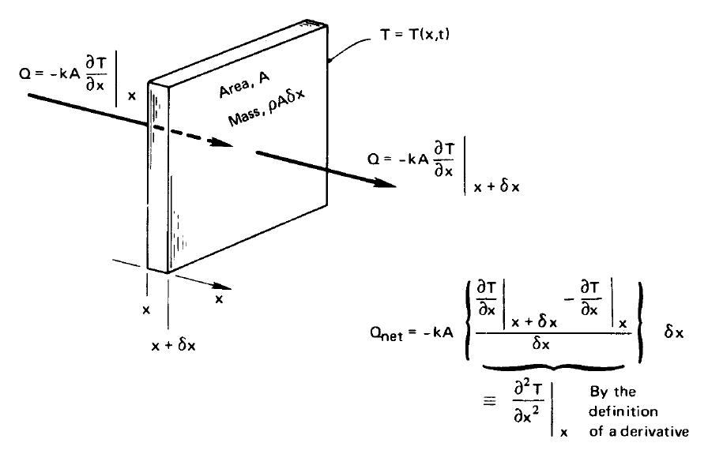
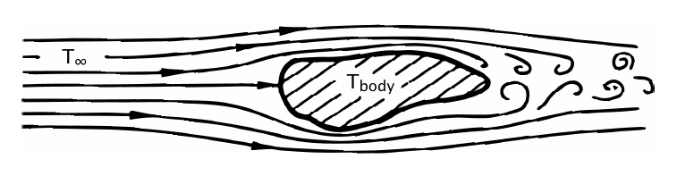
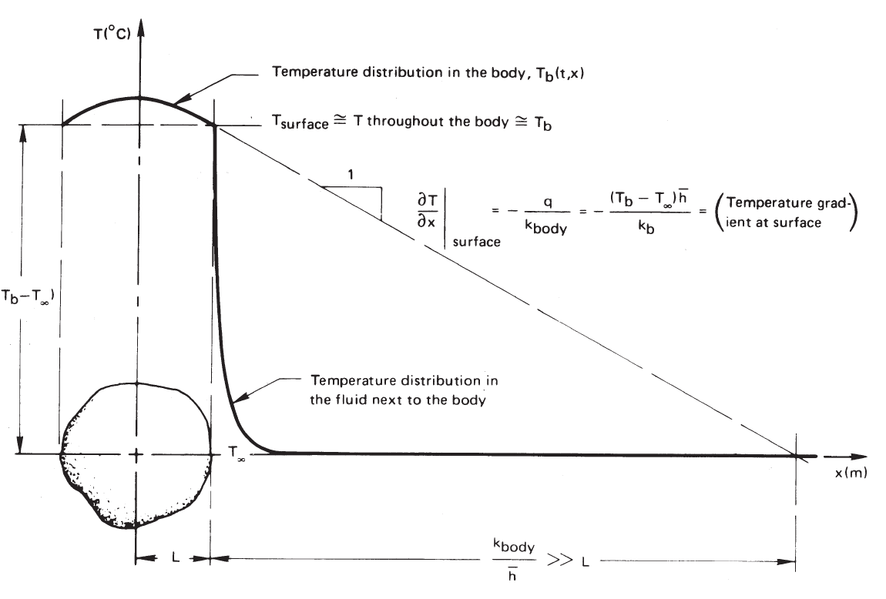

# Theory Bridge: Fourier's Law, Heat Equation, And Biot Number

This is a short theory bridge, not a full lab. Its job is to connect the
lumped thermal models from Lab 7 to the spatial models needed for the long
cylinder experiment.

Read selectively in
[Lienhard, A Heat Transfer Textbook](../../references/lienhard-heat-transfer-textbook-v6.pdf),
Section 1.3, pp. 11-26. Focus on Fourier's Law, the derivation of the heat
conduction equation, convection/lumped cooling, dimensional analysis, the Biot
number, and Fig. 1.10.

This bridge follows the order of Lienhard Section 1.3:

| Lienhard reading | How to read it |
| --- | --- |
| pp. 11-13, Fourier's Law | Read carefully. This is the law that turns a temperature gradient into a heat flux. |
| pp. 14-16, thermal conductivity and Example 1.2 | Skim for scale. Notice how \(k\) controls the temperature gradient needed for a given heat flux. |
| pp. 17-18, one-dimensional heat conduction equation | Read slowly. This is the derivation core of the bridge. |
| pp. 19-21, convection and Newton's law of cooling | Read for the meaning of \(h\), the heat transfer coefficient. |
| pp. 21-24, lumped capacity, Fig. 1.10, and Biot number | Read carefully. This explains when a one-temperature model is acceptable. |
| pp. 24-26, thermocouple example | Skim for how Lienhard checks the Biot number assumption in a real calculation. |

## Why This Bridge Exists

Lab 7 used lumped models: one temperature for one object, or two temperatures
for two coupled objects. That works when internal temperature gradients are
small enough to ignore. The long cylinder is different. Its temperature depends
on position as well as time, so we need a model that can describe heat flowing
along the rod.

The bridge has three questions:

1. What law tells us how heat flows down a temperature gradient?
2. How does conservation of energy turn that law into a differential equation?
3. When is it reasonable to ignore spatial temperature gradients?

## 1. Heat And Temperature

Heat and temperature are related, but they are not the same quantity.
Temperature describes the thermal state of a system. Heat is energy transferred
across the system boundary because of a temperature difference.



*Lienhard and Lienhard, Fig. 1.1, textbook p. 7: First-Law energy balance for a
closed system.*

The **First Law of Thermodynamics** is conservation of energy. With Lienhard's
sign convention, the rate at which heat enters a closed system equals the rate
at which the system does compression work plus the rate at which its internal
energy increases.

For a closed system with compression work, Lienhard Eq. (1.2a) is

\[
\dot Q=p\frac{dV}{dt}+\frac{dU}{dt}.
\tag{1.2a}
\]

For the incompressible solids and liquids used in this course, the volume-work
term is normally absent and the specific heats at constant pressure and volume
may be represented by \(c\). Equation (1.3) then becomes

\[
\dot Q=\frac{dU}{dt}=mc\frac{dT}{dt}.
\tag{1.3}
\]

This equation does **not** say that heat and temperature are identical. It says
that a net heat-transfer rate changes the internal energy and therefore changes
temperature at a rate controlled by the thermal mass \(mc\).

## 2. Heat Conduction And Fourier's Law

Use Lienhard Section 1.3, "Modes of heat transfer," pp. 11-27, as the source for this section.

This is the first major idea in the pp. 11-26 reading span.

| Read this in Lienhard | What to take from it |
| --- | --- |
| Section 1.3, p. 11, line beginning "Fourier's law," through Eq. (1.8) | \(q\) is heat flux, \(k\) is thermal conductivity, and the temperature gradient drives conduction. |
| Section 1.3, p. 11, line beginning "The heat flux is a vector quantity" | The minus sign is a direction statement: heat flows from higher temperature to lower temperature. |
| Section 1.3, p. 13, line beginning "The direction of heat flow," through Eq. (1.9) | In one-dimensional steady conduction, Lienhard often rewrites the law with positive \(\Delta T\) and positive \(q\). |
| Section 1.3, p. 13, line beginning "Notice that," through Eq. (1.10) | For the same heat flux, a material with larger \(k\) needs a smaller temperature gradient. |

Fourier's Law says that heat flows from hot regions toward cold regions. In one
dimension,

\[
q_x=-k\frac{\partial T}{\partial x}.
\]

Here \(q_x\) is heat flux in W/m\(^2\), \(k\) is thermal conductivity in
W/(m K), and \(\partial T/\partial x\) is the temperature gradient. The minus
sign matters: heat flows in the direction of decreasing temperature.

For a rod with cross-sectional area \(A\), the heat-flow rate is

\[
\dot Q_x=-kA\frac{\partial T}{\partial x}.
\]

For this course, the key idea is not the symbol manipulation. The key idea is
that a temperature gradient causes a heat current.



*Lienhard and Lienhard, Fig. 1.5, textbook p. 14: a temperature gradient and
the corresponding direction of conductive heat flow.*

In Lienhard's one-dimensional notation, Fourier's Law is

\[
q=-k\frac{dT}{dx}.
\tag{1.8}
\]

When you read Lienhard, notice the small change in notation. Lienhard first
writes \(dT/dx\), because he is describing one-dimensional conduction. We write
\(\partial T/\partial x\) here because the long-cylinder experiment will have a
temperature \(T(x,t)\) that can depend on both position and time.

## 3. One-Dimensional Conduction: From Energy Balance To The Heat Equation

Use Lienhard Section 1.3, pp. 17-18 (PDF pp. 31-32), beginning with
"One-dimensional heat conduction equation," and Fig. 1.8. Read this part
slowly; it is the bridge from a heat-flow law to a temperature equation.

This is the derivation core of the bridge.



*Lienhard and Lienhard, Fig. 1.8, textbook p. 18: Fourier conduction into and
out of a differential element.*

For the differential element, the net conductive heat loss is

\[
\dot Q_{\mathrm{net}}
=-kA\left(
\left.\frac{\partial T}{\partial x}\right|_{x+\delta x}
-\left.\frac{\partial T}{\partial x}\right|_x
\right)
\simeq-kA\frac{\partial^2T}{\partial x^2}\delta x.
\tag{1.12}
\]

The corresponding internal-energy change is

\[
-\dot Q_{\mathrm{net}}
=\frac{dU}{dt}
=\rho cA\frac{\partial T}{\partial t}\delta x.
\tag{1.13}
\]

Combining them gives

\[
\frac{\partial^2T}{\partial x^2}
=\frac{\rho c}{k}\frac{\partial T}{\partial t}
=\frac{1}{\alpha}\frac{\partial T}{\partial t},
\qquad \alpha=\frac{k}{\rho c}.
\tag{1.14}
\]

Your goal is to understand how Lienhard gets from this physical picture:

```text
small slice of material + Fourier's Law + conservation of energy
```

to this one-dimensional heat equation:

\[
\frac{\partial T}{\partial t}
=
\alpha\frac{\partial^2T}{\partial x^2}.
\]

Follow Lienhard's derivation in this order:

| Step | Lienhard reference | What the step does |
| --- | --- | --- |
| 1 | Section 1.3, p. 17, line beginning "One-dimensional heat conduction equation" | Names the problem: Fourier's law contains both \(T\) and \(q\), but we want an equation for \(T(x,t)\). |
| 2 | Section 1.3, p. 17, line beginning "Now let us eliminate q," plus Fig. 1.8 and Eq. (1.12) | Applies Fourier's Law at the left and right faces of a thin slice. The difference between the two fluxes produces a second derivative, \(\partial^2T/\partial x^2\). |
| 3 | Section 1.3, p. 17, line beginning "To eliminate the heat loss," through Eq. (1.13) | Uses the First Law for the slice: net heat loss changes the slice's internal energy. |
| 4 | Section 1.3, p. 17, line beginning "Combining eqns." through Eq. (1.14) | Combines the flux difference with energy storage to eliminate \(q\). This gives the one-dimensional heat equation. |
| 5 | Section 1.3, p. 18, line beginning "This result is the one-dimensional heat conduction equation" | Explains why the result matters: we can solve for the temperature distribution \(T(x,t)\). |
| 6 | Section 1.3, p. 18, line beginning "This is the thermal diffusivity" | Introduces thermal diffusivity, \(\alpha=k/(\rho c)\), as the material property controlling transient spreading of heat. |

Use these checkpoints while reading pp. 17-18:

1. In Eq. (1.12), identify the heat conducted out of the right face and the
   heat conducted in through the left face.
2. Explain why subtracting those two nearby fluxes produces
   \(\partial^2T/\partial x^2\), not just \(\partial T/\partial x\).
3. In Eq. (1.13), identify the energy-storage term for the slice.
4. In Eq. (1.14), point to the moment when \(q\) disappears and the unknown
   becomes \(T(x,t)\).
5. On p. 18, explain in words what thermal diffusivity \(\alpha\) measures.

Start with conservation of energy for a small piece of material:

```text
rate of thermal energy storage = heat flowing in - heat flowing out + heat generated
```

For a solid with density \(\rho\), heat capacity \(c_p\), and constant thermal
conductivity \(k\), this becomes

\[
\rho c_p\frac{\partial T}{\partial t}
=
k\nabla^2 T+\dot q'''.
\]

This is the same physical idea as Lienhard's Eq. (1.14), but written in a more
general three-dimensional form and with a possible internal heat-generation term,
\(\dot q'''\). Lienhard's Chapter 1 derivation is one-dimensional and has no
internal heat generation.

If there is no internal heat generation, \(\dot q'''=0\), then

\[
\frac{\partial T}{\partial t}
=
\alpha\nabla^2T,
\qquad
\alpha=\frac{k}{\rho c_p}.
\]

The parameter \(\alpha\) is the thermal diffusivity. It tells how quickly a
temperature disturbance spreads through the material.

For a long, thin rod whose temperature varies mostly along its length, this
becomes the one-dimensional heat equation:

\[
\frac{\partial T}{\partial t}
=
\alpha\frac{\partial^2T}{\partial x^2}.
\]

The later rod lab will add side heat loss to the room, because the cylinder is
not perfectly insulated.

## 4. Heat Convection And Newton's Law Of Cooling



*Lienhard and Lienhard, Fig. 1.9, textbook p. 19: fluid flow carries heat away
from a warmer body.*

Newton proposed that the cooling rate should be proportional to the difference
between the body temperature and the incoming-fluid temperature:

\[
-\frac{dT_{\mathrm{body}}}{dt}
\propto T_{\mathrm{body}}-T_\infty.
\tag{1.15}
\]

Using the First Law gives

\[
-\dot Q\propto T_{\mathrm{body}}-T_\infty.
\tag{1.16}
\]

Defining the positive outward heat flux \(q=\dot Q_{\mathrm{out}}/A\) and the
heat-transfer coefficient \(h\) gives Newton's law of cooling:

\[
q=h\left(T_{\mathrm{body}}-T_\infty\right).
\tag{1.17}
\]

Here \(h\) has units W/(m\(^2\) K). Unlike \(k\), which is a material property,
\(h\) depends on the fluid, flow, geometry, and often temperature.

## 5. Lumped Cooling And The Biot Number

Use Lienhard Section 1.3, pp. 11-26, as the source for this
section. Read pp. 19-21 to understand Newton's law of cooling and the heat
transfer coefficient \(h\). Then read pp. 21-24 carefully for the lumped-capacity
model, Fig. 1.10, and the Biot number. Skim pp. 24-26 to see how the
thermocouple example checks whether \(\mathrm{Bi}\ll1\) is actually valid.

Before assuming that a body has one uniform temperature, ask how heat moves
through it. Heat must first conduct through the solid to its surface and then
transfer from the surface to the surroundings by convection. These two stages
have approximate thermal resistances

\[
R_{\mathrm{cond}}\sim\frac{L_c}{kA},
\qquad
R_{\mathrm{conv}}\sim\frac{1}{hA}.
\]

Thermal resistance relates a temperature difference to a total heat-transfer
rate:

\[
\Delta T=R\dot Q.
\]

Therefore, both \(R_{\mathrm{cond}}\) and \(R_{\mathrm{conv}}\) have units of
kelvin per watt, K/W. A resistance quoted per unit area, \(R''=AR\), instead has
units of m\(^2\) K/W.

Using the same representative area for this scaling argument, their ratio is

\[
\frac{R_{\mathrm{cond}}}{R_{\mathrm{conv}}}
\sim\frac{hL_c}{k}.
\]

This ratio compares resistance to heat flow **inside the solid** with resistance
to heat transfer **from its surface to the surroundings**. We now derive the
same dimensionless combination from the heat-transport equations.

### Nondimensional Derivation

With no internal heat generation, the temperature inside the solid obeys

\[
\rho c\frac{\partial T}{\partial t}=k\nabla^2T.
\]

At a surface cooled by convection, Fourier's Law inside the solid must match
Newton's law of cooling at the surface:

\[
-k\frac{\partial T}{\partial n}=h(T-T_\infty),
\]

where \(n\) is the outward-normal direction. Define dimensionless temperature,
position, and time by

\[
\theta=\frac{T-T_\infty}{T_i-T_\infty},
\qquad
\mathbf{x}^*=\frac{\mathbf{x}}{L_c},
\qquad
\mathrm{Fo}=\frac{\alpha t}{L_c^2}.
\]

Here \(\mathrm{Fo}\) is the Fourier number and
\(\alpha=k/(\rho c)\) is the thermal diffusivity. In these variables, the heat
equation becomes

\[
\frac{\partial\theta}{\partial\mathrm{Fo}}
=\nabla^{*2}\theta,
\]

and the convective boundary condition becomes

\[
-\frac{\partial\theta}{\partial n^*}
=\frac{hL_c}{k}\theta
=\mathrm{Bi}\,\theta,
\qquad
\boxed{\mathrm{Bi}=\frac{hL_c}{k}}.
\]

The Biot number therefore appears naturally when the convective boundary
condition is made dimensionless. It is not an additional empirical correction.
It is the parameter that determines how strongly surface cooling competes with
internal conduction.

Here \(h\) is the convection coefficient to the surroundings, \(k\) is the
thermal conductivity inside the solid, and \(L_c\) is a characteristic length,
often \(V/A_s\), the volume divided by the surface area. The tricky bit is that
there can be more than one characteristic length (or thermal conductivity
constant) in the problem. How do you choose which one to use? For a long, thin
cylinder, the Bi number for the radius, \(r\), can be small, but the Biot number
of the length, \(L\), can be large, e.g. \(r\ll L\). In this case, instead of
having a differential equation that depends on both radius and length, you can
reduce it to a 1D problem by ignoring any radial dependence of the temperature.

Interpretation:

- Small \(\mathrm{Bi}\): internal conduction offers much less resistance than
  convection. Internal temperature gradients are small, so a lumped model may
  be reasonable.
- Large \(\mathrm{Bi}\): internal conduction offers appreciable resistance.
  Internal temperature gradients matter, so a spatial model is needed.

Only after establishing that \(\mathrm{Bi}\) is small do we approximate the
body by one temperature. Applying the First Law, introduced in Section 1, and
using Newton's law of cooling then gives

\[
-hA(T-T_\infty)
=\frac{d}{dt}\left[\rho cV(T-T_{\mathrm{ref}})\right].
\tag{1.19}
\]

Therefore,

\[
\frac{d(T-T_\infty)}{dt}
=-\frac{hA}{\rho cV}(T-T_\infty),
\tag{1.20}
\]

whose general solution is

\[
\ln(T-T_\infty)
=-\frac{t}{\rho cV/(hA)}+C.
\tag{1.21}
\]

With \(T(0)=T_i\), define \(\tau=\rho cV/(hA)\). The normalized cooling curve is

\[
\frac{T-T_\infty}{T_i-T_\infty}=e^{-t/\tau}.
\tag{1.22}
\]



*Lienhard and Lienhard, Fig. 1.10, textbook p. 23: when internal conduction is
fast compared with surface cooling, the body remains nearly isothermal.*

Figure 1.10 is the picture to keep in mind: dimensional analysis is not extra
decoration. It tells us which effects are small enough to neglect and which
effects must be kept in the model.

## What To Prepare

Before class, write short answers to these questions. Use Lienhard Section 1.3,
pp. 11-26. Give most of your time to questions 3-9, which follow the main arc
from Fourier's Law to the heat equation to the Biot number.

1. In Fourier's Law, why is there a minus sign?
2. What are the units of \(q_x\), \(\dot Q_x\), and \(k\)?
3. On pp. 14-16, why does a larger \(k\) lead to a smaller temperature gradient
   for the same heat flux?
4. In Lienhard Eq. (1.12), what physical quantity is being calculated?
5. In Lienhard Eq. (1.13), what physical quantity is being stored?
6. Why does combining Eq. (1.12) and Eq. (1.13) produce an equation for
   \(T(x,t)\) instead of an equation for \(q\)?
7. What physical property does thermal diffusivity \(\alpha\) describe?
8. How does the ratio of conduction resistance to convection resistance produce
   the Biot number, and why does a small Biot number support a lumped-temperature
   model?
9. In Lienhard's thermocouple example, why does checking \(\mathrm{Bi}\) matter?
10. Why might the long metal cylinder require a one-dimensional or two-dimensional
   model instead of a lumped model?

## Two Different Approximation Questions

The words **long** and **thin** describe two independent approximations. We will
not hide them inside one general statement that the rod is "approximately
one-dimensional."

1. **Length:** Can the physical end at \(x=L\) be ignored over the part of the
   rod we measure? We will answer this first by solving the finite-length
   one-dimensional boundary-value problem analytically and comparing it with
   the semi-infinite solution.
2. **Radius:** Can temperature variation across a cross section be ignored? For
   a circular rod, we will use

   \(\displaystyle
   \mathrm{Bi}_{\perp}=\frac{h(A/P)}{k}=\frac{hR}{2k}.
   \)

   We will first work in the \(\mathrm{Bi}_{\perp}\ll1\) regime, where a
   one-dimensional model is justified. Later we will retain radial variation
   and study the large-Biot-number regime numerically.

The next full theory treatment uses
[Lienhard Section 4.5](../../references/lienhard-heat-transfer-textbook-v6.pdf)
to carry out the finite-length solution and the transverse-Biot-number check.
Each topic will combine an instructor lecture with guided self-study from the
textbook. The accompanying
[Fin Design: From A Finite Rod To An Infinite Rod](../fin-design-derivation/index.md)
page develops every equation from (4.27) through (4.51).
